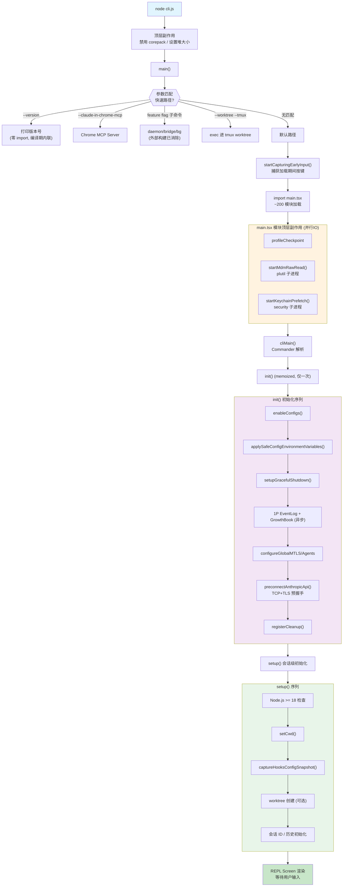

# 第2章 构建系统与启动流程

## 2.1 构建系统详解

### 2.1.1 build.ts 全文结构

`build.ts`（198行）是整个项目的构建脚本，结构清晰：

1. **常量定义**（第6-7行）：版本号与构建时间
2. **Feature flags 定义**（第10-100行）：90 个编译期开关
3. **Bun.build() 调用**（第102-175行）：bundler 配置 + 两个自定义插件
4. **后处理**（第177-197行）：添加 shebang、设置权限、输出统计

### 2.1.2 Plugin 1: bun-bundle-feature-shim

这是整个构建系统的核心插件，实现了 feature flag 的编译期替换。

```typescript
// build.ts 第130-153行
{
  name: 'bun-bundle-feature-shim',
  setup(build) {
    build.onResolve({ filter: /^bun:bundle$/ }, () => ({
      path: 'bun:bundle',
      namespace: 'bun-bundle-shim',
    }))
    build.onLoad({ filter: /.*/, namespace: 'bun-bundle-shim' }, () => {
      const lines = Object.entries(featureFlags)
        .map(([k, v]) => `  '${k}': ${v},`)
        .join('\n')
      return {
        contents: `
const features = {\n${lines}\n};
export function feature(name) {
  if (name in features) return features[name];
  return false;
}
`,
        loader: 'js',
      }
    })
  },
},
```

工作原理：

1. `onResolve`：当 bundler 遇到 `import { feature } from 'bun:bundle'` 时，将这个虚拟模块路由到自定义的 `bun-bundle-shim` ��名空间
2. `onLoad`：为该命名空间生成一个运行时模块，包含一个 `features` 字典（所有 flag 的键值对）和一个 `feature()` 函数
3. Bun bundler 的 tree-shaking 会将 `feature('DAEMON')` 这类调用内联为 `false`，然后将 `if (false) { ... }` 整个代码块消除

在外部构建中，90 个 flag 中仅 4 个为 `true`：

```typescript
// build.ts 第25、33、61、86行
BUILTIN_EXPLORE_PLAN_AGENTS: true,
COMPACTION_REMINDERS: true,
MCP_SKILLS: true,
TOKEN_BUDGET: true,
```

其余 86 个均为 `false`，对应的代码（如 DAEMON、BRIDGE_MODE、VOICE_MODE、SSH_REMOTE 等）在编译产物中完全不存��。

### 2.1.3 Plugin 2: text-file-loader

```typescript
// build.ts 第155-173行
{
  name: 'text-file-loader',
  setup(build) {
    build.onLoad({ filter: /\.(md|txt)$/ }, async (args) => {
      const fs = await import('fs/promises')
      const contents = await fs.readFile(args.path, 'utf-8')
      return {
        contents: `export default ${JSON.stringify(contents)}`,
        loader: 'js',
      }
    })
    build.onLoad({ filter: /\.d\.ts$/ }, () => ({
      contents: 'export {}',
      loader: 'js',
    }))
  },
},
```

两个职责：

1. **Markdown/文本文件作为字符串导入**：当源码 `import content from './prompt.md'` 时，文件内容被序列化为 `export default "..."` 的 JS 模块。这用于系统提示词等大段文本的内联。
2. **`.d.ts` 类型声明文件清空**：类型声明文件在运行时无意义，生成空导出 `export {}` 避免 bundler 报错。

### 2.1.4 Bun.build() 核心配置

```typescript
// build.ts 第102-128行
const result = await Bun.build({
  entrypoints: ['./src/entrypoints/cli.tsx'],
  outdir: './dist',
  target: 'node',
  format: 'esm',
  sourcemap: 'linked',
  minify: false,
  define: {
    'MACRO.VERSION': JSON.stringify(VERSION),
    'MACRO.BUILD_TIME': JSON.stringify(BUILD_TIME),
    'MACRO.ISSUES_EXPLAINER': JSON.stringify('report the issue at ...'),
    'MACRO.FEEDBACK_CHANNEL': JSON.stringify('https://github.com/...'),
    'MACRO.PACKAGE_URL': JSON.stringify('https://www.npmjs.com/...'),
    'MACRO.NATIVE_PACKAGE_URL': JSON.stringify('https://www.npmjs.com/...'),
    'MACRO.VERSION_CHANGELOG': JSON.stringify(''),
    'Bun.env.NODE_ENV': JSON.stringify('production'),
  },
  external: [
    '*.node',
    'sharp',
    '@img/*',
    '@anthropic-ai/bedrock-sdk',
    '@anthropic-ai/vertex-sdk',
    '@anthropic-ai/foundry-sdk',
  ],
})
```

`define` 字段实现编译期常量注入。源码中的 `MACRO.VERSION` 在编译后被替换为字面量字符串 `"2.1.88"`。这些 MACRO 常量的使用方式见 `cli.tsx` 的快速路径：

```typescript
// src/entrypoints/cli.tsx 第39-41行
console.log(`${MACRO.VERSION} (Claude Code)`);
```

编译后变为：

```javascript
console.log("2.1.88 (Claude Code)");
```

`external` 字段指定不打包的模块。`.node` 是原生二进制模块，`sharp` 是图片处理库（被 `image-processor-src` 替代），三个 Anthropic 云 SDK 是可选依赖。

### 2.1.5 构建后处理

```typescript
// build.ts 第177-197行
if (result.success) {
  const fs = await import('fs/promises')
  const outFile = result.outputs[0]!.path
  const content = await fs.readFile(outFile, 'utf-8')
  if (!content.startsWith('#!/')) {
    await fs.writeFile(outFile, `#!/usr/bin/env node\n${content}`)
  }
  await fs.chmod(outFile, 0o755)

  console.log('Build succeeded')
  console.log(`  Output: ${result.outputs.map(o => o.path).join(', ')}`)
  const stat = await fs.stat(outFile)
  console.log(`  Size: ${(stat.size / 1024 / 1024).toFixed(1)}MB`)
}
```

三步后处理：

1. 在产物头部添加 `#!/usr/bin/env node` shebang，使文件可直接作为命令执行
2. 设置 `0o755` 权限（所有者读写执行，其他人读执行）
3. 打印构建结果和产物大小

## 2.2 CLI 入口：快速路径分发

### 代码流程图：完整启动链路



### 2.2.1 文件概览

`src/entrypoints/cli.tsx`（302行）是 Bun bundler 的唯一入口点（`entrypoints: ['./src/entrypoints/cli.tsx']`）。它的设计哲学是**快速路径优先**——对于特定的 CLI 参数，尽可能早地返回，避免加载不必要的模块。

### 2.2.2 顶层副作用（第1-26行）

```typescript
// src/entrypoints/cli.tsx 第1行
import { feature } from 'bun:bundle';

// 第5行
process.env.COREPACK_ENABLE_AUTO_PIN = '0';

// 第9-13行
if (process.env.CLAUDE_CODE_REMOTE === 'true') {
  const existing = process.env.NODE_OPTIONS || '';
  process.env.NODE_OPTIONS = existing
    ? `${existing} --max-old-space-size=8192`
    : '--max-old-space-size=8192';
}

// 第21-26行
if (feature('ABLATION_BASELINE') && process.env.CLAUDE_CODE_ABLATION_BASELINE) {
  for (const k of ['CLAUDE_CODE_SIMPLE', ...]) {
    process.env[k] ??= '1';
  }
}
```

三个顶层副作用在任何 async 逻辑之前执行：

1. 禁用 corepack 自动 pin（防止污染 package.json）
2. 在 CCR 远程环境中设置 Node.js 堆大小上限为 8GB
3. 消融基线实验（`ABLATION_BASELINE` 在外部构建中为 `false`，此代码块被消除）

### 2.2.3 main() 函数与快速路径

```typescript
// src/entrypoints/cli.tsx 第33行
async function main(): Promise<void> {
  const args = process.argv.slice(2);
```

核心逻辑是一系列 `if`/`return` 的快速路径分发。以下按执行顺序逐一分析：

**路径 1：`--version`（零 import）**

```typescript
// src/entrypoints/cli.tsx 第37-42行
if (args.length === 1 && (args[0] === '--version' || args[0] === '-v' || args[0] === '-V')) {
  console.log(`${MACRO.VERSION} (Claude Code)`);
  return;
}
```

这是最快的路径——不需要加载任何模块，`MACRO.VERSION` 是编译期内联的字符串常量。`claude --version` 的响应时间接近零。

**路径 2：`--dump-system-prompt`（内部调试）**

```typescript
// src/entrypoints/cli.tsx 第53-71行
if (feature('DUMP_SYSTEM_PROMPT') && args[0] === '--dump-system-prompt') {
  const { enableConfigs } = await import('../utils/config.js');
  enableConfigs();
  const { getSystemPrompt } = await import('../constants/prompts.js');
  const prompt = await getSystemPrompt([], model);
  console.log(prompt.join('\n'));
  return;
}
```

被 `feature('DUMP_SYSTEM_PROMPT')` 保护，在外部构建中被消除。

**路径 3：Chrome MCP / 原生主机**

```typescript
// src/entrypoints/cli.tsx 第72-93行
if (process.argv[2] === '--claude-in-chrome-mcp') {
  const { runClaudeInChromeMcpServer } = await import('../utils/claudeInChrome/mcpServer.js');
  await runClaudeInChromeMcpServer();
  return;
} else if (process.argv[2] === '--chrome-native-host') {
  const { runChromeNativeHost } = await import('../utils/claudeInChrome/chromeNativeHost.js');
  await runChromeNativeHost();
  return;
} else if (feature('CHICAGO_MCP') && process.argv[2] === '--computer-use-mcp') {
  // ...
}
```

Chrome 扩展集成的专用入口。注意 `--computer-use-mcp` 被 feature flag 保护。

**路径 4-9：feature flag 保护的子命令**

```typescript
// src/entrypoints/cli.tsx 第100-233行
// --daemon-worker (DAEMON flag, 外部构建消除)
// remote-control / rc / remote (BRIDGE_MODE flag, 外���构建消除)
// daemon (DAEMON flag, 外部构建消除)
// ps / logs / attach / kill / --bg (BG_SESSIONS flag, 外部构建消除)
// new / list / reply (TEMPLATES flag, 外部构建消除)
// environment-runner (BYOC_ENVIRONMENT_RUNNER flag, 外部构建消除)
// self-hosted-runner (SELF_HOSTED_RUNNER flag, 外部构建消除)
```

这些路径全部被 feature flag 包裹，在外部构建中被 dead code elimination 消除。

**路径 10：`--worktree --tmux` 快速路径**

```typescript
// src/entrypoints/cli.tsx 第248-274行
const hasTmuxFlag = args.includes('--tmux') || args.includes('--tmux=classic');
if (hasTmuxFlag && (args.includes('-w') || args.includes('--worktree') || ...)) {
  const { enableConfigs } = await import('../utils/config.js');
  enableConfigs();
  const { isWorktreeModeEnabled } = await import('../utils/worktreeModeEnabled.js');
  if (isWorktreeModeEnabled()) {
    const { execIntoTmuxWorktree } = await import('../utils/worktree.js');
    const result = await execIntoTmuxWorktree(args);
    if (result.handled) return;
  }
}
```

如果同时传了 `--worktree` 和 `--tmux`，在加载完整 CLI 前尝试直接 exec 进 tmux 会话。

**默认路径：加载完整 CLI**

```typescript
// src/entrypoints/cli.tsx 第287-298行
const { startCapturingEarlyInput } = await import('../utils/earlyInput.js');
startCapturingEarlyInput();
profileCheckpoint('cli_before_main_import');
const { main: cliMain } = await import('../main.js');
profileCheckpoint('cli_after_main_import');
await cliMain();
profileCheckpoint('cli_after_main_complete');
```

当没有匹配到任何快速路径时，执行以下步骤：

1. 开始捕获早期键盘输入（用户在 CLI 加载期间的按键不会丢失）
2. 动态导入 `main.tsx`——这是最重量级的操作，会触发 ~200 个模块的加载
3. 调用 `cliMain()` 进入 Commander 解析流程

### 2.2.4 入口文件末尾

```typescript
// src/entrypoints/cli.tsx 第301-302行
main().catch((error) => { /* 错误处理 */ });
```

`main()` 在模块顶层被调用（IIFE 风格），`catch` 处理未捕获异常。

## 2.3 main.tsx 的模块顶层副作用

`src/main.tsx`（4683行）是整个应用最大的单一文件。它的前 200 行在模块加载阶段（不是函数调用阶段）就会执行。

### 2.3.1 启动性能优化三板斧

```typescript
// src/main.tsx 第9-10行
import { profileCheckpoint, profileReport } from './utils/startupProfiler.js';
profileCheckpoint('main_tsx_entry');
```

第一步：记录模块评估的起始时间戳。

```typescript
// src/main.tsx 第13-16行
import { startMdmRawRead } from './utils/settings/mdm/rawRead.js';
startMdmRawRead();
```

第二步：启动 MDM（Mobile Device Management）设置的子进程读取。在 macOS 上这意味着执行 `plutil` 命令读取系统级配置。子进程启动后立即返回，在后续模块加载期间并行执行。

```typescript
// src/main.tsx 第17-20行
import { ensureKeychainPrefetchCompleted, startKeychainPrefetch }
  from './utils/secureStorage/keychainPrefetch.js';
startKeychainPrefetch();
```

第三步：启动 macOS Keychain 的预读取。OAuth token 和 API key 存储在系统 Keychain 中，读取操作需要执行 `security` 命令。同样是启动子进程后立即返回。

这三个副作用穿插在 `import` 语句之间，利用模块加载的 ~135ms 窗口并行完成 IO 密集型操作。到模块加载完毕时，这些子进程的结果通常已经就绪。

### 2.3.2 条件 require 与死代码消除

```typescript
// src/main.tsx 第69-82行
const getTeammateUtils = () =>
  require('./utils/teammate.js') as typeof import('./utils/teammate.js');
const getTeammatePromptAddendum = () =>
  require('./utils/swarm/teammatePromptAddendum.js') as ...;

const coordinatorModeModule = feature('COORDINATOR_MODE')
  ? require('./coordinator/coordinatorMode.js') as ...
  : null;

const assistantModule = feature('KAIROS')
  ? require('./assistant/index.js') as ...
  : null;
```

两种模式：

1. **延迟 require 函数**：`getTeammateUtils()` 返回一个函数，调用时才执行 `require()`。这打破了循环依赖链（`teammate.ts -> AppState.tsx -> ... -> main.tsx`）。
2. **Feature flag 保护的 require**：`coordinatorModeModule` 和 `assistantModule` 受 feature flag 保护。在外部构建中，`feature('COORDINATOR_MODE')` 和 `feature('KAIROS')` 均为 `false`，三元表达式直接求值为 `null`，`require()` 调用被消除。

### 2.3.3 调试模式检测与阻止

```typescript
// src/main.tsx 第266-271行
if ("external" !== 'ant' && isBeingDebugged()) {
  process.exit(1);
}
```

外部构建中 `"external"` 是字面量字符串（原本是 `process.env.USER_TYPE` 的编译期替换），`"external" !== 'ant'` 恒为 `true`。如果检测到 Node.js 调试器（`--inspect`、`--debug`），立即退出。这是一个反调试保护措施。

`isBeingDebugged()` 函数（第232-263行）检查三个信号源：

- `process.execArgv` 中的 `--inspect`/`--debug` 标志
- `process.env.NODE_OPTIONS` 中的调试标志
- `inspector.url()` 返回非空（调试器已连接）

## 2.4 init() 初始化流程

### 2.4.1 Memoized 单次执行

```typescript
// src/entrypoints/init.ts 第57行
export const init = memoize(async (): Promise<void> => {
```

`init()` 使用 lodash 的 `memoize` 包装，无论调用多少次，实际逻辑只执行一次。后续调用返回缓存的 Promise。

### 2.4.2 初始化序列

init() 的执行顺序严格有序，每一步都有性能计时：

**步骤 1：启用配置系统**

```typescript
// src/entrypoints/init.ts 第64-66行
enableConfigs()
```

激活配置读取能力。在此之前，任何 `getGlobalConfig()` / `getProjectConfig()` 调用都会失败。

**步骤 2：应用安全环境变量**

```typescript
// src/entrypoints/init.ts 第74-78行
applySafeConfigEnvironmentVariables()
applyExtraCACertsFromConfig()
```

只应用"安全"的环境变量（如 `NODE_EXTRA_CA_CERTS`��。完整的环境变量（可能来自不受信任的项目配置）要等到信任对话框通过后才应用。CA 证书必须在第一次 TLS 握手之前设置，因为 Bun 的 BoringSSL 会在启动时缓存证书存储。

**步骤 3：注册优雅退出**

```typescript
// src/entrypoints/init.ts 第87行
setupGracefulShutdown()
```

注册 `SIGINT`/`SIGTERM`/`exit` 处理器。确保退出时刷新遥测数据、保存会话、清理临时文件。

**步骤 4：异步 1P 事件日志**

```typescript
// src/entrypoints/init.ts 第94-105行
void Promise.all([
  import('../services/analytics/firstPartyEventLogger.js'),
  import('../services/analytics/growthbook.js'),
]).then(([fp, gb]) => {
  fp.initialize1PEventLogging()
  gb.onGrowthBookRefresh(() => {
    void fp.reinitialize1PEventLoggingIfConfigChanged()
  })
})
```

动态导入 1P 事件日志和 GrowthBook（A/B 测试）模块。使用 `void` 表明是 fire-and-forget 操作，不阻塞主流程。

**步骤 5：网络配置**

```typescript
// src/entrypoints/init.ts 第136-151行
configureGlobalMTLS()
configureGlobalAgents()
preconnectAnthropicApi()
```

三步网络初始化：

1. mTLS 双向认证配置（企业环境）
2. HTTP 代理配置（`https-proxy-agent`）
3. 预连接 Anthropic API——在用户还在输入的 ~100ms 内完成 TCP+TLS 握手

**步骤 6：清理注册**

```typescript
// src/entrypoints/init.ts ��189-200行
registerCleanup(shutdownLspServerManager)
registerCleanup(async () => {
  const { cleanupSessionTeams } = await import('../utils/swarm/teamHelpers.js')
  await cleanupSessionTeams()
})
```

注册进程退出时需要执行的清理函数。LSP 服务管理器关闭、团队会话清理等。

### 2.4.3 配置错误处理

```typescript
// src/entrypoints/init.ts 第215-237行
} catch (error) {
  if (error instanceof ConfigParseError) {
    if (getIsNonInteractiveSession()) {
      process.stderr.write(`Configuration error in ${error.filePath}: ${error.message}\n`)
      gracefulShutdownSync(1)
      return
    }
    return import('../components/InvalidConfigDialog.js').then(m =>
      m.showInvalidConfigDialog({ error }),
    )
  } else {
    throw error
  }
}
```

如果配置解析失败（JSON 语法错误、schema 不匹配等），在交互模式下弹出 Ink 组件显示错误对话框；在非交互模式下直接输出到 stderr 并退出。

## 2.5 setup() 会话级初始化

`src/setup.ts`（477行）在每个 CLI 会话中调用一次（区别于 `init()` 的进程级一次性调用）。

### 2.5.1 函数签名

```typescript
// src/setup.ts 第56-66行
export async function setup(
  cwd: string,
  permissionMode: PermissionMode,
  allowDangerouslySkipPermissions: boolean,
  worktreeEnabled: boolean,
  worktreeName: string | undefined,
  tmuxEnabled: boolean,
  customSessionId?: string | null,
  worktreePRNumber?: number,
  messagingSocketPath?: string,
): Promise<void> {
```

接收工作目录、权限模式、worktree 配置等参数。

### 2.5.2 执行序列

**Node.js 版本检���**

```typescript
// src/setup.ts 第70-79行
const nodeVersion = process.version.match(/^v(\d+)\./)?.[1]
if (!nodeVersion || parseInt(nodeVersion) < 18) {
  console.error(chalk.bold.red(
    'Error: Claude Code requires Node.js version 18 or higher.',
  ))
  process.exit(1)
}
```

硬性要求 Node.js >= 18。

**UDS 消息服务器**

```typescript
// src/setup.ts ��95-101行
if (feature('UDS_INBOX')) {
  const m = await import('./utils/udsMessaging.js')
  await m.startUdsMessaging(
    messagingSocketPath ?? m.getDefaultUdsSocketPath(),
    { isExplicit: messagingSocketPath !== undefined },
  )
}
```

Unix Domain Socket 消息服务器，被 `UDS_INBOX` feature flag 保护（外部构建消除）。

**设置工作目录**

```typescript
// src/setup.ts 第161行
setCwd(cwd)
```

必须在所有依赖工作目录的代码之前调用。这是整个启动序列的关键同步点。

**捕获 hooks 配置快照**

```typescript
// src/setup.ts 第165-169行
captureHooksConfigSnapshot()
```

记录当前 hooks 配置的快照，用于检测运行期间是否有人篡改了 hooks 配置文件。必须在 `setCwd()` 之后，确保从正确的目录读取。

**Worktree 创建**

```typescript
// src/setup.ts 第176-285行
if (worktreeEnabled) {
  // 检查 git 仓库
  // 创建 worktree
  // 创建 tmux 会话（可选）
  // 切换工作目录到 worktree
  // 更新 projectRoot
  // 清除缓存
}
```

如果启用了 `--worktree` 参数，创建 git worktree 并将会话的工作目录切换到其中。

**后台任务启动**

```typescript
// src/setup.ts 第292-304行
if (!isBareMode()) {
  initSessionMemory()
  if (feature('CONTEXT_COLLAPSE')) {
    // ...
  }
}
void lockCurrentVersion()
```

初始化会话记忆、锁定当前版本（防止自动更新器在会话期间删除当前版本）。

**命令和插件预取**

```typescript
// src/setup.ts 第322-329行
if (!skipPluginPrefetch) {
  void getCommands(getProjectRoot())
}
void import('./utils/plugins/loadPluginHooks.js').then(m => {
  if (!skipPluginPrefetch) {
    void m.loadPluginHooks()
    m.setupPluginHookHotReload()
  }
})
```

Fire-and-forget 预取斜杠命令列表和插件钩子。使用 `void` 表示不等待结果——这些操作的结果在用户输入第一条消息之前会就绪。

**遥测事件**

```typescript
// src/setup.ts 第378行
logEvent('tengu_started', {})
```

发出 `tengu_started` 事件——这是最早的可靠"进程已启动"信号。放在 `initSinks()` 之后确保事件能被发送。

**权限安全检查**

```typescript
// src/setup.ts 第397-441行
if (permissionMode === 'bypassPermissions' || allowDangerouslySkipPermissions) {
  // 禁止在 root/sudo 下跳过权限
  // Anthropic 员工只能在 Docker/sandbox 中跳过权限
}
```

`--dangerously-skip-permissions` 的安全防护：禁止以 root 运行、要求必须在隔离容器中且无互联网访问。

## 2.6 交互式 REPL vs 非交互式 print mode

### 2.6.1 分叉判���

```typescript
// src/main.tsx 第799-803行
const hasPrintFlag = cliArgs.includes('-p') || cliArgs.includes('--print');
const hasInitOnlyFlag = cliArgs.includes('--init-only');
const hasSdkUrl = cliArgs.some(arg => arg.startsWith('--sdk-url'));
const isNonInteractive = hasPrintFlag || hasInitOnlyFlag || hasSdkUrl || !process.stdout.isTTY;
```

判定逻辑——四个条件中任一为真即为非交互模式：

1. 显式 `-p`/`--print` 标志
2. `--init-only` 标志（只运行 hooks 然后退出）
3. `--sdk-url` 标志（SDK 模式）
4. stdout 不是 TTY（管道、文件重定向等）

### 2.6.2 非交互式路径（print mode）

```typescript
// src/main.tsx 第2584-2860行
if (isNonInteractiveSession) {
  // 1. 应用完整环境变量（信任对话框被跳过）
  applyConfigEnvironmentVariables();

  // 2. 初始化遥测
  initializeTelemetryAfterTrust();

  // 3. 启动 SessionStart hooks
  const sessionStartHooksPromise = processSessionStartHooks('startup');

  // 4. 导入 print.ts 并运行无头模式
  const { runHeadless } = await import('src/cli/print.js');
  void runHeadless(inputPrompt, /* ... 大量配置参数 ... */);
  return;
}
```

非交互模式的核心路径：

1. 跳过信任对话框（`-p` 模式被视为受信任环境）
2. 直接应用所有环境变量
3. 动态导入 `src/cli/print.js` 中的 `runHeadless()`
4. `runHeadless()` 发送一次查询、获取响应、输出到 stdout、退出

### 2.6.3 交互式路径（REPL 模式）

交互式路径要复杂得多。在 `main.tsx` 的 action handler 中（约第1006行开始），经过大量参数解析和配置后，最终通过 `launchRepl()` 启动 Ink 渲染：

```typescript
// src/replLauncher.tsx 第12-22行
export async function launchRepl(
  root: Root,
  appProps: AppWrapperProps,
  replProps: REPLProps,
  renderAndRun: (root: Root, element: React.ReactNode) => Promise<void>,
): Promise<void> {
  const { App } = await import('./components/App.js');
  const { REPL } = await import('./screens/REPL.js');
  await renderAndRun(root, <App {...appProps}>
    <REPL {...replProps} />
  </App>);
}
```

`launchRepl()` 动态导入 `App` 组件和 `REPL` 屏幕组件，然后调用 `renderAndRun()` 将 React 组件树交给 Ink 渲染引擎。`App` 提供全局上下文（FPS 指标、统计、状态），`REPL` 是主交互界面。

在 `main.tsx` 中，`launchRepl()` 被多个不同场景调用：

- 普通交互会话（约第3176行）
- 继续上一会话 `--continue`（约第3134行）
- 恢复指定会话 `--resume`（约第3242行）
- 直接连接 `cc://` URL（约第3338行）
- SSH 远程会话（约第3487行）
- 其他特殊模式...

每个场景传递不同的 `REPLProps`，包含初始消息、恢复的会话历史、特定的模型配置等。

## 2.7 bootstrap/state.ts 全局状态

### 2.7.1 State 类型定义

```typescript
// src/bootstrap/state.ts 第45-257行
type State = {
  originalCwd: string
  projectRoot: string
  totalCostUSD: number
  totalAPIDuration: number
  // ... 约 90 个字段 ...
  sessionId: SessionId
  modelUsage: { [modelName: string]: ModelUsage }
  mainLoopModelOverride: ModelSetting | undefined
  isInteractive: boolean
  sdkBetas: string[] | undefined
  lastAPIRequest: Omit<BetaMessageStreamParams, 'messages'> | null
  invokedSkills: Map<string, { skillName: string; content: string; ... }>
  // ...
}
```

State 类型横跨约 210 行，是整个应用运行时状态的完整描述。关键字段分组：

| 分组 | 主要字段 | 用途 |
|------|---------|------|
| 路径 | `originalCwd`, `projectRoot`, `cwd` | 工作目录管理 |
| 会话 | `sessionId`, `parentSessionId`, `isInteractive` | 会话标识与模式 |
| 计费 | `totalCostUSD`, `modelUsage`, `totalLinesAdded/Removed` | 费用与使用量统计 |
| 模型 | `mainLoopModelOverride`, `initialMainLoopModel`, `modelStrings` | 模型选择 |
| 遥测 | `meter`, `sessionCounter`, `loggerProvider`, `tracerProvider` | OpenTelemetry 集成 |
| API | `lastAPIRequest`, `lastAPIRequestMessages`, `lastMainRequestId` | API 调试信息 |
| 缓存 | `systemPromptSectionCache`, `cachedClaudeMdContent`, `planSlugCache` | 性能缓存 |
| 权限 | `sessionBypassPermissionsMode`, `sessionTrustAccepted` | 安全控制 |
| 扩展 | `inlinePlugins`, `registeredHooks`, `invokedSkills`, `allowedChannels` | 插件与技能 |

### 2.7.2 状态初始化

```typescript
// src/bootstrap/state.ts 第260行
function getInitialState(): State {
  let resolvedCwd = ''
  // 解析符号链接，NFC 规范化（macOS 兼容）
  const rawCwd = cwd()
  try {
    resolvedCwd = realpathSync(rawCwd).normalize('NFC')
  } catch {
    resolvedCwd = rawCwd.normalize('NFC')
  }
  const state: State = {
    originalCwd: resolvedCwd,
    projectRoot: resolvedCwd,
    totalCostUSD: 0,
    // ...
    sessionId: randomUUID() as SessionId,
    clientType: 'cli',
    allowedSettingSources: [
      'userSettings', 'projectSettings', 'localSettings',
      'flagSettings', 'policySettings',
    ],
    // ...
  }
  return state
}
```

初始化的关键细节：

1. `resolvedCwd`：先 `realpathSync()` 解析符号链接，再 `.normalize('NFC')` 做 Unicode 规范化。macOS 的 HFS+ 文件系统使用 NFD 编码，不规范化会导致路径比较失败。
2. `sessionId`：使用 `randomUUID()` 生成，每次进程启动获得唯一标识。
3. `clientType: 'cli'`：默认客户端类型，可被后续逻辑覆盖为 `'sdk-typescript'`、`'remote'` 等。

### 2.7.3 Getter/Setter 模式

state.ts 对外暴露的不是 State 对象本身，而是精细的 getter/setter 函数：

```typescript
// 典型的 getter/setter 对
export function getSessionId(): SessionId { return state.sessionId }
export function switchSession(id: SessionId): void { state.sessionId = id }
export function getCwdState(): string { return state.cwd }
export function setCwdState(v: string): void { state.cwd = v }
export function getIsNonInteractiveSession(): boolean { return !state.isInteractive }
export function setIsInteractive(v: boolean): void { state.isInteractive = v }
```

这种封装有两个目的：

1. **控制访问**：外部代码不能随意修改任意字段，只能通过导出的函数
2. **变更追踪**：setter 可以加入日志、事件发射、副作用触发等逻辑

## 2.8 main() 函数的 Commander 配置

### 2.8.1 preAction 钩子

```typescript
// src/main.tsx 第907-967行
program.hook('preAction', async thisCommand => {
  await Promise.all([ensureMdmSettingsLoaded(), ensureKeychainPrefetchCompleted()]);
  await init();
  // 设置进程标题
  process.title = 'claude';
  // 附加日志 sink
  const { initSinks } = await import('./utils/sinks.js');
  initSinks();
  // 处理 --plugin-dir
  // 运行迁移
  runMigrations();
  // 加载远程管理设置
  void loadRemoteManagedSettings();
  void loadPolicyLimits();
});
```

Commander 的 `preAction` 钩子在**任何命令执行前**运行。这里完成了：

1. 等待 MDM 和 Keychain 预取完成（在模块加载阶段启动的异步操作）
2. 执行 `init()` 全局初始化
3. 附加分析日志 sink
4. 运行数据库迁移（当前版本号为 11）
5. 加载远程管理设置和策略限制

### 2.8.2 迁移系统

```typescript
// src/main.tsx 第325-352行
const CURRENT_MIGRATION_VERSION = 11;
function runMigrations(): void {
  if (getGlobalConfig().migrationVersion !== CURRENT_MIGRATION_VERSION) {
    migrateAutoUpdatesToSettings();
    migrateBypassPermissionsAcceptedToSettings();
    // ... 共 10 个迁移 ...
    saveGlobalConfig(prev => ({
      ...prev,
      migrationVersion: CURRENT_MIGRATION_VERSION,
    }));
  }
}
```

版本化的同步迁移系统。只在 `migrationVersion` 不匹配时执行，执行完后更新版本号。迁移内容包括模型名称变更（Sonnet 4.5 -> Sonnet 4.6）、设置字段迁移等。

## 2.9 完整启动时序图

```
用户输入: claude "hello"
    |
    v
[cli.tsx] 模块加载
    |-- process.env.COREPACK_ENABLE_AUTO_PIN = '0'
    |-- (feature flag 保护的环境变量设置)
    |
    v
[cli.tsx] main()
    |-- args = process.argv.slice(2)
    |-- 检查快速路径: --version? --dump-system-prompt? --daemon? ...
    |-- 无匹配 -> 加载完整 CLI
    |
    v
[earlyInput.js] startCapturingEarlyInput()
    |   (捕获用户在加载期间的按键)
    |
    v
[main.tsx] 模块加载 (~135ms)
    |-- profileCheckpoint('main_tsx_entry')
    |-- startMdmRawRead()         // 启动 MDM 子进程
    |-- startKeychainPrefetch()   // 启动 Keychain 子进程
    |-- 200+ 个 import 语句加载
    |-- isBeingDebugged() 检查
    |
    v
[main.tsx] main()
    |-- initializeWarningHandler()
    |-- 注册 SIGINT/exit 处理器
    |-- 检测 isNonInteractive (基于 -p/--print/TTY)
    |-- setIsInteractive() / setClientType()
    |-- eagerLoadSettings() (--settings / --setting-sources)
    |
    v
[main.tsx] run()
    |-- 创建 Commander program
    |-- program.hook('preAction', ...)
    |       |
    |       v
    |   [preAction]
    |       |-- await ensureMdmSettingsLoaded()
    |       |-- await ensureKeychainPrefetchCompleted()
    |       |-- await init()    // memoized 全局初始化
    |       |       |-- enableConfigs()
    |       |       |-- applySafeConfigEnvironmentVariables()
    |       |       |-- setupGracefulShutdown()
    |       |       |-- configureGlobalMTLS()
    |       |       |-- configureGlobalAgents()
    |       |       |-- preconnectAnthropicApi()
    |       |       +-- registerCleanup(...)
    |       |-- initSinks()
    |       |-- runMigrations()
    |       +-- loadRemoteManagedSettings() (async, 不等待)
    |
    v
[main.tsx] action handler
    |-- 解析所有 CLI 选项
    |-- await setup(cwd, permissionMode, ...)
    |       |-- Node.js 版本检查
    |       |-- setCwd()
    |       |-- captureHooksConfigSnapshot()
    |       |-- worktree 创建 (如果启用)
    |       |-- initSessionMemory()
    |       |-- 命令/插件预取 (async, 不等待)
    |       |-- logEvent('tengu_started')
    |       +-- 权限安全检查
    |
    v
[分叉点]
    |
    |-- [isNonInteractive = true]
    |       |-- applyConfigEnvironmentVariables()
    |       |-- initializeTelemetryAfterTrust()
    |       |-- import('src/cli/print.js')
    |       +-- runHeadless(prompt, ...)
    |
    +-- [isNonInteractive = false]
            |-- showSetupScreens() (信任对话框等)
            |-- 配置 MCP 服务器
            |-- 构建初始消息
            |-- import('src/components/App.js')
            |-- import('src/screens/REPL.js')
            +-- launchRepl(root, <App><REPL /></App>)
```

## 2.10 本章总结

Claude Code 的启动流程体现了三个核心工程目标：

1. **极致的启动速度**：快速路径分发（`--version` 零 import）、顶层副作用并行化（MDM/Keychain 子进程与模块加载重叠）、Commander preAction 钩子（只在实际执行命令时初始化）
2. **最小化模块加载**：feature flag 编译消除 86 个功能模块、动态 import 按需加载、条件 require 打破循环依赖
3. **分层初始化**：`init()` 进程级一次性（网络、配置、代理）、`setup()` 会话级（工作目录、hooks、插件）、Commander action handler（参数解析、模式分叉）

整个启动链从 `cli.tsx` 入口到 REPL 渲染，经过约 6 个文件、4 层初始化，最终汇聚到两个出口：`runHeadless()` 或 `launchRepl()`。
