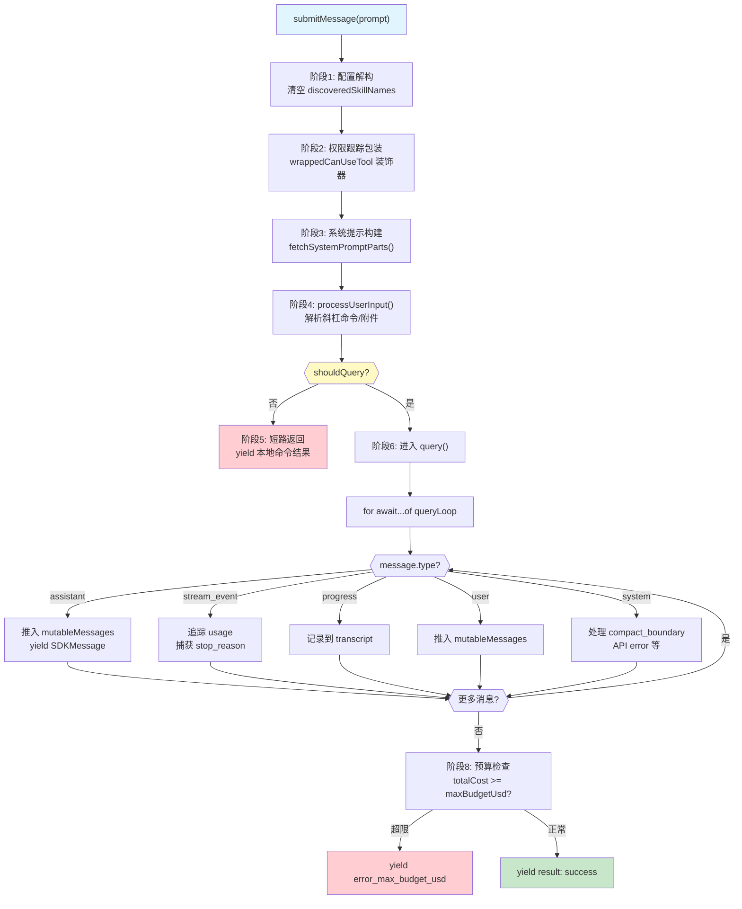
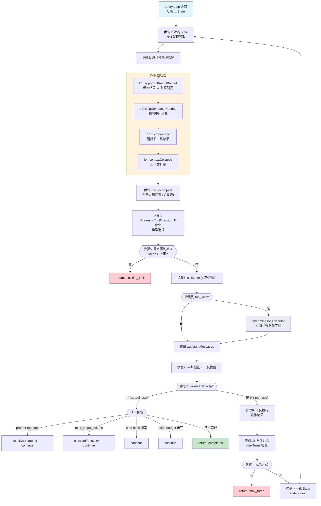

# 第5章 核心对话引擎 -- QueryEngine

## 5.1 架构概览

Claude Code 的对话引擎由两个核心模块构成：

- **QueryEngine** (`src/QueryEngine.ts`)：对话生命周期管理器，负责会话状态、消息持久化、SDK 事件分发
- **queryLoop** (`src/query.ts`)：核心推理循环，负责 LLM 调用、工具执行、自动压缩、终止判断

两者的关系是：QueryEngine 是面向外部的接口层，queryLoop 是内部的推理引擎。QueryEngine 通过异步生成器 `submitMessage()` 驱动 queryLoop，并将 queryLoop 产生的内部消息类型转换为 SDK 兼容的外部消息类型。

### 代码流程图：submitMessage 完整生命周期



### 代码流程图：queryLoop while(true) 循环



## 5.2 QueryEngine 类的职责与生命周期

### 5.2.1 类定义与核心状态

```typescript
// src/QueryEngine.ts 第184-198行
export class QueryEngine {
  private config: QueryEngineConfig
  private mutableMessages: Message[]
  private abortController: AbortController
  private permissionDenials: SDKPermissionDenial[]
  private totalUsage: NonNullableUsage
  private hasHandledOrphanedPermission = false
  private readFileState: FileStateCache
  private discoveredSkillNames = new Set<string>()
  private loadedNestedMemoryPaths = new Set<string>()
```

关键设计：

- `mutableMessages`：整个会话的消息历史，跨多个 turn 持久化
- `totalUsage`：累计 token 用量，跨 turn 累加
- `permissionDenials`：记录用户拒绝的工具调用，用于 SDK 上报
- `discoveredSkillNames`：每个 turn 开始时清空，追踪本轮发现的 skill
- `readFileState`：文件读取缓存，跨 turn 持久化（避免重复读取相同文件）

### 5.2.2 生命周期模型

```
创建 QueryEngine (一次)
  |
  v
submitMessage("用户消息1")  --> turn 1
  |  yield SDKMessage...
  v
submitMessage("用户消息2")  --> turn 2
  |  yield SDKMessage...
  v
...（每次 turn 共享同一个 mutableMessages 数组）
```

一个 QueryEngine 实例对应一个完整的对话。每次 `submitMessage()` 调用是一个 turn，turn 之间共享消息历史、文件缓存、累计费用等状态。

## 5.3 submitMessage() 异步生成器的完整流程

`submitMessage()` 是一个 `AsyncGenerator<SDKMessage, void, unknown>`，使用 `yield` 向调用方流式推送事件。以下逐阶段讲解。

### 阶段1：配置解构与环境初始化（第213-241行）

```typescript
// src/QueryEngine.ts 第209-241行
async *submitMessage(
  prompt: string | ContentBlockParam[],
  options?: { uuid?: string; isMeta?: boolean },
): AsyncGenerator<SDKMessage, void, unknown> {
  const {
    cwd, commands, tools, mcpClients, verbose = false,
    thinkingConfig, maxTurns, maxBudgetUsd, taskBudget,
    canUseTool, customSystemPrompt, appendSystemPrompt,
    userSpecifiedModel, fallbackModel, jsonSchema,
    getAppState, setAppState, replayUserMessages = false,
    includePartialMessages = false, agents = [], setSDKStatus,
    orphanedPermission,
  } = this.config

  this.discoveredSkillNames.clear()
  setCwd(cwd)
```

注意 `this.discoveredSkillNames.clear()` 确保每个 turn 的 skill 发现追踪是独立的。

### 阶段2：权限跟踪包装（第244-271行）

```typescript
// src/QueryEngine.ts 第244-271行
const wrappedCanUseTool: CanUseToolFn = async (
  tool, input, toolUseContext, assistantMessage, toolUseID, forceDecision,
) => {
  const result = await canUseTool(
    tool, input, toolUseContext, assistantMessage, toolUseID, forceDecision,
  )
  if (result.behavior !== 'allow') {
    this.permissionDenials.push({
      tool_name: sdkCompatToolName(tool.name),
      tool_use_id: toolUseID,
      tool_input: input,
    })
  }
  return result
}
```

这是一个装饰器模式：在原始 `canUseTool` 之上包装一层，额外记录权限拒绝信息。所有被拒绝的工具调用都会在最终 result 中上报给 SDK 调用方。

### 阶段3：系统提示构建（第284-325行）

```typescript
// src/QueryEngine.ts 第289-325行
const {
  defaultSystemPrompt,
  userContext: baseUserContext,
  systemContext,
} = await fetchSystemPromptParts({
  tools, mainLoopModel: initialMainLoopModel,
  additionalWorkingDirectories: Array.from(...),
  mcpClients,
  customSystemPrompt: customPrompt,
})

const systemPrompt = asSystemPrompt([
  ...(customPrompt !== undefined ? [customPrompt] : defaultSystemPrompt),
  ...(memoryMechanicsPrompt ? [memoryMechanicsPrompt] : []),
  ...(appendSystemPrompt ? [appendSystemPrompt] : []),
])
```

系统提示的组装逻辑：

1. 如果用户提供了 `customSystemPrompt`，则替代默认提示
2. 如果启用了 memory 机制且有 `CLAUDE_COWORK_MEMORY_PATH_OVERRIDE`，追加 memory 机制提示
3. 如果有 `appendSystemPrompt`，追加到末尾

### 阶段4：用户输入处理（第410-428行）

```typescript
// src/QueryEngine.ts 第410-428行
const {
  messages: messagesFromUserInput,
  shouldQuery,
  allowedTools,
  model: modelFromUserInput,
  resultText,
} = await processUserInput({
  input: prompt,
  mode: 'prompt',
  setToolJSX: () => {},
  context: { ...processUserInputContext, messages: this.mutableMessages },
  messages: this.mutableMessages,
  uuid: options?.uuid,
  isMeta: options?.isMeta,
  querySource: 'sdk',
})

this.mutableMessages.push(...messagesFromUserInput)
```

`processUserInput` 是一个关键函数，它：

- 解析斜杠命令（/compact、/clear 等）
- 处理附件（图片、文件）
- 判断是否需要调用 LLM（`shouldQuery`）
- 如果是本地命令，直接返回结果而不调 API

### 阶段5：短路返回（本地命令）（第556-639行）

```typescript
// src/QueryEngine.ts 第556行
if (!shouldQuery) {
  // 返回本地斜杠命令的结果
  for (const msg of messagesFromUserInput) {
    // ...yield 各种消息类型
  }
  yield {
    type: 'result',
    subtype: 'success',
    // ...
  }
  return
}
```

当用户输入的是本地命令（如 `/help`、`/compact`）时，不需要调用 LLM，直接 yield 结果并 return。

### 阶段6：进入核心查询循环（第675-686行）

```typescript
// src/QueryEngine.ts 第675-686行
for await (const message of query({
  messages,
  systemPrompt,
  userContext,
  systemContext,
  canUseTool: wrappedCanUseTool,
  toolUseContext: processUserInputContext,
  fallbackModel,
  querySource: 'sdk',
  maxTurns,
  taskBudget,
})) {
```

这里启动了 `query()` 函数，它内部调用 `queryLoop()`。`submitMessage()` 通过 `for await...of` 消费 queryLoop 产出的每一个事件。

### 阶段7：消息分发与状态管理（第757-968行）

这是 submitMessage 的核心 switch 语句，处理 queryLoop 产出的每种消息类型：

```typescript
// src/QueryEngine.ts 第757行
switch (message.type) {
  case 'tombstone':    // 控制信号，跳过
  case 'assistant':    // 助手回复 -> 推入 mutableMessages + yield 给 SDK
  case 'progress':     // 工具进度 -> 推入 mutableMessages + 记录到 transcript
  case 'user':         // 工具结果等 -> 推入 mutableMessages
  case 'stream_event': // 流式事件 -> 追踪 usage、stop_reason
  case 'attachment':   // 附件 -> 处理 max_turns_reached、structured_output 等
  case 'system':       // 系统消息 -> 处理 compact_boundary、api_error 等
  case 'tool_use_summary': // 工具摘要 -> 直接 yield 给 SDK
}
```

关键设计点：

- `stream_event` 中的 `message_start` 重置当前消息的 usage 计数器
- `message_delta` 中累加 usage 并捕获真实的 `stop_reason`
- `message_stop` 时将当前消息的 usage 累加到 `totalUsage`
- compact_boundary 消息触发内存释放：`this.mutableMessages.splice(0, mutableBoundaryIdx)`

### 阶段8：预算检查与最终结果（第971-1000行）

```typescript
// src/QueryEngine.ts 第972行
if (maxBudgetUsd !== undefined && getTotalCost() >= maxBudgetUsd) {
  yield {
    type: 'result',
    subtype: 'error_max_budget_usd',
    // ...
    errors: [`Reached maximum budget ($${maxBudgetUsd})`],
  }
  return
}
```

每处理完一个消息后，检查是否超出 USD 预算。这是 QueryEngine 级别的硬限制，与 queryLoop 内部的 turn 限制互补。

## 5.4 queryLoop() 的 while(true) 循环结构

### 5.4.1 入口与状态初始化

```typescript
// src/query.ts 第241-280行
async function* queryLoop(
  params: QueryParams,
  consumedCommandUuids: string[],
): AsyncGenerator<...> {
  const { systemPrompt, userContext, systemContext, canUseTool,
          fallbackModel, querySource, maxTurns, skipCacheWrite } = params
  const deps = params.deps ?? productionDeps()

  let state: State = {
    messages: params.messages,
    toolUseContext: params.toolUseContext,
    maxOutputTokensOverride: params.maxOutputTokensOverride,
    autoCompactTracking: undefined,
    stopHookActive: undefined,
    maxOutputTokensRecoveryCount: 0,
    hasAttemptedReactiveCompact: false,
    turnCount: 1,
    pendingToolUseSummary: undefined,
    transition: undefined,
  }
  const budgetTracker = feature('TOKEN_BUDGET') ? createBudgetTracker() : null
```

**State 结构**是循环迭代之间传递状态的核心载体，每次 continue 时通过 `state = { ...newState }` 整体替换。

### 5.4.2 循环体的10个步骤

以下逐一讲解 `while(true)` 循环内的每个阶段。

**步骤1：状态解构与 skill 发现预取（第307-335行）**

```typescript
// src/query.ts 第311-335行
let { toolUseContext } = state
const { messages, autoCompactTracking, maxOutputTokensRecoveryCount,
        hasAttemptedReactiveCompact, maxOutputTokensOverride,
        pendingToolUseSummary, stopHookActive, turnCount } = state

const pendingSkillPrefetch = skillPrefetch?.startSkillDiscoveryPrefetch(
  null, messages, toolUseContext,
)

yield { type: 'stream_request_start' }
```

每轮迭代开始时，解构 state 为局部变量。同时启动 skill 发现的异步预取（不阻塞）。

**步骤2：消息预处理管线（第365-447行）**

```typescript
// src/query.ts 第365-447行
let messagesForQuery = [...getMessagesAfterCompactBoundary(messages)]

// 2a. Tool result budget（第379行）
messagesForQuery = await applyToolResultBudget(messagesForQuery, ...)

// 2b. Snip compact（第401行）
if (feature('HISTORY_SNIP')) {
  const snipResult = snipModule!.snipCompactIfNeeded(messagesForQuery)
  messagesForQuery = snipResult.messages
}

// 2c. Microcompact（第414行）
const microcompactResult = await deps.microcompact(
  messagesForQuery, toolUseContext, querySource,
)
messagesForQuery = microcompactResult.messages

// 2d. Context collapse（第440行）
if (feature('CONTEXT_COLLAPSE') && contextCollapse) {
  const collapseResult = await contextCollapse.applyCollapsesIfNeeded(...)
  messagesForQuery = collapseResult.messages
}
```

消息预处理管线按顺序执行四个阶段：

1. **Tool result budget**：对工具结果的总大小进行裁剪
2. **Snip compact**：基于标记的历史消息裁剪
3. **Microcompact**：微级别压缩（删除冗余内容）
4. **Context collapse**：上下文折叠（将旧对话折叠为摘要）

**步骤3：自动压缩（第453-543行）**

```typescript
// src/query.ts 第454-467行
const { compactionResult, consecutiveFailures } = await deps.autocompact(
  messagesForQuery, toolUseContext,
  { systemPrompt, userContext, systemContext, toolUseContext,
    forkContextMessages: messagesForQuery },
  querySource, tracking, snipTokensFreed,
)

if (compactionResult) {
  // ...发送压缩后的消息
  const postCompactMessages = buildPostCompactMessages(compactionResult)
  for (const message of postCompactMessages) {
    yield message
  }
  messagesForQuery = postCompactMessages
}
```

自动压缩是 Claude Code 应对长上下文的关键机制。当 token 数量接近模型上下文窗口时，自动将历史消息压缩为摘要。

**步骤4：模型选择与流式工具执行器初始化（第560-580行）**

```typescript
// src/query.ts 第561-568行
const useStreamingToolExecution = config.gates.streamingToolExecution
let streamingToolExecutor = useStreamingToolExecution
  ? new StreamingToolExecutor(
      toolUseContext.options.tools,
      canUseTool,
      toolUseContext,
    )
  : null

let currentModel = getRuntimeMainLoopModel({
  permissionMode,
  mainLoopModel: toolUseContext.options.mainLoopModel,
  exceeds200kTokens: permissionMode === 'plan' &&
    doesMostRecentAssistantMessageExceed200k(messagesForQuery),
})
```

`StreamingToolExecutor` 允许在 LLM 流式输出的同时并行执行工具，而不必等到整个回复完成。

**步骤5：阻塞限制检查（第628-648行）**

```typescript
// src/query.ts 第637-647行
if (!compactionResult && querySource !== 'compact' && ...) {
  const { isAtBlockingLimit } = calculateTokenWarningState(
    tokenCountWithEstimation(messagesForQuery) - snipTokensFreed,
    toolUseContext.options.mainLoopModel,
  )
  if (isAtBlockingLimit) {
    yield createAssistantAPIErrorMessage({
      content: PROMPT_TOO_LONG_ERROR_MESSAGE,
      error: 'invalid_request',
    })
    return { reason: 'blocking_limit' }
  }
}
```

这是一个硬阻塞：如果 token 数量超过上限且无法自动压缩，直接终止循环。

**步骤6：LLM API 调用与流式处理（第654-863行）**

```typescript
// src/query.ts 第659-708行
for await (const message of deps.callModel({
  messages: prependUserContext(messagesForQuery, userContext),
  systemPrompt: fullSystemPrompt,
  thinkingConfig: toolUseContext.options.thinkingConfig,
  tools: toolUseContext.options.tools,
  signal: toolUseContext.abortController.signal,
  options: { ... },
})) {
  // ...处理流式事件、收集 assistantMessages、toolUseBlocks
  // ...StreamingToolExecutor 在此处并行启动工具执行
  if (message.type === 'assistant') {
    assistantMessages.push(message)
    const msgToolUseBlocks = message.message.content.filter(
      content => content.type === 'tool_use',
    ) as ToolUseBlock[]
    if (msgToolUseBlocks.length > 0) {
      toolUseBlocks.push(...msgToolUseBlocks)
      needsFollowUp = true
    }
    // 流式工具执行：一旦检测到 tool_use 块就立即开始执行
    if (streamingToolExecutor && !toolUseContext.abortController.signal.aborted) {
      for (const toolBlock of msgToolUseBlocks) {
        streamingToolExecutor.addTool(toolBlock, message)
      }
    }
  }
}
```

这是循环体中最长的部分。LLM 的流式响应被逐块处理：

- 文本块被累积到 assistantMessages
- tool_use 块立即被 StreamingToolExecutor 接收并开始并行执行
- 可恢复错误（prompt-too-long、max_output_tokens）被暂扣（withheld），等后续恢复逻辑判断

Fallback 机制：如果 `FallbackTriggeredError` 被抛出（连续 529 错误），切换到 fallback 模型重试。

**步骤7：中断检查与摘要（第1011-1060行）**

```typescript
// src/query.ts 第1015行
if (toolUseContext.abortController.signal.aborted) {
  // ...消费 StreamingToolExecutor 的剩余结果
  // ...生成中断消息
  return { reason: 'aborted_streaming' }
}

// Yield上一轮的工具摘要
if (pendingToolUseSummary) {
  const summary = await pendingToolUseSummary
  if (summary) { yield summary }
}
```

**步骤8：无工具调用时的终止路径（第1062-1357行）**

```typescript
// src/query.ts 第1062行
if (!needsFollowUp) {
  // 8a. prompt-too-long 恢复（collapse drain -> reactive compact）
  // 8b. max_output_tokens 恢复（escalate -> multi-turn recovery）
  // 8c. API error 跳过 stop hooks
  // 8d. 执行 Stop Hooks
  // 8e. Token Budget 检查
  // 8f. return { reason: 'completed' }
}
```

当 LLM 回复中没有 tool_use 块时，进入终止判断。这里有多条 continue 路径和 return 路径：

| 条件 | 动作 | 转换原因 |
|------|------|----------|
| prompt-too-long 且有 collapse 可 drain | continue | `collapse_drain_retry` |
| prompt-too-long 且 reactive compact 成功 | continue | `reactive_compact_retry` |
| max_output_tokens 且未 escalate | continue | `max_output_tokens_escalate` |
| max_output_tokens 且恢复次数 < 3 | continue | `max_output_tokens_recovery` |
| stop hook 有 blocking error | continue | `stop_hook_blocking` |
| token budget 未用完 | continue | `token_budget_continuation` |
| 正常完成 | return | `completed` |
| stop hook 阻止继续 | return | `stop_hook_prevented` |

**步骤9：工具执行（第1360-1408行）**

```typescript
// src/query.ts 第1380-1408行
const toolUpdates = streamingToolExecutor
  ? streamingToolExecutor.getRemainingResults()
  : runTools(toolUseBlocks, assistantMessages, canUseTool, toolUseContext)

for await (const update of toolUpdates) {
  if (update.message) {
    yield update.message
    toolResults.push(
      ...normalizeMessagesForAPI([update.message], ...).filter(...)
    )
  }
  if (update.newContext) {
    updatedToolUseContext = { ...update.newContext, queryTracking }
  }
}
```

如果使用了 StreamingToolExecutor，工具可能在步骤6时已经开始执行（甚至已完成），这里只是收集剩余结果。否则通过 `runTools` 串行执行。

**步骤10：附件注入与下一轮准备（第1580-1728行）**

```typescript
// src/query.ts 第1580-1590行
for await (const attachment of getAttachmentMessages(
  null, updatedToolUseContext, null,
  queuedCommandsSnapshot,
  [...messagesForQuery, ...assistantMessages, ...toolResults],
  querySource,
)) {
  yield attachment
  toolResults.push(attachment)
}

// 检查 maxTurns 限制
if (maxTurns && nextTurnCount > maxTurns) {
  yield createAttachmentMessage({ type: 'max_turns_reached', maxTurns, turnCount: nextTurnCount })
  return { reason: 'max_turns', turnCount: nextTurnCount }
}

// 构建下一轮的 state
const next: State = {
  messages: [...messagesForQuery, ...assistantMessages, ...toolResults],
  toolUseContext: toolUseContextWithQueryTracking,
  autoCompactTracking: tracking,
  turnCount: nextTurnCount,
  maxOutputTokensRecoveryCount: 0,
  hasAttemptedReactiveCompact: false,
  pendingToolUseSummary: nextPendingToolUseSummary,
  maxOutputTokensOverride: undefined,
  stopHookActive,
  transition: { reason: 'next_turn' },
}
state = next
```

附件注入包括：

- 内存预取的结果（CLAUDE.md 等）
- Skill 发现的结果
- 排队的命令（来自 message queue）
- 文件变更通知

然后构建下一轮的 State 并 `continue` 回到循环顶部。

## 5.5 依赖注入设计（QueryDeps）

```typescript
// src/query/deps.ts 第21-40行
export type QueryDeps = {
  callModel: typeof queryModelWithStreaming
  microcompact: typeof microcompactMessages
  autocompact: typeof autoCompactIfNeeded
  uuid: () => string
}

export function productionDeps(): QueryDeps {
  return {
    callModel: queryModelWithStreaming,
    microcompact: microcompactMessages,
    autocompact: autoCompactIfNeeded,
    uuid: randomUUID,
  }
}
```

为什么这样设计：

1. **测试友好**：测试可以注入 fake 实现，避免 `spyOn` 模块导入的样板代码
2. **类型安全**：使用 `typeof fn` 让类型与真实实现自动同步
3. **零成本**：生产环境直接返回真实函数引用，没有额外间接层
4. **范围克制**：只注入了 4 个依赖，不过度设计

测试中的用法示例：

```typescript
const fakeDeps: QueryDeps = {
  callModel: async function* () { yield fakeMessage },
  microcompact: async (msgs) => ({ messages: msgs }),
  autocompact: async () => ({ compactionResult: null }),
  uuid: () => 'test-uuid',
}
query({ ..., deps: fakeDeps })
```

## 5.6 循环终止条件汇总

queryLoop 有以下所有 `return` 路径：

| 位置 | 原因 | 条件 |
|------|------|------|
| 第647行 | `blocking_limit` | token 数超硬限制且自动压缩不可用 |
| 第977行 | `image_error` | ImageSizeError 或 ImageResizeError |
| 第996行 | `model_error` | LLM API 抛出未处理异常 |
| 第1051行 | `aborted_streaming` | 用户在流式传输期间中断 |
| 第1175行 | `image_error`/`prompt_too_long` | 恢复失败后暴露被暂扣的错误 |
| 第1182行 | `prompt_too_long` | context collapse 无法恢复 |
| 第1264行 | `completed` | API error 消息（跳过 stop hooks） |
| 第1279行 | `stop_hook_prevented` | Stop hook 阻止继续 |
| 第1357行 | `completed` | 正常完成（无工具调用且通过所有检查） |
| 第1515行 | `aborted_tools` | 用户在工具执行期间中断 |
| 第1520行 | `hook_stopped` | 工具执行期间 hook 阻止继续 |
| 第1711行 | `max_turns` | 达到最大 turn 数限制 |

所有 continue 路径（保持循环运行）：

| 位置 | 原因 | 条件 |
|------|------|------|
| 第1115行 | `collapse_drain_retry` | context collapse drain 后重试 |
| 第1165行 | `reactive_compact_retry` | reactive compact 后重试 |
| 第1220行 | `max_output_tokens_escalate` | 从 8k 升级到 64k max_tokens |
| 第1251行 | `max_output_tokens_recovery` | 注入恢复消息继续 |
| 第1305行 | `stop_hook_blocking` | stop hook 有阻塞错误需要重试 |
| 第1340行 | `token_budget_continuation` | token budget 未用完 |
| 第1727行 | `next_turn` | 正常的工具调用后继续下一轮 |

## 5.7 Token 预算系统（BudgetTracker）

### 5.7.1 数据结构

```typescript
// src/query/tokenBudget.ts 第6-11行
export type BudgetTracker = {
  continuationCount: number     // 已连续继续的次数
  lastDeltaTokens: number       // 上次检查时的增量 token 数
  lastGlobalTurnTokens: number  // 上次检查时的全局 turn token 数
  startedAt: number             // 开始时间戳
}
```

### 5.7.2 递减检测算法

```typescript
// src/query/tokenBudget.ts 第45-93行
export function checkTokenBudget(
  tracker: BudgetTracker,
  agentId: string | undefined,
  budget: number | null,
  globalTurnTokens: number,
): TokenBudgetDecision {
  // 子代理或无预算时直接停止
  if (agentId || budget === null || budget <= 0) {
    return { action: 'stop', completionEvent: null }
  }

  const turnTokens = globalTurnTokens
  const pct = Math.round((turnTokens / budget) * 100)
  const deltaSinceLastCheck = globalTurnTokens - tracker.lastGlobalTurnTokens

  // 递减检测：连续3次以上且每次增量 < 500 tokens
  const isDiminishing =
    tracker.continuationCount >= 3 &&
    deltaSinceLastCheck < DIMINISHING_THRESHOLD &&
    tracker.lastDeltaTokens < DIMINISHING_THRESHOLD

  // 未递减且未达90%阈值 -> 继续
  if (!isDiminishing && turnTokens < budget * COMPLETION_THRESHOLD) {
    tracker.continuationCount++
    tracker.lastDeltaTokens = deltaSinceLastCheck
    tracker.lastGlobalTurnTokens = globalTurnTokens
    return { action: 'continue', nudgeMessage: ..., ... }
  }

  // 递减或之前有过继续 -> 停止
  if (isDiminishing || tracker.continuationCount > 0) {
    return { action: 'stop', completionEvent: { ... } }
  }

  return { action: 'stop', completionEvent: null }
}
```

算法逻辑：

1. **子代理不参与**：`agentId` 不为空时直接停止
2. **继续条件**：尚未递减 且 token 用量 < 预算的 90%
3. **递减检测**：连续 3 次以上继续，且最近两次增量都 < 500 tokens。这意味着模型在做重复或无意义的工作
4. **停止条件**：检测到递减，或已达到 90% 预算

两个关键常量：

- `COMPLETION_THRESHOLD = 0.9`：达到预算 90% 时停止
- `DIMINISHING_THRESHOLD = 500`：每次增量低于 500 tokens 视为递减

## 5.8 Stop Hooks 机制

```typescript
// src/query/stopHooks.ts 第65-81行
export async function* handleStopHooks(
  messagesForQuery: Message[],
  assistantMessages: AssistantMessage[],
  systemPrompt: SystemPrompt,
  userContext: { [k: string]: string },
  systemContext: { [k: string]: string },
  toolUseContext: ToolUseContext,
  querySource: QuerySource,
  stopHookActive?: boolean,
): AsyncGenerator<..., StopHookResult> {
```

Stop Hooks 在模型完成回复（没有工具调用）后执行，分为多个阶段：

### 阶段1：后台任务（第133-173行）

非阻塞的后台任务，fire-and-forget：

- `executePromptSuggestion`：生成下一步建议
- `executeExtractMemories`：提取记忆
- `executeAutoDream`：自动梦境
- `cleanupComputerUseAfterTurn`：CU 清理

### 阶段2：Stop Hook 执行（第180-306行）

```typescript
// src/query/stopHooks.ts 第180-189行
const generator = executeStopHooks(
  permissionMode,
  toolUseContext.abortController.signal,
  undefined,
  stopHookActive ?? false,
  toolUseContext.agentId,
  toolUseContext,
  [...messagesForQuery, ...assistantMessages],
  toolUseContext.agentType,
)
```

Stop hooks 可以产生三种结果：

- **非阻塞错误**（non_blocking_error）：记录但不影响流程
- **阻塞错误**（blockingError）：注入为 user message，触发模型重新回复
- **阻止继续**（preventContinuation）：直接终止对话

### 阶段3：Teammate Hooks（第335-453行）

如果当前是 teammate 模式，额外执行：

- `TaskCompleted` hooks：对进行中的任务执行完成 hooks
- `TeammateIdle` hooks：通知 teammate 空闲

### 返回值

```typescript
type StopHookResult = {
  blockingErrors: Message[]       // 阻塞错误消息（将注入对话）
  preventContinuation: boolean    // 是否阻止继续
}
```

## 5.9 QueryConfig：不可变的快照配置

```typescript
// src/query/config.ts 第18-27行
export type QueryConfig = {
  sessionId: SessionId
  gates: {
    streamingToolExecution: boolean  // 是否启用流式工具执行
    emitToolUseSummaries: boolean    // 是否生成工具摘要
    isAnt: boolean                   // 是否为 Anthropic 内部用户
    fastModeEnabled: boolean         // 是否启用快速模式
  }
}
```

`QueryConfig` 在 `queryLoop` 入口处创建一次，整个循环期间不变。这是有意为之的设计：

- 避免在循环迭代之间出现配置漂移
- Statsig feature gate 使用 `CACHED_MAY_BE_STALE`，本身就允许一定的陈旧性
- feature() gate 被刻意排除在外，因为它们是 tree-shaking 的边界

## 5.10 小结

QueryEngine 和 queryLoop 的设计体现了几个核心原则：

1. **异步生成器作为流式协议**：整个对话引擎通过 `yield` 驱动，调用方通过 `for await...of` 消费，天然支持背压控制
2. **状态机模式**：queryLoop 的 State 在每次 continue 时整体替换，每次 continue 都携带明确的 `transition.reason`，使状态转换可追踪
3. **渐进式恢复**：错误不是立即终止，而是尝试多级恢复（collapse drain -> reactive compact -> max_output_tokens escalate -> recovery message）
4. **依赖注入**：通过 QueryDeps 实现测试隔离，避免全局 mock
5. **关注点分离**：QueryEngine 管理会话生命周期和 SDK 协议，queryLoop 管理推理逻辑，两者通过 AsyncGenerator 协议解耦
