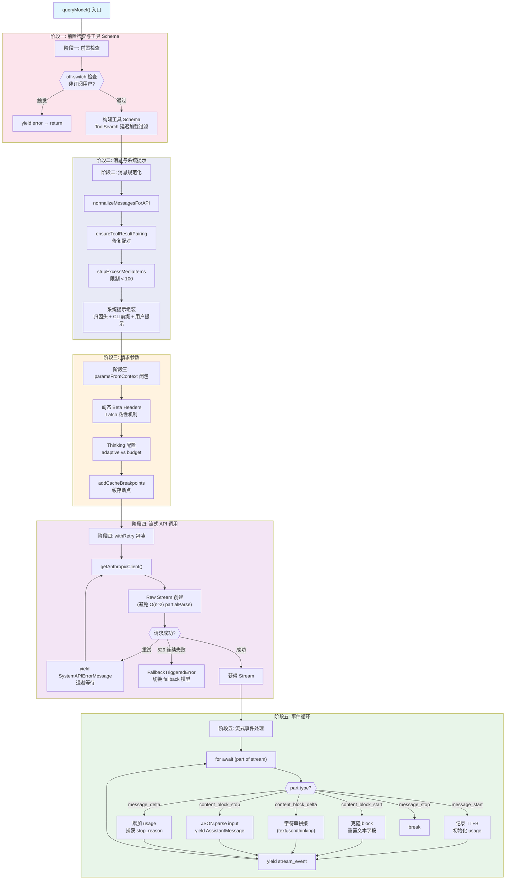

# 第6章 LLM API 调用与流式处理

## 6.1 架构概览

Claude Code 的 API 调用层由以下核心模块组成：

- **queryModel** (`src/services/api/claude.ts`)：API 请求构建与流式事件处理
- **getAnthropicClient** (`src/services/api/client.ts`)：SDK 客户端工厂（支持 1P/Bedrock/Vertex/Foundry）
- **withRetry** (`src/services/api/withRetry.ts`)：重试框架（退避策略、529 处理、模型降级）
- **StreamingToolExecutor** (`src/services/tools/StreamingToolExecutor.ts`)：流式工具并发执行
- **cost-tracker** (`src/cost-tracker.ts`)：成本追踪与持久化

### 代码流程图：queryModel 五阶段流水线



## 6.2 queryModel() 函数的完整结构

`queryModel` 是核心 API 调用函数，定义在 `src/services/api/claude.ts` 第1017行。它是一个异步生成器，产出三种事件类型：

```typescript
// src/services/api/claude.ts 第1017-1027行
async function* queryModel(
  messages: Message[],
  systemPrompt: SystemPrompt,
  thinkingConfig: ThinkingConfig,
  tools: Tools,
  signal: AbortSignal,
  options: Options,
): AsyncGenerator<
  StreamEvent | AssistantMessage | SystemAPIErrorMessage,
  void
> {
```

整个函数分为五个大阶段。

### 6.2.1 阶段一：前置检查与工具 Schema 构建（第1028-1257行）

**Off-switch 检查**（第1031-1049行）：

```typescript
// src/services/api/claude.ts 第1031-1042行
if (
  !isClaudeAISubscriber() &&
  isNonCustomOpusModel(options.model) &&
  (await getDynamicConfig_BLOCKS_ON_INIT<{ activated: boolean }>(
    'tengu-off-switch', { activated: false },
  )).activated
) {
  logEvent('tengu_off_switch_query', {})
  yield getAssistantMessageFromError(new Error(CUSTOM_OFF_SWITCH_MESSAGE), options.model)
  return
}
```

Off-switch 只对非订阅用户的非自定义 Opus 模型生效。这是一个紧急关停机制。

**工具 Schema 构建**（第1064-1257行）：

```typescript
// src/services/api/claude.ts 第1235-1246行
const toolSchemas = await Promise.all(
  filteredTools.map(tool =>
    toolToAPISchema(tool, {
      getToolPermissionContext: options.getToolPermissionContext,
      tools,
      agents: options.agents,
      allowedAgentTypes: options.allowedAgentTypes,
      model: options.model,
      deferLoading: willDefer(tool),
    }),
  ),
)
```

关键逻辑：

- **Tool Search**：启用时，未被发现的 deferred tools 不会发送给 API（通过 `defer_loading` 标记），减少 token 消耗
- **LSP 延迟加载**：LSP 初始化未完成时，LSP 工具标记为 deferred
- **全局缓存策略**：MCP 工具是 per-user 的，存在时不能使用全局缓存 scope

### 6.2.2 阶段二：消息规范化与系统提示装配（第1260-1396行）

```typescript
// src/services/api/claude.ts 第1266行
let messagesForAPI = normalizeMessagesForAPI(messages, filteredTools)

// 修复 tool_use/tool_result 配对
messagesForAPI = ensureToolResultPairing(messagesForAPI)

// 剥离 advisor blocks（无 beta header 时 API 会拒绝）
if (!betas.includes(ADVISOR_BETA_HEADER)) {
  messagesForAPI = stripAdvisorBlocks(messagesForAPI)
}

// 限制媒体项数量 < 100
messagesForAPI = stripExcessMediaItems(messagesForAPI, API_MAX_MEDIA_PER_REQUEST)
```

系统提示的最终组装：

```typescript
// src/services/api/claude.ts 第1358-1369行
systemPrompt = asSystemPrompt(
  [
    getAttributionHeader(fingerprint),       // 归因头
    getCLISyspromptPrefix({ ... }),           // CLI 前缀
    ...systemPrompt,                          // 用户/默认系统提示
    ...(advisorModel ? [ADVISOR_TOOL_INSTRUCTIONS] : []),
    ...(injectChromeHere ? [CHROME_TOOL_SEARCH_INSTRUCTIONS] : []),
  ].filter(Boolean),
)
```

### 6.2.3 阶段三：请求参数构建（paramsFromContext）（第1538-1729行）

`paramsFromContext` 是一个闭包，在每次重试时被调用来生成请求参数：

```typescript
// src/services/api/claude.ts 第1538-1729行
const paramsFromContext = (retryContext: RetryContext) => {
  const betasParams = [...betas]

  // 动态 beta headers
  // ...Sonnet 1M, Bedrock, effort, task_budget, structured_outputs

  const maxOutputTokens =
    retryContext?.maxTokensOverride ||
    options.maxOutputTokensOverride ||
    getMaxOutputTokensForModel(options.model)

  // Thinking 配置
  let thinking: BetaMessageStreamParams['thinking'] | undefined = undefined
  if (hasThinking && modelSupportsThinking(options.model)) {
    if (modelSupportsAdaptiveThinking(options.model)) {
      thinking = { type: 'adaptive' }
    } else {
      let thinkingBudget = getMaxThinkingTokensForModel(options.model)
      thinkingBudget = Math.min(maxOutputTokens - 1, thinkingBudget)
      thinking = { budget_tokens: thinkingBudget, type: 'enabled' }
    }
  }

  return {
    model: normalizeModelStringForAPI(options.model),
    messages: addCacheBreakpoints(messagesForAPI, ...),
    system, tools: allTools, tool_choice: options.toolChoice,
    ...(useBetas && { betas: betasParams }),
    metadata: getAPIMetadata(),
    max_tokens: maxOutputTokens,
    thinking,
    // ...temperature, context_management, speed 等
  }
}
```

**Thinking 配置的选择逻辑**：

1. 如果模型支持 adaptive thinking -> 使用 `{ type: 'adaptive' }`（无预算限制）
2. 否则使用 enabled + budget_tokens（budget = min(maxOutput-1, modelDefault)）

**Beta Headers 的 Latch 机制**（第1405-1456行）：

```typescript
// src/services/api/claude.ts 第1412-1422行
let afkHeaderLatched = getAfkModeHeaderLatched() === true
if (feature('TRANSCRIPT_CLASSIFIER')) {
  if (!afkHeaderLatched && isAgenticQuery && shouldIncludeFirstPartyOnlyBetas()
      && (autoModeStateModule?.isAutoModeActive() ?? false)) {
    afkHeaderLatched = true
    setAfkModeHeaderLatched(true)
  }
}
```

Latch 是一个"粘性开关"设计：一旦某个 beta header 在会话中首次发送，就在整个会话中持续发送。这防止了中途切换 header 导致服务端缓存失效（约 50-70K tokens 的缓存代价）。

### 6.2.4 阶段四：流式 API 调用（第1776-2304行）

#### 为什么使用 Raw Stream

```typescript
// src/services/api/claude.ts 第1818-1832行
// Use raw stream instead of BetaMessageStream to avoid O(n^2) partial JSON parsing
// BetaMessageStream calls partialParse() on every input_json_delta, which we don't need
// since we handle tool input accumulation ourselves
const result = await anthropic.beta.messages
  .create(
    { ...params, stream: true },
    { signal, ...(clientRequestId && {
        headers: { [CLIENT_REQUEST_ID_HEADER]: clientRequestId },
      }),
    },
  )
  .withResponse()
```

使用 Raw Stream 而非 `BetaMessageStream` 的原因：

- `BetaMessageStream` 在每个 `input_json_delta` 上执行 `partialParse()`，时间复杂度是 O(n^2)
- Claude Code 自己管理 tool input 的字符串拼接，不需要部分 JSON 解析
- Raw Stream 的开销更小，且给予更精细的控制

#### withRetry 包装

```typescript
// src/services/api/claude.ts 第1778-1846行
const generator = withRetry(
  () => getAnthropicClient({
    maxRetries: 0,  // 禁用 SDK 自动重试，改用手动实现
    model: options.model,
    fetchOverride: options.fetchOverride,
    source: options.querySource,
  }),
  async (anthropic, attempt, context) => {
    // ...构建参数、发送请求
    const result = await anthropic.beta.messages.create(...)
    streamRequestId = result.request_id
    streamResponse = result.response
    return result.data
  },
  { model: options.model, fallbackModel: options.fallbackModel, ... },
)

// 消费 withRetry 产出的 system error messages
let e
do {
  e = await generator.next()
  if (!('controller' in e.value)) {
    yield e.value  // yield API error messages
  }
} while (!e.done)
stream = e.value as Stream<BetaRawMessageStreamEvent>
```

`withRetry` 返回的是一个 AsyncGenerator：

- 每次重试前 yield 一个 `SystemAPIErrorMessage`（包含延迟信息）
- 最终 return 重试成功后的结果

### 6.2.5 阶段五：流式事件处理循环（第1940-2304行）

```typescript
// src/services/api/claude.ts 第1940行
for await (const part of stream) {
  resetStreamIdleTimer()
  // ...stall detection

  switch (part.type) {
    case 'message_start': { ... }
    case 'content_block_start': { ... }
    case 'content_block_delta': { ... }
    case 'content_block_stop': { ... }
    case 'message_delta': { ... }
    case 'message_stop': break
  }

  yield { type: 'stream_event', event: part, ... }
}
```

逐个事件类型讲解：

**message_start**（第1980-1993行）：

```typescript
case 'message_start': {
  partialMessage = part.message
  ttftMs = Date.now() - start
  usage = updateUsage(usage, part.message?.usage)
  // 捕获 research 字段（仅内部用户）
  break
}
```

记录 TTFB（Time To First Byte），初始化 partialMessage。

**content_block_start**（第1995-2051行）：

```typescript
case 'content_block_start':
  switch (part.content_block.type) {
    case 'tool_use':
      contentBlocks[part.index] = { ...part.content_block, input: '' }
      break
    case 'server_tool_use':
      contentBlocks[part.index] = { ...part.content_block, input: '' }
      if ((part.content_block.name as string) === 'advisor') {
        isAdvisorInProgress = true
      }
      break
    case 'text':
      contentBlocks[part.index] = { ...part.content_block, text: '' }
      break
    case 'thinking':
      contentBlocks[part.index] = {
        ...part.content_block, thinking: '', signature: '',
      }
      break
    default:
      contentBlocks[part.index] = { ...part.content_block }
      break
  }
```

关键设计：所有 content block 都被克隆后存入 `contentBlocks` 数组，并重置文本字段为空字符串。这是因为 SDK 有时会在 `content_block_start` 中包含文本，然后在 `content_block_delta` 中重复发送相同文本。

**content_block_delta**（第2053-2169行）：

```typescript
case 'content_block_delta': {
  const contentBlock = contentBlocks[part.index]
  switch (delta.type) {
    case 'input_json_delta':
      contentBlock.input += delta.partial_json   // 字符串拼接
      break
    case 'text_delta':
      contentBlock.text += delta.text
      break
    case 'signature_delta':
      contentBlock.signature = delta.signature
      break
    case 'thinking_delta':
      contentBlock.thinking += delta.thinking
      break
  }
}
```

核心操作就是字符串拼接。tool_use 的 input 被存为原始 JSON 字符串（不做部分解析），直到 `content_block_stop` 时才一次性解析。这就是避免 O(n^2) 的关键。

**content_block_stop**（第2171-2211行）：

```typescript
case 'content_block_stop': {
  const contentBlock = contentBlocks[part.index]
  const m: AssistantMessage = {
    message: {
      ...partialMessage,
      content: normalizeContentFromAPI(
        [contentBlock] as BetaContentBlock[], tools, options.agentId,
      ),
    },
    requestId: streamRequestId ?? undefined,
    type: 'assistant',
    uuid: randomUUID(),
    timestamp: new Date().toISOString(),
  }
  newMessages.push(m)
  yield m
}
```

每个 content block 完成时，立即构造并 yield 一个 `AssistantMessage`。`normalizeContentFromAPI` 负责将累积的 JSON 字符串解析为 tool input 对象。

**message_delta**（第2213-2293行）：

```typescript
case 'message_delta': {
  usage = updateUsage(usage, part.usage)
  stopReason = part.delta.stop_reason

  // 直接属性变异（不是对象替换）
  const lastMsg = newMessages.at(-1)
  if (lastMsg) {
    lastMsg.message.usage = usage
    lastMsg.message.stop_reason = stopReason
  }

  // 计算成本
  const costUSDForPart = calculateUSDCost(resolvedModel, usage)
  costUSD += addToTotalSessionCost(costUSDForPart, usage, options.model)

  // max_tokens 处理
  if (stopReason === 'max_tokens') {
    yield createAssistantAPIErrorMessage({
      content: `...exceeded the ${maxOutputTokens} output token maximum...`,
      apiError: 'max_output_tokens',
    })
  }
}
```

**直接属性变异**（而非对象替换）是一个关键设计决策。注释明确解释了原因：transcript 写入队列持有对 `message.message` 的引用，使用 100ms 的延迟刷新。如果创建新对象，队列持有的旧引用就会过时。

**message_stop**（第2295-2296行）：

```typescript
case 'message_stop':
  break
```

不需要特殊处理，后续的清理逻辑在循环外。

## 6.3 StreamingToolExecutor 的并发执行策略

### 6.3.1 核心状态模型

```typescript
// src/services/tools/StreamingToolExecutor.ts 第19行
type ToolStatus = 'queued' | 'executing' | 'completed' | 'yielded'

type TrackedTool = {
  id: string
  block: ToolUseBlock
  assistantMessage: AssistantMessage
  status: ToolStatus
  isConcurrencySafe: boolean
  promise?: Promise<void>
  results?: Message[]
  pendingProgress: Message[]
  contextModifiers?: Array<(context: ToolUseContext) => ToolUseContext>
}
```

每个工具有四个状态：queued -> executing -> completed -> yielded。

### 6.3.2 并发控制规则

```typescript
// src/services/tools/StreamingToolExecutor.ts 第129-135行
private canExecuteTool(isConcurrencySafe: boolean): boolean {
  const executingTools = this.tools.filter(t => t.status === 'executing')
  return (
    executingTools.length === 0 ||
    (isConcurrencySafe && executingTools.every(t => t.isConcurrencySafe))
  )
}
```

规则简明：

- 如果没有工具在执行，任何工具都可以开始
- 如果有工具在执行，只有当"所有执行中的工具"和"当前工具"都标记为 `isConcurrencySafe` 时才能并发
- 非并发安全的工具必须独占执行

实际效果：多个 Read/Grep 可以并发执行，但 Bash/Edit 必须独占。

### 6.3.3 Bash 错误级联

```typescript
// src/services/tools/StreamingToolExecutor.ts 第358-363行
if (tool.block.name === BASH_TOOL_NAME) {
  this.hasErrored = true
  this.erroredToolDescription = this.getToolDescription(tool)
  this.siblingAbortController.abort('sibling_error')
}
```

只有 Bash 工具的错误会触发级联取消。原因是 Bash 命令之间经常有隐式依赖（如 `mkdir` 失败后续命令无意义），而 Read/WebFetch 等工具是独立的。

`siblingAbortController` 是 `toolUseContext.abortController` 的子控制器。取消它只会影响同级工具，不会终止整个 query 循环。

### 6.3.4 进度消息的即时分发

```typescript
// src/services/tools/StreamingToolExecutor.ts 第367-374行
if (update.message.type === 'progress') {
  tool.pendingProgress.push(update.message)
  if (this.progressAvailableResolve) {
    this.progressAvailableResolve()
    this.progressAvailableResolve = undefined
  }
}
```

进度消息（如工具执行状态）通过 Promise resolve 机制即时通知消费者，不需要等待工具完成。`getRemainingResults()` 同时等待工具完成和进度可用：

```typescript
// src/services/tools/StreamingToolExecutor.ts 第472-484行
const progressPromise = new Promise<void>(resolve => {
  this.progressAvailableResolve = resolve
})
if (executingPromises.length > 0) {
  await Promise.race([...executingPromises, progressPromise])
}
```

## 6.4 withRetry 重试框架

### 6.4.1 签名与核心循环

```typescript
// src/services/api/withRetry.ts 第170-178行
export async function* withRetry<T>(
  getClient: () => Promise<Anthropic>,
  operation: (client: Anthropic, attempt: number, context: RetryContext) => Promise<T>,
  options: RetryOptions,
): AsyncGenerator<SystemAPIErrorMessage, T> {
```

`withRetry` 是一个泛型异步生成器：

- yield 类型：`SystemAPIErrorMessage`（重试前的错误通知）
- return 类型：`T`（操作成功的结果）

核心循环逻辑：

```typescript
// src/services/api/withRetry.ts 第189-514行
for (let attempt = 1; attempt <= maxRetries + 1; attempt++) {
  if (options.signal?.aborted) throw new APIUserAbortError()

  try {
    // 获取或复用客户端
    if (client === null || isAuthError(lastError) || isStaleConnection(lastError)) {
      client = await getClient()
    }
    return await operation(client, attempt, retryContext)
  } catch (error) {
    // ...错误处理与重试逻辑
  }
}
```

### 6.4.2 529 处理策略

```typescript
// src/services/api/withRetry.ts 第326-365行
if (is529Error(error) && (process.env.FALLBACK_FOR_ALL_PRIMARY_MODELS ||
    (!isClaudeAISubscriber() && isNonCustomOpusModel(options.model)))) {
  consecutive529Errors++
  if (consecutive529Errors >= MAX_529_RETRIES) {
    if (options.fallbackModel) {
      throw new FallbackTriggeredError(options.model, options.fallbackModel)
    }
    // 外部用户：抛出友好错误
    if (process.env.USER_TYPE === 'external' && !isPersistentRetryEnabled()) {
      throw new CannotRetryError(new Error(REPEATED_529_ERROR_MESSAGE), retryContext)
    }
  }
}
```

529 (Overloaded) 处理的三级策略：

1. **前3次**：正常重试加退避
2. **第3次后**：如果有 fallbackModel，抛出 `FallbackTriggeredError` 触发模型切换
3. **无 fallback**：外部用户直接报错，内部用户（ant）可以无限重试

**Foreground vs Background 区分**：

```typescript
// src/services/api/withRetry.ts 第62-82行
const FOREGROUND_529_RETRY_SOURCES = new Set<QuerySource>([
  'repl_main_thread', 'sdk', 'agent:custom', 'agent:default',
  'compact', 'hook_agent', 'side_question', 'auto_mode', ...
])
```

后台任务（摘要生成、标题生成等）在遇到 529 时立即失败，不重试。原因是在容量紧张时，每次重试都是 3-10 倍的网关放大。

### 6.4.3 退避策略

```typescript
// src/services/api/withRetry.ts 第530-548行
export function getRetryDelay(
  attempt: number,
  retryAfterHeader?: string | null,
  maxDelayMs = 32000,
): number {
  // 优先使用服务器 Retry-After 头
  if (retryAfterHeader) {
    const seconds = parseInt(retryAfterHeader, 10)
    if (!isNaN(seconds)) return seconds * 1000
  }
  // 指数退避 + 25% 抖动
  const baseDelay = Math.min(BASE_DELAY_MS * Math.pow(2, attempt - 1), maxDelayMs)
  const jitter = Math.random() * 0.25 * baseDelay
  return baseDelay + jitter
}
```

退避公式：`min(500ms * 2^(attempt-1), 32s) + random(0, 25%)`

对于 persistent 模式（无人值守会话），最大退避上限提升到 5 分钟，且总等待时间上限 6 小时。

### 6.4.4 Fast Mode 降级

```typescript
// src/services/api/withRetry.ts 第267-304行
if (wasFastModeActive && error instanceof APIError &&
    (error.status === 429 || is529Error(error))) {
  const retryAfterMs = getRetryAfterMs(error)
  if (retryAfterMs !== null && retryAfterMs < SHORT_RETRY_THRESHOLD_MS) {
    // 短延迟（<20s）：保持 fast mode 重试（保留缓存）
    await sleep(retryAfterMs, options.signal, { abortError })
    continue
  }
  // 长延迟：进入 cooldown（切换到标准速度）
  const cooldownMs = Math.max(retryAfterMs ?? 30min, 10min)
  triggerFastModeCooldown(Date.now() + cooldownMs, cooldownReason)
  retryContext.fastMode = false
  continue
}
```

Fast Mode 的降级策略：

- retry-after < 20s：保持 fast mode 重试（保留 prompt cache 缓存键一致性）
- retry-after >= 20s 或未知：进入 cooldown 周期（至少 10 分钟），切回标准速度

### 6.4.5 Persistent Retry 模式

```typescript
// src/services/api/withRetry.ts 第477-506行
if (persistent) {
  let remaining = delayMs
  while (remaining > 0) {
    if (options.signal?.aborted) throw new APIUserAbortError()
    if (error instanceof APIError) {
      yield createSystemAPIErrorMessage(error, remaining, reportedAttempt, maxRetries)
    }
    const chunk = Math.min(remaining, HEARTBEAT_INTERVAL_MS)  // 30s
    await sleep(chunk, options.signal, { abortError })
    remaining -= chunk
  }
  // 钳制 attempt 使 for-loop 永不终止
  if (attempt >= maxRetries) attempt = maxRetries
}
```

Persistent 模式通过 `CLAUDE_CODE_UNATTENDED_RETRY` 环境变量启用（仅内部用户）。长等待被切分为 30 秒的心跳块，每次心跳 yield 一个 SystemAPIErrorMessage，防止宿主环境认为会话空闲。

## 6.5 客户端工厂（getAnthropicClient）

```typescript
// src/services/api/client.ts 第88-316行
export async function getAnthropicClient({
  apiKey, maxRetries, model, fetchOverride, source,
}: { ... }): Promise<Anthropic> {
```

工厂模式支持四种 API provider：

| Provider | 环境变量 | SDK 类 |
|----------|----------|--------|
| 1P (First Party) | 默认 | `Anthropic` |
| Bedrock | `CLAUDE_CODE_USE_BEDROCK` | `AnthropicBedrock` |
| Foundry (Azure) | `CLAUDE_CODE_USE_FOUNDRY` | `AnthropicFoundry` |
| Vertex AI | `CLAUDE_CODE_USE_VERTEX` | `AnthropicVertex` |

每种 provider 有独立的认证流程：

- **1P**：API Key 或 OAuth（Claude.ai 订阅用户）
- **Bedrock**：AWS credentials（支持 Bearer Token 和 IAM）
- **Foundry**：Azure AD Token Provider 或 API Key
- **Vertex**：Google Auth（支持 service account 和 ADC）

**Fetch 包装**（第358-389行）：

```typescript
// src/services/api/client.ts 第358-389行
function buildFetch(
  fetchOverride: ClientOptions['fetch'],
  source: string | undefined,
): ClientOptions['fetch'] {
  const inner = fetchOverride ?? globalThis.fetch
  const injectClientRequestId =
    getAPIProvider() === 'firstParty' && isFirstPartyAnthropicBaseUrl()
  return (input, init) => {
    const headers = new Headers(init?.headers)
    if (injectClientRequestId && !headers.has(CLIENT_REQUEST_ID_HEADER)) {
      headers.set(CLIENT_REQUEST_ID_HEADER, randomUUID())
    }
    // ...日志
    return inner(input, { ...init, headers })
  }
}
```

每个请求注入 `x-client-request-id` 头（仅 1P），用于超时场景下与服务端日志关联。

## 6.6 成本追踪实现

### 6.6.1 实时成本计算

成本在 `message_delta` 事件中实时计算：

```typescript
// src/services/api/claude.ts 第2251-2256行
const costUSDForPart = calculateUSDCost(resolvedModel, usage)
costUSD += addToTotalSessionCost(costUSDForPart, usage, options.model)
```

`addToTotalSessionCost` 做三件事：

```typescript
// src/cost-tracker.ts 第278-323行
export function addToTotalSessionCost(
  cost: number, usage: Usage, model: string,
): number {
  // 1. 按模型累加用量
  const modelUsage = addToTotalModelUsage(cost, usage, model)

  // 2. 更新全局状态
  addToTotalCostState(cost, modelUsage, model)

  // 3. OpenTelemetry 指标上报
  getCostCounter()?.add(cost, attrs)
  getTokenCounter()?.add(usage.input_tokens, { ...attrs, type: 'input' })
  getTokenCounter()?.add(usage.output_tokens, { ...attrs, type: 'output' })

  // 4. Advisor 递归计费
  for (const advisorUsage of getAdvisorUsage(usage)) {
    const advisorCost = calculateUSDCost(advisorUsage.model, advisorUsage)
    totalCost += addToTotalSessionCost(advisorCost, advisorUsage, advisorUsage.model)
  }
  return totalCost
}
```

### 6.6.2 持久化与恢复

```typescript
// src/cost-tracker.ts 第143-175行
export function saveCurrentSessionCosts(fpsMetrics?: FpsMetrics): void {
  saveCurrentProjectConfig(current => ({
    ...current,
    lastCost: getTotalCostUSD(),
    lastAPIDuration: getTotalAPIDuration(),
    lastModelUsage: Object.fromEntries(
      Object.entries(getModelUsage()).map(([model, usage]) => [
        model, { inputTokens: usage.inputTokens, outputTokens: usage.outputTokens, ... },
      ]),
    ),
    lastSessionId: getSessionId(),
  }))
}
```

成本数据保存到项目级配置文件（`.claude/projects/...`），以 sessionId 为键。恢复时通过 `restoreCostStateForSession(sessionId)` 加载。

## 6.7 非流式 Fallback 机制

当流式传输失败时（网络错误、空流等），系统会降级到非流式 API 调用：

```typescript
// src/services/api/claude.ts（流式 catch 块中）
// 检测空流
if (!partialMessage || (newMessages.length === 0 && !stopReason)) {
  throw new Error('Stream ended without receiving any events')
}
```

非流式 fallback 通过 `executeNonStreamingRequest` 实现：

```typescript
// src/services/api/claude.ts 第818-917行
export async function* executeNonStreamingRequest(
  clientOptions, retryOptions, paramsFromContext, onAttempt, captureRequest,
  originatingRequestId?,
): AsyncGenerator<SystemAPIErrorMessage, BetaMessage> {
  const fallbackTimeoutMs = getNonstreamingFallbackTimeoutMs()
  // 远程会话 120s，本地 300s
  const generator = withRetry(
    () => getAnthropicClient({ ... }),
    async (anthropic, attempt, context) => {
      const adjustedParams = adjustParamsForNonStreaming(retryParams, MAX_NON_STREAMING_TOKENS)
      return await anthropic.beta.messages.create(
        { ...adjustedParams, model: normalizeModelStringForAPI(...) },
        { signal, timeout: fallbackTimeoutMs },
      )
    },
    { ... },
  )
}
```

非流式 fallback 会调整 `max_tokens` 上限（`MAX_NON_STREAMING_TOKENS`），因为非流式请求有更严格的超时限制。

可通过 `CLAUDE_CODE_DISABLE_NONSTREAMING_FALLBACK` 环境变量或 statsig gate 禁用。禁用原因：当启用 StreamingToolExecutor 时，中途 fallback 会导致工具被执行两次。

## 6.8 Idle Watchdog 和 Stall 检测

### 6.8.1 Idle Watchdog

```typescript
// src/services/api/claude.ts 第1874-1928行
const STREAM_IDLE_TIMEOUT_MS =
  parseInt(process.env.CLAUDE_STREAM_IDLE_TIMEOUT_MS || '', 10) || 90_000
const STREAM_IDLE_WARNING_MS = STREAM_IDLE_TIMEOUT_MS / 2

function resetStreamIdleTimer(): void {
  clearStreamIdleTimers()
  if (!streamWatchdogEnabled) return

  streamIdleWarningTimer = setTimeout(() => {
    logForDebugging(`Streaming idle warning: no chunks for ${warnMs/1000}s`)
  }, STREAM_IDLE_WARNING_MS)

  streamIdleTimer = setTimeout(() => {
    streamIdleAborted = true
    releaseStreamResources()
  }, STREAM_IDLE_TIMEOUT_MS)
}
```

Watchdog 机制：

- 每收到一个 chunk 就重置定时器
- 45 秒无 chunk：打印警告
- 90 秒无 chunk：中止流并释放资源
- 通过 `CLAUDE_ENABLE_STREAM_WATCHDOG` 环境变量启用
- 与 SDK 的 request timeout 互补（SDK timeout 只覆盖初始 fetch，不覆盖流式 body）

### 6.8.2 Stall 检测

```typescript
// src/services/api/claude.ts 第1936-1966行
const STALL_THRESHOLD_MS = 30_000  // 30 seconds

for await (const part of stream) {
  const now = Date.now()
  if (lastEventTime !== null) {
    const timeSinceLastEvent = now - lastEventTime
    if (timeSinceLastEvent > STALL_THRESHOLD_MS) {
      stallCount++
      totalStallTime += timeSinceLastEvent
      logEvent('tengu_streaming_stall', { ... })
    }
  }
  lastEventTime = now
}
```

Stall 检测是被动的（只在收到下一个 chunk 时才能检测到），与 Watchdog 的主动 setTimeout 互补。Stall 只记录日志不中断流，用于监控和诊断。

## 6.9 max_output_tokens 恢复策略

当模型回复被截断（`stop_reason === 'max_tokens'` 或 `'model_context_window_exceeded'`），queryLoop 执行分级恢复：

**第一级：Escalate（第1195-1221行）**

```typescript
// src/query.ts 第1199-1220行
if (capEnabled && maxOutputTokensOverride === undefined &&
    !process.env.CLAUDE_CODE_MAX_OUTPUT_TOKENS) {
  // 从默认 8k 升级到 64k (ESCALATED_MAX_TOKENS)
  state = { ...state, maxOutputTokensOverride: ESCALATED_MAX_TOKENS,
            transition: { reason: 'max_output_tokens_escalate' } }
  continue
}
```

同一个请求以更大的 max_tokens 重试（不注入任何消息），用户无感知。

**第二级：Multi-turn Recovery（第1223-1252行）**

```typescript
// src/query.ts 第1224-1229行
const recoveryMessage = createUserMessage({
  content:
    `Output token limit hit. Resume directly - no apology, no recap. ` +
    `Pick up mid-thought if that is where the cut happened. Break remaining work into smaller pieces.`,
  isMeta: true,
})
```

注入一条隐藏的用户消息，指示模型从中断处继续。最多重试 `MAX_OUTPUT_TOKENS_RECOVERY_LIMIT = 3` 次。

**第三级：放弃恢复**

```typescript
// src/query.ts 第1254-1256行
// Recovery exhausted - surface the withheld error now.
yield lastMessage
```

3 次恢复后仍然被截断，暴露被暂扣的错误消息给调用方。

## 6.10 小结

Claude Code 的 API 调用层体现了几个工程原则：

1. **渐进式降级**：流式 -> 非流式 fallback -> 模型 fallback -> 错误暴露
2. **缓存感知**：Beta header latch 机制、fast mode 短延迟重试都是为了保护服务端 prompt cache
3. **可观测性**：每个关键路径都有 `logEvent`、`queryCheckpoint`、`logForDiagnosticsNoPII` 三级遥测
4. **资源管理**：`releaseStreamResources()` 显式释放 TLS/socket 缓冲区（V8 堆外内存）；`siblingAbortController` 做工具级隔离
5. **并发控制**：StreamingToolExecutor 通过简单的 `isConcurrencySafe` 标记实现安全的并行工具执行，Bash 错误级联保护依赖链
