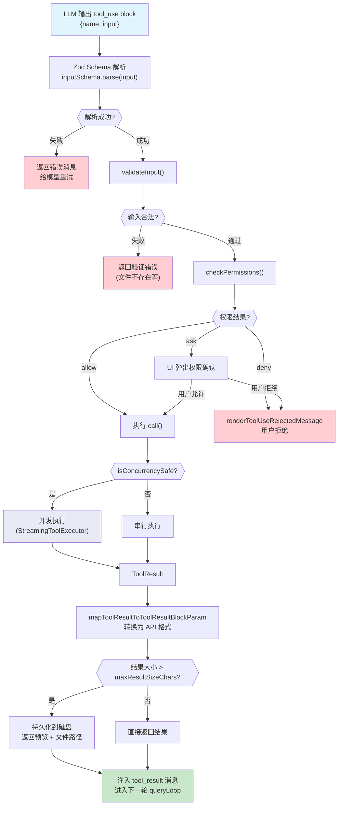

# 第7章 工具系统架构与实现

## 7.1 概述

Claude Code 的工具系统是整个产品的执行引擎。模型通过工具与外部世界交互：执行命令、读写文件、搜索代码、启动子 agent。本章将从 `Tool` 泛型接口开始，逐层深入工具的注册管道、执行上下文、延迟加载机制，最后对 BashTool 和 FileEditTool 做逐行级别的源码分析。

### 代码流程图：工具调用执行流水线



核心源码文件：

- `src/Tool.ts` -- Tool 泛型接口定义与 `buildTool()` 工厂函数
- `src/tools.ts` -- 工具注册与过滤管道
- `src/tools/BashTool/BashTool.tsx` -- Shell 命令执行
- `src/tools/FileEditTool/FileEditTool.ts` -- 文件编辑
- `src/tools/FileReadTool/FileReadTool.ts` -- 文件读取
- `src/tools/GrepTool/GrepTool.ts` -- 基于 ripgrep 的搜索
- `src/tools/AgentTool/AgentTool.tsx` -- 子 agent 启动

## 7.2 Tool 泛型接口完整设计

### 7.2.1 类型签名

```typescript
// src/Tool.ts
export type Tool<
  Input extends AnyObject = AnyObject,
  Output = unknown,
  P extends ToolProgressData = ToolProgressData,
> = {
  // ... 完整字段定义
}
```

三个泛型参数：

| 参数 | 约束 | 含义 |
|------|------|------|
| `Input` | `extends AnyObject` | 工具输入的 Zod schema 类型，必须解析为 `{ [key: string]: unknown }` |
| `Output` | 无约束 | 工具执行结果的类型 |
| `P` | `extends ToolProgressData` | 进度事件的类型，用于流式进度上报 |

### 7.2.2 核心字段逐一讲解

**1. 标识与元数据**

```typescript
readonly name: string
aliases?: string[]
searchHint?: string
```

- `name`: 工具的主标识符，全局唯一。模型在 `tool_use` block 中通过这个名字调用工具。
- `aliases`: 工具重命名后的向后兼容别名。`toolMatchesName()` 函数同时匹配主名和别名：

```typescript
export function toolMatchesName(
  tool: { name: string; aliases?: string[] },
  name: string,
): boolean {
  return tool.name === name || (tool.aliases?.includes(name) ?? false)
}
```

- `searchHint`: 3-10 个词的能力短语，供 ToolSearch 做关键词匹配。优先使用工具名中没有的词（如 NotebookEdit 的 hint 是 `'jupyter'`）。

**2. Schema 定义**

```typescript
readonly inputSchema: Input
readonly inputJSONSchema?: ToolInputJSONSchema
outputSchema?: z.ZodType<unknown>
```

- `inputSchema`: 用 Zod 定义的输入参数 schema。模型生成的 JSON 参数会经过这个 schema 的解析和校验。
- `inputJSONSchema`: MCP 工具的替代方案，直接以 JSON Schema 格式指定输入（不需要经过 Zod 转换）。
- `outputSchema`: 输出类型的 Zod schema，目前是可选的（TODO 注释表明将来会变为必需）。

**3. 核心执行方法**

```typescript
call(
  args: z.infer<Input>,
  context: ToolUseContext,
  canUseTool: CanUseToolFn,
  parentMessage: AssistantMessage,
  onProgress?: ToolCallProgress<P>,
): Promise<ToolResult<Output>>
```

这是工具的主执行函数。五个参数：
- `args`: 经过 Zod schema 解析后的输入参数
- `context`: 执行上下文（见 7.3 节详解）
- `canUseTool`: 权限检查回调
- `parentMessage`: 触发此工具调用的 assistant 消息
- `onProgress`: 可选的进度上报回调

返回 `ToolResult<T>` 类型：

```typescript
export type ToolResult<T> = {
  data: T
  newMessages?: (UserMessage | AssistantMessage | AttachmentMessage | SystemMessage)[]
  contextModifier?: (context: ToolUseContext) => ToolUseContext
  mcpMeta?: { _meta?: Record<string, unknown>; structuredContent?: Record<string, unknown> }
}
```

`contextModifier` 允许工具修改后续的执行上下文，但仅对非并发安全的工具生效。

**4. 权限控制方法**

```typescript
validateInput?(input, context): Promise<ValidationResult>
checkPermissions(input, context): Promise<PermissionResult>
preparePermissionMatcher?(input): Promise<(pattern: string) => boolean>
```

执行顺序：`validateInput` -> `checkPermissions`。

- `validateInput`: 校验输入的合法性（如文件是否存在、字符串是否可找到），返回 `{ result: true }` 或包含错误信息的对象。这一步不涉及 UI 交互。
- `checkPermissions`: 检查用户权限。由工具自身实现特定逻辑（如 BashTool 调用 `bashToolHasPermission`），通用权限逻辑在 `permissions.ts` 中。
- `preparePermissionMatcher`: 为 hook 的 `if` 条件准备匹配器。一次解析、多次匹配，避免重复开销。

**5. 行为特征声明**

```typescript
isEnabled(): boolean
isConcurrencySafe(input): boolean
isReadOnly(input): boolean
isDestructive?(input): boolean
interruptBehavior?(): 'cancel' | 'block'
```

- `isEnabled`: 工具是否在当前环境下可用（如某些工具仅在 ant 内部启用）。
- `isConcurrencySafe`: 是否可以与其他工具并发执行。BashTool 的实现是 `this.isReadOnly?.(input) ?? false`，即只有只读命令才并发安全。
- `isReadOnly`: 是否只读操作。影响并发安全判定和安全分类器。
- `isDestructive`: 是否执行不可逆操作（删除、覆盖、发送）。默认 `false`。
- `interruptBehavior`: 用户提交新消息时的行为。`'cancel'` 停止并丢弃结果；`'block'` 继续运行，新消息等待。默认 `'block'`。

**6. 搜索与 UI 归类**

```typescript
isSearchOrReadCommand?(input): { isSearch: boolean; isRead: boolean; isList?: boolean }
```

判断工具调用是否为搜索/读取操作，用于 UI 中的折叠显示。GrepTool 固定返回 `{ isSearch: true, isRead: false }`。BashTool 则需要解析命令字符串来判断。

**7. 延迟加载相关**

```typescript
readonly shouldDefer?: boolean
readonly alwaysLoad?: boolean
```

- `shouldDefer`: 为 `true` 时，工具以 `defer_loading: true` 发送，需要通过 ToolSearch 才能调用。
- `alwaysLoad`: 为 `true` 时，即使 ToolSearch 启用，也始终发送完整 schema。MCP 工具可通过 `_meta['anthropic/alwaysLoad']` 设置。

**8. 结果大小控制**

```typescript
maxResultSizeChars: number
```

工具结果超过此字符数时，会被持久化到磁盘，模型收到的是预览 + 文件路径。FileReadTool 设为 `Infinity`，因为持久化会导致循环（Read -> 文件 -> Read）。

**9. 渲染方法族**

Tool 接口定义了大量渲染方法，对应工具生命周期的不同阶段：

| 方法 | 用途 |
|------|------|
| `renderToolUseMessage` | 渲染工具调用消息（输入参数可能不完整） |
| `renderToolResultMessage` | 渲染工具结果 |
| `renderToolUseProgressMessage` | 渲染执行中的进度 |
| `renderToolUseRejectedMessage` | 渲染权限拒绝消息 |
| `renderToolUseErrorMessage` | 渲染错误消息 |
| `renderGroupedToolUse` | 渲染并行工具调用的分组视图 |
| `renderToolUseTag` | 渲染工具调用后的附加标签（如超时、模型信息） |

还有两个重要的数据转换方法：

```typescript
mapToolResultToToolResultBlockParam(content: Output, toolUseID: string): ToolResultBlockParam
toAutoClassifierInput(input): unknown
```

- `mapToolResultToToolResultBlockParam`: 将工具结果转换为 API 可消费的 `ToolResultBlockParam` 格式。这是工具结果发回给模型的关键环节。
- `toAutoClassifierInput`: 将输入压缩为安全分类器可用的格式。返回空字符串表示跳过分类器。

### 7.2.3 辅助类型

```typescript
export type Tools = readonly Tool[]
```

`Tools` 是只读数组类型别名，方便在代码库中跟踪工具集合的传递和过滤。

```typescript
export type ToolCallProgress<P extends ToolProgressData = ToolProgressData> = (
  progress: ToolProgress<P>,
) => void
```

进度上报回调类型。`ToolProgress<P>` 包含 `toolUseID` 和类型化的 `data`。

## 7.3 buildTool() 工厂函数与默认值

### 7.3.1 设计动机

Tool 接口有 50+ 个字段/方法。如果每个工具都要实现全部方法，重复代码会很多。`buildTool()` 提供安全的默认值，让工具定义只需关注差异化的部分。

### 7.3.2 可默认的方法

```typescript
type DefaultableToolKeys =
  | 'isEnabled'
  | 'isConcurrencySafe'
  | 'isReadOnly'
  | 'isDestructive'
  | 'checkPermissions'
  | 'toAutoClassifierInput'
  | 'userFacingName'
```

### 7.3.3 默认值定义

```typescript
const TOOL_DEFAULTS = {
  isEnabled: () => true,
  isConcurrencySafe: (_input?: unknown) => false,
  isReadOnly: (_input?: unknown) => false,
  isDestructive: (_input?: unknown) => false,
  checkPermissions: (
    input: { [key: string]: unknown },
    _ctx?: ToolUseContext,
  ): Promise<PermissionResult> =>
    Promise.resolve({ behavior: 'allow', updatedInput: input }),
  toAutoClassifierInput: (_input?: unknown) => '',
  userFacingName: (_input?: unknown) => '',
}
```

关键设计原则是 **fail-closed**：
- `isConcurrencySafe` 默认 `false`：假设不安全，要求显式声明可并发
- `isReadOnly` 默认 `false`：假设有写操作
- `checkPermissions` 默认 `allow`：交给通用权限系统处理
- `toAutoClassifierInput` 默认空字符串：跳过分类器（安全相关工具必须覆写）

### 7.3.4 buildTool 实现

```typescript
export function buildTool<D extends AnyToolDef>(def: D): BuiltTool<D> {
  return {
    ...TOOL_DEFAULTS,
    userFacingName: () => def.name,
    ...def,
  } as BuiltTool<D>
}
```

展开顺序：`TOOL_DEFAULTS` -> `{ userFacingName: () => def.name }` -> `def`。后面的属性覆盖前面的，所以工具定义中的任何覆写都会生效。`userFacingName` 在默认值之后、`def` 之前展开，意味着如果工具没有指定 `userFacingName`，默认使用工具名。

类型层面，`BuiltTool<D>` 精确镜像运行时的 spread 语义：对于每个 defaultable key，如果 `D` 提供了，用 `D` 的类型；否则用 `TOOL_DEFAULTS` 的类型。

## 7.4 ToolUseContext 执行上下文

`ToolUseContext` 是工具执行时的全部运行时状态。这是一个庞大的类型，这里按功能分组讲解关键字段。

### 7.4.1 配置选项

```typescript
options: {
  commands: Command[]
  debug: boolean
  mainLoopModel: string
  tools: Tools
  verbose: boolean
  thinkingConfig: ThinkingConfig
  mcpClients: MCPServerConnection[]
  mcpResources: Record<string, ServerResource[]>
  isNonInteractiveSession: boolean
  agentDefinitions: AgentDefinitionsResult
  maxBudgetUsd?: number
  customSystemPrompt?: string
  appendSystemPrompt?: string
  querySource?: QuerySource
  refreshTools?: () => Tools
}
```

`refreshTools` 是一个回调，用于在 MCP 服务器中途连接后获取最新的工具列表。

### 7.4.2 状态管理

```typescript
abortController: AbortController
readFileState: FileStateCache
getAppState(): AppState
setAppState(f: (prev: AppState) => AppState): void
setAppStateForTasks?: (f: (prev: AppState) => AppState) => void
```

- `abortController`: 用于取消正在执行的工具调用。
- `readFileState`: 文件读取状态缓存。FileEditTool 用它来检测 "stale write"（文件被读取后又被外部修改）。
- `setAppStateForTasks`: 任务级别的状态更新，始终到达根 store。对于嵌套子 agent，普通 `setAppState` 是 no-op，但 `setAppStateForTasks` 始终有效。

### 7.4.3 消息与文件追踪

```typescript
messages: Message[]
updateFileHistoryState: (updater: (prev: FileHistoryState) => FileHistoryState) => void
updateAttributionState: (updater: (prev: AttributionState) => AttributionState) => void
contentReplacementState?: ContentReplacementState
```

- `messages`: 当前对话的完整消息列表。
- `contentReplacementState`: 工具结果预算的内容替换状态。用于在 query.ts 中应用聚合工具结果预算（Tool Result Budget，见第8章）。

### 7.4.4 UI 交互

```typescript
setToolJSX?: SetToolJSXFn
addNotification?: (notif: Notification) => void
sendOSNotification?: (opts: { message: string; notificationType: string }) => void
setStreamMode?: (mode: SpinnerMode) => void
```

BashTool 在命令执行期间通过 `setToolJSX` 显示进度 UI，执行完成后设为 `null` 清除。

## 7.5 工具注册管道

### 7.5.1 三层管道架构

`src/tools.ts` 定义了工具从定义到模型可见的三层管道：

```
getAllBaseTools() -> filterToolsByDenyRules() -> assembleToolPool()
```

### 7.5.2 getAllBaseTools(): 全量工具列表

```typescript
export function getAllBaseTools(): Tools {
  return [
    AgentTool,
    TaskOutputTool,
    BashTool,
    ...(hasEmbeddedSearchTools() ? [] : [GlobTool, GrepTool]),
    ExitPlanModeV2Tool,
    FileReadTool,
    FileEditTool,
    FileWriteTool,
    NotebookEditTool,
    WebFetchTool,
    TodoWriteTool,
    WebSearchTool,
    TaskStopTool,
    AskUserQuestionTool,
    SkillTool,
    EnterPlanModeTool,
    // ... 大量条件加载的工具
    ...(isToolSearchEnabledOptimistic() ? [ToolSearchTool] : []),
  ]
}
```

关键设计点：

**条件加载模式**：大量工具通过 feature flag 和环境变量条件加载。如 `feature('PROACTIVE')` 使用 `bun:bundle` 的编译期 feature flag，实现死代码消除：

```typescript
const SleepTool =
  feature('PROACTIVE') || feature('KAIROS')
    ? require('./tools/SleepTool/SleepTool.js').SleepTool
    : null
```

这种模式确保未启用的工具代码不会出现在最终产物中。

**嵌入式搜索工具排除**：当 ant 内部构建包含嵌入式 bfs/ugrep 时，`GlobTool` 和 `GrepTool` 被排除，因为 shell 中的 find/grep 已被别名到这些快速工具。

**懒加载防循环依赖**：TeamCreateTool/TeamDeleteTool 等通过函数包装的 `require()` 实现懒加载，打破 `tools.ts -> Tool -> ... -> tools.ts` 的循环依赖。

### 7.5.3 filterToolsByDenyRules(): 权限过滤

```typescript
export function filterToolsByDenyRules<
  T extends { name: string; mcpInfo?: { serverName: string; toolName: string } },
>(tools: readonly T[], permissionContext: ToolPermissionContext): T[] {
  return tools.filter(tool => !getDenyRuleForTool(permissionContext, tool))
}
```

如果权限上下文中存在对某工具的全局 deny 规则（无 `ruleContent`，即无条件 deny），该工具在送给模型之前就被移除。支持 MCP 服务器前缀规则（如 `mcp__server` 移除该服务器的所有工具）。

### 7.5.4 getTools(): 组合过滤

```typescript
export const getTools = (permissionContext: ToolPermissionContext): Tools => {
  if (isEnvTruthy(process.env.CLAUDE_CODE_SIMPLE)) {
    const simpleTools: Tool[] = [BashTool, FileReadTool, FileEditTool]
    return filterToolsByDenyRules(simpleTools, permissionContext)
  }

  const tools = getAllBaseTools().filter(tool => !specialTools.has(tool.name))
  let allowedTools = filterToolsByDenyRules(tools, permissionContext)

  if (isReplModeEnabled()) {
    const replEnabled = allowedTools.some(tool =>
      toolMatchesName(tool, REPL_TOOL_NAME),
    )
    if (replEnabled) {
      allowedTools = allowedTools.filter(
        tool => !REPL_ONLY_TOOLS.has(tool.name),
      )
    }
  }

  const isEnabled = allowedTools.map(_ => _.isEnabled())
  return allowedTools.filter((_, i) => isEnabled[i])
}
```

流程：
1. 如果是简单模式（`CLAUDE_CODE_SIMPLE`），只保留 Bash/Read/Edit 三个工具
2. 从全量列表中排除特殊工具（ListMcpResourcesTool 等按需添加）
3. 应用 deny 规则过滤
4. REPL 模式下隐藏被 REPL 包裹的原始工具
5. 调用每个工具的 `isEnabled()` 做最终过滤

### 7.5.5 assembleToolPool(): 最终组装

```typescript
export function assembleToolPool(
  permissionContext: ToolPermissionContext,
  mcpTools: Tools,
): Tools {
  const builtInTools = getTools(permissionContext)
  const allowedMcpTools = filterToolsByDenyRules(mcpTools, permissionContext)
  const byName = (a: Tool, b: Tool) => a.name.localeCompare(b.name)
  return uniqBy(
    [...builtInTools].sort(byName).concat(allowedMcpTools.sort(byName)),
    'name',
  )
}
```

关键设计：
- 内置工具和 MCP 工具分别排序后拼接，确保 prompt cache 稳定性
- 内置工具始终作为连续前缀（服务器的缓存策略在最后一个前缀匹配的内置工具后放置断点）
- `uniqBy('name')` 确保名称冲突时内置工具优先

## 7.6 ToolSearch 延迟加载机制

当工具数量超过阈值时，ToolSearch 启用。部分工具的 schema 不会在初始 prompt 中发送，而是标记为 `defer_loading: true`。模型需要先调用 ToolSearch 工具来获取完整 schema，然后才能调用这些延迟工具。

```typescript
// Tool 接口中的相关字段
readonly shouldDefer?: boolean      // 设为 true 则延迟加载
readonly alwaysLoad?: boolean       // 设为 true 则永不延迟
searchHint?: string                 // 帮助 ToolSearch 做关键词匹配
```

在 `tools.ts` 中，ToolSearchTool 本身也是条件加载的：

```typescript
...(isToolSearchEnabledOptimistic() ? [ToolSearchTool] : []),
```

`isToolSearchEnabledOptimistic()` 是一个乐观检查——在请求时才做最终决定。

## 7.7 BashTool 源码深入分析

### 7.7.1 整体结构

BashTool 是整个工具系统中最复杂的工具，源码超过 1000 行。核心功能包括：

1. Shell 命令执行（支持沙箱）
2. 前台/后台任务管理
3. sed 命令拦截与模拟
4. 命令语义分析（搜索/读取/静默命令分类）
5. 进度流式上报
6. 大输出持久化

### 7.7.2 输入 Schema

```typescript
const fullInputSchema = lazySchema(() => z.strictObject({
  command: z.string().describe('The command to execute'),
  timeout: semanticNumber(z.number().optional()),
  description: z.string().optional(),
  run_in_background: semanticBoolean(z.boolean().optional()),
  dangerouslyDisableSandbox: semanticBoolean(z.boolean().optional()),
  _simulatedSedEdit: z.object({
    filePath: z.string(),
    newContent: z.string()
  }).optional()
}))
```

`_simulatedSedEdit` 是内部字段，在面向模型的 schema 中被 `omit` 掉：

```typescript
const inputSchema = lazySchema(() =>
  isBackgroundTasksDisabled
    ? fullInputSchema().omit({ run_in_background: true, _simulatedSedEdit: true })
    : fullInputSchema().omit({ _simulatedSedEdit: true })
)
```

这个字段由 SedEditPermissionRequest 在用户批准 sed 预览后设置，确保写入内容与预览完全一致。如果暴露在 schema 中，模型可能绕过权限检查。

### 7.7.3 沙箱判断

沙箱判断逻辑在 `shouldUseSandbox.ts` 中：

```typescript
// src/tools/BashTool/shouldUseSandbox.ts
type SandboxInput = {
  command?: string
  dangerouslyDisableSandbox?: boolean
}
```

`containsExcludedCommand()` 函数检查命令是否应排除沙箱：

```typescript
function containsExcludedCommand(command: string): boolean {
  // 1. 检查动态配置的禁用命令（仅 ant 内部）
  if (process.env.USER_TYPE === 'ant') {
    const disabledCommands = getFeatureValue_CACHED_MAY_BE_STALE(...)
    for (const substring of disabledCommands.substrings) {
      if (command.includes(substring)) return true
    }
    // 检查子命令前缀匹配
  }

  // 2. 检查用户设置中的排除命令
  const settings = getSettings_DEPRECATED()
  const userExcludedCommands = settings.sandbox?.excludedCommands ?? []

  // 3. 拆分复合命令逐一检查（防止 "docker ps && curl evil.com" 逃逸）
  let subcommands = splitCommand_DEPRECATED(command)
  for (const subcommand of subcommands) {
    // 迭代式剥离环境变量和包装命令（timeout、env 等）
    // 匹配通配符模式
  }
}
```

注意源码中的安全注释：`excludedCommands` 是用户便利功能，不是安全边界。真正的安全控制是沙箱的权限提示系统。

### 7.7.4 命令语义分析

BashTool 维护了多组命令集合来分类命令行为：

```typescript
const BASH_SEARCH_COMMANDS = new Set(['find', 'grep', 'rg', 'ag', 'ack', 'locate', 'which', 'whereis'])
const BASH_READ_COMMANDS = new Set(['cat', 'head', 'tail', 'less', 'more', 'wc', 'stat', 'file', 'strings', 'jq', 'awk', 'cut', 'sort', 'uniq', 'tr'])
const BASH_LIST_COMMANDS = new Set(['ls', 'tree', 'du'])
const BASH_SEMANTIC_NEUTRAL_COMMANDS = new Set(['echo', 'printf', 'true', 'false', ':'])
const BASH_SILENT_COMMANDS = new Set(['mv', 'cp', 'rm', 'mkdir', 'rmdir', 'chmod', 'chown', 'chgrp', 'touch', 'ln', 'cd', 'export', 'unset', 'wait'])
```

`isSearchOrReadBashCommand()` 的判断逻辑：
1. 用 `splitCommandWithOperators` 将命令拆分为子命令和操作符
2. 跳过操作符（`||`, `&&`, `|`, `;`）和重定向目标
3. 跳过语义中性命令（echo, printf 等）
4. 管道中所有部分都必须是搜索/读取命令，才认为整个命令可折叠

```typescript
export function isSearchOrReadBashCommand(command: string): {
  isSearch: boolean;
  isRead: boolean;
  isList: boolean;
} {
  // ...对每个子命令：
  const isPartSearch = BASH_SEARCH_COMMANDS.has(baseCommand)
  const isPartRead = BASH_READ_COMMANDS.has(baseCommand)
  const isPartList = BASH_LIST_COMMANDS.has(baseCommand)
  if (!isPartSearch && !isPartRead && !isPartList) {
    return { isSearch: false, isRead: false, isList: false }
  }
  // ...
}
```

### 7.7.5 只读判断与安全解析

```typescript
isReadOnly(input) {
  const compoundCommandHasCd = commandHasAnyCd(input.command)
  const result = checkReadOnlyConstraints(input, compoundCommandHasCd)
  return result.behavior === 'allow'
},
```

BashTool 的 `isConcurrencySafe` 直接委托给 `isReadOnly`：

```typescript
isConcurrencySafe(input) {
  return this.isReadOnly?.(input) ?? false
},
```

权限匹配器使用 AST 级别的安全解析：

```typescript
async preparePermissionMatcher({ command }) {
  const parsed = await parseForSecurity(command)
  if (parsed.kind !== 'simple') {
    return () => true  // 解析失败时 fail-safe，运行所有 hook
  }
  const subcommands = parsed.commands.map(c => c.argv.join(' '))
  return pattern => {
    const prefix = permissionRuleExtractPrefix(pattern)
    return subcommands.some(cmd => {
      if (prefix !== null) {
        return cmd === prefix || cmd.startsWith(`${prefix} `)
      }
      return matchWildcardPattern(pattern, cmd)
    })
  }
},
```

解析失败时返回 `() => true` 确保安全 hook 不会被跳过——这是 fail-safe 设计。对于复合命令 `ls && git push`，每个子命令都会被检查，确保 `Bash(git *)` 的安全 hook 能匹配到。

### 7.7.6 sed 拦截机制

```typescript
async call(input: BashToolInput, toolUseContext, ...) {
  if (input._simulatedSedEdit) {
    return applySedEdit(input._simulatedSedEdit, toolUseContext, parentMessage)
  }
  // ... 正常命令执行
}
```

当模型执行 sed 编辑命令时，权限对话框会解析 sed 命令并生成预览。用户批准后，预览结果通过 `_simulatedSedEdit` 字段传入，`applySedEdit` 直接写入文件，而不是真正执行 sed。这确保所见即所得。

`applySedEdit` 的实现：

```typescript
async function applySedEdit(simulatedEdit, toolUseContext, parentMessage) {
  const { filePath, newContent } = simulatedEdit
  const absoluteFilePath = expandPath(filePath)

  // 1. 读取原始内容
  const encoding = detectFileEncoding(absoluteFilePath)
  let originalContent = await fs.readFile(absoluteFilePath, { encoding })

  // 2. 跟踪文件历史（undo 支持）
  if (fileHistoryEnabled() && parentMessage) {
    await fileHistoryTrackEdit(...)
  }

  // 3. 检测行尾并写入新内容
  const endings = detectLineEndings(absoluteFilePath)
  writeTextContent(absoluteFilePath, newContent, encoding, endings)

  // 4. 通知 VSCode
  notifyVscodeFileUpdated(absoluteFilePath, originalContent, newContent)

  // 5. 更新读取时间戳（使过时写入检测正确工作）
  toolUseContext.readFileState.set(absoluteFilePath, {
    content: newContent,
    timestamp: getFileModificationTime(absoluteFilePath),
    offset: undefined,
    limit: undefined
  })

  return { data: { stdout: '', stderr: '', interrupted: false } }
}
```

### 7.7.7 命令执行流程

核心执行在 `runShellCommand` 异步生成器中：

```typescript
async function* runShellCommand({ input, abortController, setAppState, ... }):
  AsyncGenerator<{ type: 'progress'; ... }, ExecResult, void> {

  const { command, description, timeout, run_in_background } = input
  const timeoutMs = timeout || getDefaultTimeoutMs()

  // 1. 明确后台执行
  if (run_in_background === true && !isBackgroundTasksDisabled) {
    const shellId = await spawnBackgroundTask()
    return { stdout: '', stderr: '', code: 0, interrupted: false, backgroundTaskId: shellId }
  }

  // 2. 启动命令（可能使用沙箱）
  const shellCommand = await exec(command, abortController.signal, 'bash', {
    timeout: timeoutMs,
    onProgress(lastLines, allLines, totalLines, totalBytes, isIncomplete) { ... },
    preventCwdChanges,
    shouldUseSandbox: shouldUseSandbox(input),
    shouldAutoBackground
  })

  // 3. 进度循环
  do {
    generatorResult = await commandGenerator.next()
    if (!generatorResult.done && onProgress) {
      onProgress({ toolUseID: `bash-progress-${progressCounter++}`, data: { ... } })
    }
  } while (!generatorResult.done)

  // 4. 结果处理
  result = generatorResult.value
  trackGitOperations(input.command, result.code, result.stdout)
}
```

`call()` 方法中的后处理包括：
- 沙箱违规标注：`SandboxManager.annotateStderrWithSandboxFailures`
- 空行剥离：`stripEmptyLines`
- Claude Code hints 提取：`extractClaudeCodeHints`（从 stderr 提取 `<claude-code-hint />` 标签后剥离）
- 图片输出压缩：`resizeShellImageOutput`
- 大输出持久化：超过 `maxResultSizeChars` 的输出保存到磁盘

## 7.8 FileEditTool 源码深入分析

### 7.8.1 核心设计

FileEditTool 实现基于字符串替换的文件编辑。它的核心挑战是：
1. 过时写入检测（文件被外部修改后拒绝编辑）
2. 引号样式保留（curly quotes vs straight quotes）
3. 原子性写入（读取-修改-写入之间不能有异步中断）

### 7.8.2 输入校验 (validateInput)

`validateInput` 是 FileEditTool 中最长的方法，执行了多层校验：

```typescript
async validateInput(input: FileEditInput, toolUseContext: ToolUseContext) {
  const { file_path, old_string, new_string, replace_all = false } = input
  const fullFilePath = expandPath(file_path)

  // 1. 秘密检查：拒绝向团队记忆文件写入密钥
  const secretError = checkTeamMemSecrets(fullFilePath, new_string)
  if (secretError) return { result: false, message: secretError, errorCode: 0 }

  // 2. 无变更检查
  if (old_string === new_string) {
    return { result: false, message: 'No changes to make...', errorCode: 1 }
  }

  // 3. deny 规则检查
  const denyRule = matchingRuleForInput(fullFilePath, ..., 'edit', 'deny')
  if (denyRule !== null) return { result: false, ..., errorCode: 2 }

  // 4. UNC 路径安全检查（防止 NTLM 凭证泄露）
  if (fullFilePath.startsWith('\\\\') || fullFilePath.startsWith('//')) {
    return { result: true }
  }

  // 5. 文件大小检查（最大 1 GiB）
  const { size } = await fs.stat(fullFilePath)
  if (size > MAX_EDIT_FILE_SIZE) return { result: false, ..., errorCode: 10 }

  // 6. 读取文件内容（检测 UTF-16LE 编码）
  const fileBuffer = await fs.readFileBytes(fullFilePath)
  const encoding = fileBuffer[0] === 0xff && fileBuffer[1] === 0xfe ? 'utf16le' : 'utf8'
  fileContent = fileBuffer.toString(encoding).replaceAll('\r\n', '\n')

  // 7. 文件不存在时的处理
  if (fileContent === null) {
    if (old_string === '') return { result: true }  // 新文件创建
    const similarFilename = findSimilarFile(fullFilePath)
    return { result: false, ..., errorCode: 4 }
  }

  // 8. 文件存在但 old_string 为空 -- 只有空文件才合法
  if (old_string === '' && fileContent.trim() !== '') {
    return { result: false, message: 'Cannot create new file - file already exists.', errorCode: 3 }
  }

  // 9. Jupyter Notebook 重定向
  if (fullFilePath.endsWith('.ipynb')) {
    return { result: false, message: `Use the ${NOTEBOOK_EDIT_TOOL_NAME}...`, errorCode: 5 }
  }

  // 10. 必须先读取文件
  const readTimestamp = toolUseContext.readFileState.get(fullFilePath)
  if (!readTimestamp || readTimestamp.isPartialView) {
    return { result: false, message: 'File has not been read yet...', errorCode: 6 }
  }

  // 11. 过时写入检测
  if (readTimestamp) {
    const lastWriteTime = getFileModificationTime(fullFilePath)
    if (lastWriteTime > readTimestamp.timestamp) {
      const isFullRead = readTimestamp.offset === undefined && readTimestamp.limit === undefined
      if (isFullRead && fileContent === readTimestamp.content) {
        // 内容没变（Windows 上时间戳可能因云同步/杀毒软件改变），安全继续
      } else {
        return { result: false, message: 'File has been modified since read...', errorCode: 7 }
      }
    }
  }

  // 12. 字符串查找（带引号规范化）
  const actualOldString = findActualString(file, old_string)
  if (!actualOldString) {
    return { result: false, message: `String to replace not found...`, errorCode: 8 }
  }

  // 13. 多匹配检查
  const matches = file.split(actualOldString).length - 1
  if (matches > 1 && !replace_all) {
    return { result: false, message: `Found ${matches} matches...`, errorCode: 9 }
  }

  // 14. Claude 设置文件的额外校验
  const settingsValidationResult = validateInputForSettingsFileEdit(...)
  if (settingsValidationResult !== null) return settingsValidationResult

  return { result: true, meta: { actualOldString } }
}
```

### 7.8.3 过时写入检测的双重检查

第 11 步是 FileEditTool 的核心安全机制。它检查文件在上次读取后是否被修改：

```typescript
const lastWriteTime = getFileModificationTime(fullFilePath)
if (lastWriteTime > readTimestamp.timestamp) {
  // 时间戳变了，但在 Windows 上可能是误报
  const isFullRead = readTimestamp.offset === undefined && readTimestamp.limit === undefined
  if (isFullRead && fileContent === readTimestamp.content) {
    // 内容实际没变，安全继续
  } else {
    return { result: false, message: 'File has been modified since read...', errorCode: 7 }
  }
}
```

这里有一个 Windows 特殊处理：云同步、杀毒软件等可能在不修改内容的情况下改变时间戳。如果是完整读取且内容不变，则忽略时间戳差异。

### 7.8.4 引号保留机制

`findActualString` 和 `preserveQuoteStyle` 处理 curly quotes vs straight quotes 的问题。模型可能输出 straight quotes，但文件中使用 curly quotes（或反之）：

```typescript
// call() 方法中：
const actualOldString = findActualString(originalFileContents, old_string) || old_string
const actualNewString = preserveQuoteStyle(old_string, actualOldString, new_string)
```

如果 `findActualString` 发现文件中的实际字符串与模型输入不同（仅引号样式不同），它返回文件中的实际版本。然后 `preserveQuoteStyle` 确保 `new_string` 中的引号样式与文件中的一致。

### 7.8.5 原子性写入

```typescript
async call(input: FileEditInput, { readFileState, ... }) {
  // 异步预处理（可以有 await）
  await fs.mkdir(dirname(absoluteFilePath))
  await fileHistoryTrackEdit(...)

  // === 临界区开始：避免在这里和写入之间做异步操作 ===
  const { content: originalFileContents, fileExists, encoding, lineEndings } =
    readFileForEdit(absoluteFilePath)

  // 再次检查过时写入（双重检查锁定模式）
  if (fileExists) {
    const lastWriteTime = getFileModificationTime(absoluteFilePath)
    const lastRead = readFileState.get(absoluteFilePath)
    if (!lastRead || lastWriteTime > lastRead.timestamp) {
      // ...同样的内容比较逻辑
      if (!contentUnchanged) {
        throw new Error(FILE_UNEXPECTEDLY_MODIFIED_ERROR)
      }
    }
  }

  // 执行替换
  const { patch, updatedFile } = getPatchForEdit({ ... })

  // 写入磁盘
  writeTextContent(absoluteFilePath, updatedFile, encoding, endings)
  // === 临界区结束 ===

  // 后续处理（可以异步）
  readFileState.set(absoluteFilePath, { content: updatedFile, timestamp: ... })
}
```

注释 `Please avoid async operations between here and writing to disk to preserve atomicity` 明确标记了临界区。`readFileForEdit` 使用同步的 `readFileSyncWithMetadata` 而非异步读取，进一步确保原子性。

### 7.8.6 执行后的状态更新

写入成功后，FileEditTool 执行一系列状态更新：

```typescript
// 1. 更新文件读取状态（使下一次编辑的过时检测正确工作）
readFileState.set(absoluteFilePath, {
  content: updatedFile,
  timestamp: getFileModificationTime(absoluteFilePath),
  offset: undefined,
  limit: undefined,
})

// 2. 通知 LSP 服务器
lspManager.changeFile(absoluteFilePath, updatedFile)
lspManager.saveFile(absoluteFilePath)

// 3. 通知 VSCode（diff 视图）
notifyVscodeFileUpdated(absoluteFilePath, originalFileContents, updatedFile)

// 4. 分析事件
logEvent('tengu_edit_string_lengths', { ... })
logFileOperation({ operation: 'edit', tool: 'FileEditTool', filePath })
```

## 7.9 FileReadTool 核心设计

### 7.9.1 安全防护

FileReadTool 的第一道防线是设备路径阻断：

```typescript
const BLOCKED_DEVICE_PATHS = new Set([
  '/dev/zero', '/dev/random', '/dev/urandom', '/dev/full',  // 无限输出
  '/dev/stdin', '/dev/tty', '/dev/console',                  // 阻塞等待输入
  '/dev/stdout', '/dev/stderr',                              // 无意义读取
  '/dev/fd/0', '/dev/fd/1', '/dev/fd/2',                    // stdio 别名
])
```

### 7.9.2 Token 限制

```typescript
export class MaxFileReadTokenExceededError extends Error {
  constructor(public tokenCount: number, public maxTokens: number) {
    super(`File content (${tokenCount} tokens) exceeds maximum allowed tokens (${maxTokens}).`)
  }
}
```

文件读取有 token 上限，超过时返回错误并建议使用 `offset`/`limit` 参数分段读取。

### 7.9.3 macOS 截图路径修复

```typescript
function getAlternateScreenshotPath(filePath: string): string | undefined {
  const amPmPattern = /^(.+)([ \u202F])(AM|PM)(\.png)$/
  const match = filename.match(amPmPattern)
  if (!match) return undefined
  const alternateSpace = currentSpace === ' ' ? THIN_SPACE : ' '
  return filePath.replace(...)
}
```

macOS 不同版本在截图文件名的 AM/PM 前使用普通空格或窄不间断空格（U+202F），这个函数自动尝试替代路径。

## 7.10 GrepTool 核心设计

### 7.10.1 基于 ripgrep 的搜索

```typescript
export const GrepTool = buildTool({
  name: GREP_TOOL_NAME,
  searchHint: 'search file contents with regex (ripgrep)',
  maxResultSizeChars: 20_000,  // 20K 持久化阈值
  isConcurrencySafe() { return true },
  isReadOnly() { return true },
  // ...
})
```

GrepTool 是并发安全且只读的——这使得多个 Grep 调用可以并行执行。

### 7.10.2 结果分页

```typescript
const DEFAULT_HEAD_LIMIT = 250

function applyHeadLimit<T>(items: T[], limit: number | undefined, offset: number = 0) {
  if (limit === 0) {
    return { items: items.slice(offset), appliedLimit: undefined }  // 显式 0 = 无限制
  }
  const effectiveLimit = limit ?? DEFAULT_HEAD_LIMIT
  const sliced = items.slice(offset, offset + effectiveLimit)
  const wasTruncated = items.length - offset > effectiveLimit
  return { items: sliced, appliedLimit: wasTruncated ? effectiveLimit : undefined }
}
```

默认限制 250 条结果。`appliedLimit` 只在实际发生截断时设置，让模型知道可以用 `offset` 分页。

### 7.10.3 VCS 目录自动排除

```typescript
const VCS_DIRECTORIES_TO_EXCLUDE = ['.git', '.svn', '.hg', '.bzr', '.jj', '.sl'] as const
```

搜索时自动排除版本控制目录，避免搜索结果中的噪声。

## 7.11 AgentTool 子 agent 启动

### 7.11.1 复杂的输入 Schema

AgentTool 的 schema 是动态构建的，根据 feature flag 组合不同的字段：

```typescript
const baseInputSchema = lazySchema(() => z.object({
  description: z.string(),
  prompt: z.string(),
  subagent_type: z.string().optional(),
  model: z.enum(['sonnet', 'opus', 'haiku']).optional(),
  run_in_background: z.boolean().optional()
}))

const fullInputSchema = lazySchema(() => {
  const multiAgentInputSchema = z.object({
    name: z.string().optional(),
    team_name: z.string().optional(),
    mode: permissionModeSchema().optional()
  })
  return baseInputSchema().merge(multiAgentInputSchema).extend({
    isolation: z.enum(['worktree', 'remote']).optional(),
    cwd: z.string().optional()
  })
})
```

根据 feature flag 动态 omit 字段：

```typescript
export const inputSchema = lazySchema(() => {
  const schema = feature('KAIROS') ? fullInputSchema() : fullInputSchema().omit({ cwd: true })
  return isBackgroundTasksDisabled || isForkSubagentEnabled()
    ? schema.omit({ run_in_background: true })
    : schema
})
```

### 7.11.2 输出类型

AgentTool 有三种输出类型，形成 discriminated union：

```typescript
const syncOutputSchema = agentToolResultSchema().extend({
  status: z.literal('completed'),
  prompt: z.string()
})

const asyncOutputSchema = z.object({
  status: z.literal('async_launched'),
  agentId: z.string(),
  description: z.string(),
  prompt: z.string(),
  outputFile: z.string(),
  canReadOutputFile: z.boolean().optional()
})
```

此外还有内部类型 `TeammateSpawnedOutput`（status: `'teammate_spawned'`）和 `RemoteLaunchedOutput`（status: `'remote_launched'`），它们被排除在导出 schema 之外，用于死代码消除。

### 7.11.3 子 agent 上下文构建

AgentTool 通过 `assembleToolPool` 为子 agent 构建工具池：

```typescript
import { assembleToolPool } from '../../tools.js'
```

子 agent 获得独立的权限上下文、工具集和工作目录，但共享父 agent 的消息历史和状态。

## 7.12 小结

Claude Code 的工具系统架构展现了以下设计原则：

1. **类型安全优先**：Tool 泛型接口 + buildTool 工厂确保编译期类型正确
2. **Fail-closed 安全默认值**：假设不安全、假设有写操作、假设需要权限
3. **渐进式加载**：feature flag + 条件 require + ToolSearch 延迟加载
4. **原子性操作**：FileEditTool 的临界区设计避免并发冲突
5. **分层过滤**：getAllBaseTools -> filterToolsByDenyRules -> assembleToolPool 的三层管道
6. **可组合性**：每个工具独立定义行为特征，管道层负责组合决策
