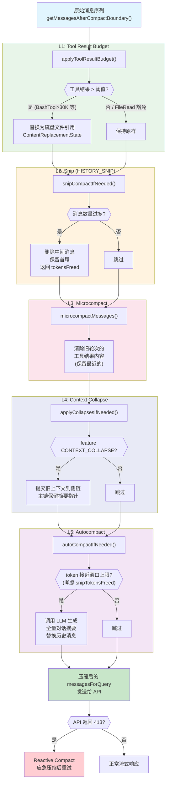

# 第8章 上下文管理与压缩策略

## 8.1 概述

大语言模型的上下文窗口是有限资源。Claude Code 在一次会话中可能执行数十甚至数百轮工具调用，每轮产生大量输入输出内容。如果不加控制，上下文窗口会迅速溢出，导致 API 返回 413 错误（prompt_too_long）。

### 代码流程图：五层渐进式压缩管道



Claude Code 实现了一套五层渐进式压缩策略，从轻量级的内容裁剪到重量级的对话摘要，逐层介入：

| 层级 | 策略 | 触发方式 | 影响 |
|------|------|----------|------|
| L1 | Tool Result Budget | 每轮请求前 | 替换超大工具结果为磁盘引用 |
| L2 | Snip | 每轮请求前 | 删除中间消息，保留首尾 |
| L3 | Microcompact | 每轮请求前 | 清除旧工具结果内容 |
| L4 | Context Collapse | 每轮请求前 | 提交上下文快照到侧链 |
| L5 | Autocompact | 每轮请求前 | 全量对话摘要重写 |

此外还有 Reactive Compact（413 应急处理），在 API 返回错误后紧急压缩。

核心源码文件：

- `src/query.ts` -- 压缩管道编排
- `src/services/compact/autoCompact.ts` -- 自动压缩阈值与触发
- `src/services/compact/compact.ts` -- 对话摘要压缩实现
- `src/services/compact/microCompact.ts` -- 微压缩（工具结果裁剪）
- `src/utils/tokens.ts` -- Token 计数与估算
- `src/services/tokenEstimation.ts` -- 粗略 token 估算

## 8.2 压缩管道在 query.ts 中的编排

所有压缩策略在 `src/query.ts` 的主查询循环中按固定顺序执行：

```typescript
// src/query.ts (简化)
let messagesForQuery = [...getMessagesAfterCompactBoundary(messages)]

// L1: Tool Result Budget
messagesForQuery = await applyToolResultBudget(
  messagesForQuery,
  toolUseContext.contentReplacementState,
  persistReplacements ? records => void recordContentReplacement(...) : undefined,
  new Set(toolUseContext.options.tools.filter(t => !Number.isFinite(t.maxResultSizeChars)).map(t => t.name)),
)

// L2: Snip
if (feature('HISTORY_SNIP')) {
  const snipResult = snipModule!.snipCompactIfNeeded(messagesForQuery)
  messagesForQuery = snipResult.messages
  snipTokensFreed = snipResult.tokensFreed
}

// L3: Microcompact
const microcompactResult = await deps.microcompact(messagesForQuery, toolUseContext, querySource)
messagesForQuery = microcompactResult.messages

// L4: Context Collapse (feature-gated)
// ...

// L5: Autocompact
const { compactionResult } = await deps.autocompact(
  messagesForQuery, toolUseContext, cacheSafeParams,
  querySource, tracking, snipTokensFreed,
)
```

关键设计原则：每一层都在前一层的结果上操作。Snip 释放的 token 数量 (`snipTokensFreed`) 会传递给 Autocompact，使其阈值判断能反映 Snip 的效果。

## 8.3 L1: Tool Result Budget

### 8.3.1 机制

Tool Result Budget 对每条消息中的聚合工具结果大小施加预算限制。超过预算的工具结果被替换为磁盘文件引用。

```typescript
// src/query.ts
messagesForQuery = await applyToolResultBudget(
  messagesForQuery,
  toolUseContext.contentReplacementState,  // 替换状态
  persistReplacements ? records => void recordContentReplacement(...) : undefined,
  new Set(
    toolUseContext.options.tools
      .filter(t => !Number.isFinite(t.maxResultSizeChars))
      .map(t => t.name),
  ),  // 豁免工具集（maxResultSizeChars = Infinity 的工具）
)
```

最后一个参数构建了一个豁免工具集。`maxResultSizeChars` 设为 `Infinity` 的工具（如 FileReadTool）不会被替换，因为将其结果持久化到文件后，模型会用 Read 读取该文件，形成循环。

### 8.3.2 持久化阈值

每个工具声明自己的 `maxResultSizeChars`：

| 工具 | 阈值 |
|------|------|
| BashTool | 30,000 字符 |
| GrepTool | 20,000 字符 |
| FileEditTool | 100,000 字符 |
| FileReadTool | Infinity（豁免） |

实际阈值还受全局默认值和 GrowthBook 覆盖影响：

```typescript
// src/utils/toolResultStorage.ts
export function getPersistenceThreshold(
  toolName: string,
  declaredMaxResultSizeChars: number,
): number {
  if (!Number.isFinite(declaredMaxResultSizeChars)) {
    return declaredMaxResultSizeChars  // Infinity 直接返回
  }
  const overrides = getFeatureValue_CACHED_MAY_BE_STALE(PERSIST_THRESHOLD_OVERRIDE_FLAG, {})
  const override = overrides?.[toolName]
  if (typeof override === 'number' && Number.isFinite(override) && override > 0) {
    return override  // GrowthBook 覆盖值
  }
  return Math.min(declaredMaxResultSizeChars, DEFAULT_MAX_RESULT_SIZE_CHARS)
}
```

### 8.3.3 ContentReplacementState

替换状态通过 `ToolUseContext.contentReplacementState` 在对话线程中传递：

```typescript
// src/Tool.ts
contentReplacementState?: ContentReplacementState
```

主线程由 REPL 一次性初始化（不重置，过期 UUID key 是惰性的）。子 agent 通过 `createSubagentContext` 克隆父级状态（缓存共享 fork 需要一致的决策）。

## 8.4 L2: Snip

### 8.4.1 机制

Snip 是一种轻量级压缩策略，直接删除中间消息，保留对话首尾。它不需要调用 API 生成摘要，因此速度快、零额外成本。

```typescript
// src/query.ts
if (feature('HISTORY_SNIP')) {
  const snipResult = snipModule!.snipCompactIfNeeded(messagesForQuery)
  messagesForQuery = snipResult.messages
  snipTokensFreed = snipResult.tokensFreed
  if (snipResult.boundaryMessage) {
    yield snipResult.boundaryMessage
  }
}
```

Snip 通过 feature flag `HISTORY_SNIP` 控制，代码通过条件 require 加载：

```typescript
const snipModule = feature('HISTORY_SNIP')
  ? (require('./services/compact/snipCompact.js') as typeof import('./services/compact/snipCompact.js'))
  : null
```

### 8.4.2 与其他策略的关系

Snip 在 Microcompact 之前执行。如果 Snip 和 Microcompact 同时触发，两者都会运行——它们不互斥。Snip 释放的 token 数传递给 Autocompact：

```typescript
snipTokensFreed = snipResult.tokensFreed
// ...
const { compactionResult } = await deps.autocompact(
  messagesForQuery, toolUseContext, cacheSafeParams,
  querySource, tracking, snipTokensFreed,
)
```

`tokenCountWithEstimation` 从最后一个 API 响应的 usage 数据读取 token 数，它看不到 Snip 删除的效果（因为受保护尾部的 assistant 消息的 usage 反映的是 Snip 前的上下文大小）。因此 `snipTokensFreed` 必须显式传递。

## 8.5 L3: Microcompact

### 8.5.1 概述

Microcompact 清除旧的工具结果内容，将其替换为短文本标记。与 Autocompact（需要 API 调用生成摘要）不同，Microcompact 是本地操作，不消耗额外 API 调用。

核心源码在 `src/services/compact/microCompact.ts`。

### 8.5.2 可压缩工具列表

```typescript
const COMPACTABLE_TOOLS = new Set<string>([
  FILE_READ_TOOL_NAME,
  ...SHELL_TOOL_NAMES,
  GREP_TOOL_NAME,
  GLOB_TOOL_NAME,
  WEB_SEARCH_TOOL_NAME,
  WEB_FETCH_TOOL_NAME,
  FILE_EDIT_TOOL_NAME,
  FILE_WRITE_TOOL_NAME,
])
```

只有这些工具的结果会被 Microcompact 清除。其他工具（如 AgentTool、TodoWriteTool 等）的结果保持不变。

### 8.5.3 入口函数

```typescript
export async function microcompactMessages(
  messages: Message[],
  toolUseContext?: ToolUseContext,
  querySource?: QuerySource,
): Promise<MicrocompactResult> {
  clearCompactWarningSuppression()

  // 1. 基于时间的触发优先
  const timeBasedResult = maybeTimeBasedMicrocompact(messages, querySource)
  if (timeBasedResult) return timeBasedResult

  // 2. 缓存编辑微压缩（ant-only）
  if (feature('CACHED_MICROCOMPACT')) {
    const mod = await getCachedMCModule()
    if (mod.isCachedMicrocompactEnabled() && mod.isModelSupportedForCacheEditing(model) && isMainThreadSource(querySource)) {
      return await cachedMicrocompactPath(messages, querySource)
    }
  }

  // 3. 无操作回退
  return { messages }
}
```

### 8.5.4 基于时间的微压缩

当用户长时间未操作后恢复对话时触发：

```typescript
export function evaluateTimeBasedTrigger(
  messages: Message[],
  querySource: QuerySource | undefined,
): { gapMinutes: number; config: TimeBasedMCConfig } | null {
  const config = getTimeBasedMCConfig()
  if (!config.enabled || !querySource || !isMainThreadSource(querySource)) {
    return null
  }
  const lastAssistant = messages.findLast(m => m.type === 'assistant')
  if (!lastAssistant) return null

  const gapMinutes = (Date.now() - new Date(lastAssistant.timestamp).getTime()) / 60_000
  if (!Number.isFinite(gapMinutes) || gapMinutes < config.gapThresholdMinutes) {
    return null
  }
  return { gapMinutes, config }
}
```

触发条件：自上次 assistant 消息以来的间隔超过配置的阈值（分钟）。此时服务器缓存已过期，完整前缀将被重写，所以趁机清除旧工具结果以缩小重写内容。

清除逻辑：

```typescript
function maybeTimeBasedMicrocompact(messages, querySource) {
  const trigger = evaluateTimeBasedTrigger(messages, querySource)
  if (!trigger) return null

  const compactableIds = collectCompactableToolIds(messages)
  const keepRecent = Math.max(1, config.keepRecent)  // 至少保留最后 1 个
  const keepSet = new Set(compactableIds.slice(-keepRecent))
  const clearSet = new Set(compactableIds.filter(id => !keepSet.has(id)))

  // 清除旧工具结果内容
  const result = messages.map(message => {
    // ...
    const newContent = message.message.content.map(block => {
      if (block.type === 'tool_result' && clearSet.has(block.tool_use_id)
          && block.content !== TIME_BASED_MC_CLEARED_MESSAGE) {
        tokensSaved += calculateToolResultTokens(block)
        return { ...block, content: TIME_BASED_MC_CLEARED_MESSAGE }
      }
      return block
    })
    // ...
  })
}
```

`TIME_BASED_MC_CLEARED_MESSAGE` 是 `'[Old tool result content cleared]'`。保留最近 N 个工具结果不清除（至少 1 个），确保模型有最近的工作上下文。

### 8.5.5 缓存编辑微压缩

这是一种更精细的微压缩策略，利用 API 的 cache editing 能力，在不使缓存前缀失效的情况下删除工具结果。

```typescript
async function cachedMicrocompactPath(messages, querySource) {
  const mod = await getCachedMCModule()
  const state = ensureCachedMCState()
  const config = mod.getCachedMCConfig()

  // 1. 收集可压缩的工具 ID
  const compactableToolIds = new Set(collectCompactableToolIds(messages))

  // 2. 注册未跟踪的工具结果
  for (const message of messages) {
    if (message.type === 'user' && Array.isArray(message.message.content)) {
      for (const block of message.message.content) {
        if (block.type === 'tool_result' && compactableToolIds.has(block.tool_use_id)
            && !state.registeredTools.has(block.tool_use_id)) {
          mod.registerToolResult(state, block.tool_use_id)
        }
      }
    }
  }

  // 3. 决定要删除哪些工具结果
  const toolsToDelete = mod.getToolResultsToDelete(state)

  // 4. 创建 cache_edits block
  if (toolsToDelete.length > 0) {
    const cacheEdits = mod.createCacheEditsBlock(state, toolsToDelete)
    if (cacheEdits) {
      pendingCacheEdits = cacheEdits
    }
  }

  // 消息不修改 -- cache_reference 和 cache_edits 在 API 层添加
  return { messages, compactionInfo: { pendingCacheEdits: { ... } } }
}
```

关键区别：缓存编辑微压缩**不修改本地消息内容**。它通过 `cache_edits` API 指令在服务端删除工具结果，保持客户端消息完整。这意味着 prompt cache 不会被破坏。

### 8.5.6 Token 估算辅助函数

```typescript
function calculateToolResultTokens(block: ToolResultBlockParam): number {
  if (!block.content) return 0
  if (typeof block.content === 'string') {
    return roughTokenCountEstimation(block.content)
  }
  return block.content.reduce((sum, item) => {
    if (item.type === 'text') return sum + roughTokenCountEstimation(item.text)
    if (item.type === 'image' || item.type === 'document') return sum + IMAGE_MAX_TOKEN_SIZE
    return sum
  }, 0)
}
```

图片和文档统一按 2000 token 估算。文本使用 `roughTokenCountEstimation`（字符数 / 4）。

## 8.6 L5: Autocompact

### 8.6.1 阈值计算

Autocompact 的触发基于精确的阈值计算。核心公式在 `autoCompact.ts` 中：

```typescript
// 常量定义
export const AUTOCOMPACT_BUFFER_TOKENS = 13_000
export const WARNING_THRESHOLD_BUFFER_TOKENS = 20_000
export const ERROR_THRESHOLD_BUFFER_TOKENS = 20_000
export const MANUAL_COMPACT_BUFFER_TOKENS = 3_000
const MAX_OUTPUT_TOKENS_FOR_SUMMARY = 20_000

// 有效上下文窗口 = 模型上下文窗口 - 摘要输出预留
export function getEffectiveContextWindowSize(model: string): number {
  const reservedTokensForSummary = Math.min(
    getMaxOutputTokensForModel(model),
    MAX_OUTPUT_TOKENS_FOR_SUMMARY,
  )
  let contextWindow = getContextWindowForModel(model, getSdkBetas())

  // 支持环境变量覆盖
  const autoCompactWindow = process.env.CLAUDE_CODE_AUTO_COMPACT_WINDOW
  if (autoCompactWindow) {
    const parsed = parseInt(autoCompactWindow, 10)
    if (!isNaN(parsed) && parsed > 0) {
      contextWindow = Math.min(contextWindow, parsed)
    }
  }

  return contextWindow - reservedTokensForSummary
}

// 自动压缩阈值 = 有效上下文窗口 - 缓冲区
export function getAutoCompactThreshold(model: string): number {
  const effectiveContextWindow = getEffectiveContextWindowSize(model)
  const autocompactThreshold = effectiveContextWindow - AUTOCOMPACT_BUFFER_TOKENS

  // 支持百分比覆盖（测试用）
  const envPercent = process.env.CLAUDE_AUTOCOMPACT_PCT_OVERRIDE
  if (envPercent) {
    const parsed = parseFloat(envPercent)
    if (!isNaN(parsed) && parsed > 0 && parsed <= 100) {
      const percentageThreshold = Math.floor(effectiveContextWindow * (parsed / 100))
      return Math.min(percentageThreshold, autocompactThreshold)
    }
  }

  return autocompactThreshold
}
```

以 Claude Sonnet 为例，假设上下文窗口为 200K tokens：

```
有效窗口 = 200,000 - 20,000 = 180,000
自动压缩阈值 = 180,000 - 13,000 = 167,000
```

当 token 使用量达到 167,000 时触发自动压缩。

### 8.6.2 多层警告状态

```typescript
export function calculateTokenWarningState(tokenUsage, model) {
  const autoCompactThreshold = getAutoCompactThreshold(model)
  const threshold = isAutoCompactEnabled() ? autoCompactThreshold : getEffectiveContextWindowSize(model)

  const percentLeft = Math.max(0, Math.round(((threshold - tokenUsage) / threshold) * 100))

  const warningThreshold = threshold - WARNING_THRESHOLD_BUFFER_TOKENS
  const errorThreshold = threshold - ERROR_THRESHOLD_BUFFER_TOKENS
  const blockingLimit = actualContextWindow - MANUAL_COMPACT_BUFFER_TOKENS

  return {
    percentLeft,
    isAboveWarningThreshold: tokenUsage >= warningThreshold,
    isAboveErrorThreshold: tokenUsage >= errorThreshold,
    isAboveAutoCompactThreshold: isAutoCompactEnabled() && tokenUsage >= autoCompactThreshold,
    isAtBlockingLimit: tokenUsage >= blockingLimit,
  }
}
```

四级状态：
- **Warning**: 接近阈值，显示警告
- **Error**: 非常接近阈值，显示错误
- **AutoCompact**: 触发自动压缩
- **Blocking**: 达到硬限制，阻塞用户输入直到执行 /compact

### 8.6.3 触发条件守卫

`shouldAutoCompact()` 在触发前执行多重守卫检查：

```typescript
export async function shouldAutoCompact(messages, model, querySource, snipTokensFreed = 0) {
  // 1. 递归守卫：session_memory 和 compact 自身是 forked agent，会死锁
  if (querySource === 'session_memory' || querySource === 'compact') return false

  // 2. Context Collapse 的上下文 agent 不能触发自动压缩
  if (feature('CONTEXT_COLLAPSE')) {
    if (querySource === 'marble_origami') return false
  }

  // 3. 检查用户是否启用了自动压缩
  if (!isAutoCompactEnabled()) return false

  // 4. Reactive-only 模式下压制主动自动压缩
  if (feature('REACTIVE_COMPACT')) {
    if (getFeatureValue_CACHED_MAY_BE_STALE('tengu_cobalt_raccoon', false)) return false
  }

  // 5. Context Collapse 模式下压制（Collapse 自己管理上下文头空间）
  if (feature('CONTEXT_COLLAPSE')) {
    if (isContextCollapseEnabled()) return false
  }

  // 6. 计算 token 数并比较阈值
  const tokenCount = tokenCountWithEstimation(messages) - snipTokensFreed
  const { isAboveAutoCompactThreshold } = calculateTokenWarningState(tokenCount, model)
  return isAboveAutoCompactThreshold
}
```

### 8.6.4 执行流程

```typescript
export async function autoCompactIfNeeded(messages, toolUseContext, ...) {
  // 断路器：连续失败 3 次后停止重试
  if (tracking?.consecutiveFailures >= MAX_CONSECUTIVE_AUTOCOMPACT_FAILURES) {
    return { wasCompacted: false }
  }

  if (!await shouldAutoCompact(...)) return { wasCompacted: false }

  // 先尝试 Session Memory 压缩（更轻量）
  const sessionMemoryResult = await trySessionMemoryCompaction(
    messages, toolUseContext.agentId, recompactionInfo.autoCompactThreshold
  )
  if (sessionMemoryResult) {
    setLastSummarizedMessageId(undefined)
    runPostCompactCleanup(querySource)
    return { wasCompacted: true, compactionResult: sessionMemoryResult }
  }

  // 回退到完整对话摘要压缩
  try {
    const compactionResult = await compactConversation(
      messages, toolUseContext, cacheSafeParams,
      true,      // 压制后续问题
      undefined, // 无自定义指令
      true,      // isAutoCompact
      recompactionInfo,
    )
    return { wasCompacted: true, compactionResult, consecutiveFailures: 0 }
  } catch (error) {
    const nextFailures = (tracking?.consecutiveFailures ?? 0) + 1
    return { wasCompacted: false, consecutiveFailures: nextFailures }
  }
}
```

### 8.6.5 断路器机制

```typescript
const MAX_CONSECUTIVE_AUTOCOMPACT_FAILURES = 3
```

注释中引用了统计数据：1,279 个会话有 50+ 次连续失败（最高 3,272 次），浪费约 250K API 调用/天。断路器在 3 次连续失败后停止重试，避免在上下文不可恢复的情况下反复尝试。

### 8.6.6 isAutoCompactEnabled

```typescript
export function isAutoCompactEnabled(): boolean {
  if (isEnvTruthy(process.env.DISABLE_COMPACT)) return false
  if (isEnvTruthy(process.env.DISABLE_AUTO_COMPACT)) return false
  const userConfig = getGlobalConfig()
  return userConfig.autoCompactEnabled
}
```

三级禁用开关：
- `DISABLE_COMPACT`: 禁用所有压缩（包括手动 /compact）
- `DISABLE_AUTO_COMPACT`: 只禁用自动压缩（手动 /compact 仍可用）
- 用户配置 `autoCompactEnabled`

## 8.7 对话摘要压缩 (compact.ts)

### 8.7.1 compactConversation

这是完整的对话摘要压缩实现。它使用 forked agent 调用模型生成对话摘要：

```typescript
export async function compactConversation(
  messages: Message[],
  context: ToolUseContext,
  cacheSafeParams: CacheSafeParams,
  suppressFollowUpQuestions: boolean,
  customInstructions?: string,
  isAutoCompact: boolean = false,
  recompactionInfo?: RecompactionInfo,
): Promise<CompactionResult> {
  if (messages.length === 0) {
    throw new Error(ERROR_MESSAGE_NOT_ENOUGH_MESSAGES)
  }
  // ...
}
```

### 8.7.2 CompactionResult

```typescript
export interface CompactionResult {
  boundaryMarker: SystemMessage          // 压缩边界标记
  summaryMessages: UserMessage[]         // 摘要消息
  attachments: AttachmentMessage[]       // 附件（CLAUDE.md 等需要重新注入）
  hookResults: HookResultMessage[]       // Hook 结果
  messagesToKeep?: Message[]             // 保留的消息（partial compact）
  userDisplayMessage?: string            // 用户可见的说明
  preCompactTokenCount?: number          // 压缩前 token 数
  postCompactTokenCount?: number         // 压缩后 token 数
  truePostCompactTokenCount?: number     // 真实压缩后 token 数（API 计数）
  compactionUsage?: ReturnType<typeof getTokenUsage>  // API 使用量
}
```

### 8.7.3 压缩后消息重建

```typescript
export function buildPostCompactMessages(result: CompactionResult): Message[] {
  return [
    result.boundaryMarker,      // 标记压缩边界
    ...result.summaryMessages,  // 摘要
    ...(result.messagesToKeep ?? []),  // 保留的消息
    ...result.attachments,      // 重新注入的附件
    ...result.hookResults,      // Hook 结果
  ]
}
```

### 8.7.4 图片剥离

压缩前会剥离图片以避免压缩 API 调用本身超出 prompt 限制：

```typescript
export function stripImagesFromMessages(messages: Message[]): Message[] {
  return messages.map(message => {
    if (message.type !== 'user') return message
    // ...
    const newContent = content.flatMap(block => {
      if (block.type === 'image') {
        return [{ type: 'text' as const, text: '[image]' }]
      }
      if (block.type === 'document') {
        return [{ type: 'text' as const, text: '[document]' }]
      }
      // tool_result 中嵌套的图片也被剥离
      if (block.type === 'tool_result' && Array.isArray(block.content)) {
        // ...
      }
      return [block]
    })
  })
}
```

### 8.7.5 PTL 重试机制

当压缩 API 调用本身返回 prompt_too_long 时，`truncateHeadForPTLRetry` 从头部丢弃消息组：

```typescript
export function truncateHeadForPTLRetry(messages, ptlResponse) {
  const groups = groupMessagesByApiRound(input)
  if (groups.length < 2) return null

  const tokenGap = getPromptTooLongTokenGap(ptlResponse)
  let dropCount: number
  if (tokenGap !== undefined) {
    // 精确丢弃：累计足够 token 的组
    let acc = 0
    dropCount = 0
    for (const g of groups) {
      acc += roughTokenCountEstimationForMessages(g)
      dropCount++
      if (acc >= tokenGap) break
    }
  } else {
    // 模糊回退：丢弃 20% 的组
    dropCount = Math.max(1, Math.floor(groups.length * 0.2))
  }

  dropCount = Math.min(dropCount, groups.length - 1)  // 至少保留一组
  const sliced = groups.slice(dropCount).flat()

  // 如果切片后第一条是 assistant 消息，添加合成 user 消息
  if (sliced[0]?.type === 'assistant') {
    return [createUserMessage({ content: PTL_RETRY_MARKER, isMeta: true }), ...sliced]
  }
  return sliced
}
```

最多重试 3 次（`MAX_PTL_RETRIES`）。

## 8.8 Reactive Compact (413 应急处理)

### 8.8.1 触发条件

Reactive Compact 在 API 返回 413 prompt_too_long 错误后触发。在 `query.ts` 的重试循环中：

```typescript
// src/query.ts (简化)
const isWithheld413 = reactiveCompact?.isWithheldPromptTooLong(message)
const isWithheldMedia = reactiveCompact?.isWithheldMediaSizeError(message)

if ((isWithheld413 || isWithheldMedia) && reactiveCompact) {
  const compacted = await reactiveCompact.tryReactiveCompact({
    messages: messagesForQuery,
    toolUseContext,
    cacheSafeParams,
    // ...
  })
}
```

### 8.8.2 与其他策略的关系

Reactive Compact 是最后的安全网。正常流程中，Autocompact 应该在达到阈值时主动触发。但如果因为 token 估算不准、多个大工具结果同时到达等原因导致 Autocompact 未能阻止溢出，API 返回 413 后 Reactive Compact 介入。

```typescript
// query.ts 中的注释
// Also skip when reactive compact is enabled and automatic compaction is
// enabled (the blocking limit would prevent the context from reaching the
// API, so reactive compact would never see a prompt-too-long to react to).
```

当 Reactive Compact 和 Autocompact 同时启用时，阻塞限制会被跳过，让请求到达 API，使 Reactive Compact 有机会在真正的 413 上触发。

### 8.8.3 Context Collapse 集成

```typescript
if (feature('CONTEXT_COLLAPSE') && isWithheld413) {
  // reactiveCompact compiled out but contextCollapse withheld and
  // the retry still 413'd, fall through to reactive compact.
  return { reason: 'prompt_too_long' }
}
```

Context Collapse 也处理 413 错误。流程是：先尝试 Context Collapse（提交暂存的上下文），如果重试仍然 413，再降级到 Reactive Compact。

## 8.9 Token 估算策略

### 8.9.1 核心函数 tokenCountWithEstimation

这是 Claude Code 中测量上下文大小的标准函数：

```typescript
// src/utils/tokens.ts
export function tokenCountWithEstimation(messages: readonly Message[]): number {
  let i = messages.length - 1
  while (i >= 0) {
    const message = messages[i]
    const usage = message ? getTokenUsage(message) : undefined
    if (message && usage) {
      // 处理并行工具调用的消息分裂
      const responseId = getAssistantMessageId(message)
      if (responseId) {
        let j = i - 1
        while (j >= 0) {
          const priorId = messages[j] ? getAssistantMessageId(messages[j]!) : undefined
          if (priorId === responseId) {
            i = j  // 回退到同一 API 响应的最早分裂
          } else if (priorId !== undefined) {
            break   // 碰到不同 API 响应，停止
          }
          j--
        }
      }
      return getTokenCountFromUsage(usage) + roughTokenCountEstimationForMessages(messages.slice(i + 1))
    }
    i--
  }
  return roughTokenCountEstimationForMessages(messages)
}
```

策略：**基准值 + 增量估算**。

1. 从后往前找到最近一条有 `usage` 数据的 assistant 消息
2. 该消息的 `usage` 提供精确的基准值（来自 API 响应）
3. 对该消息之后的所有消息使用粗略估算
4. 两者相加得到当前上下文大小

### 8.9.2 并行工具调用的消息分裂处理

当模型并行调用多个工具时，streaming 代码为每个 content block 生成一条独立的 assistant 记录（共享同一 `message.id` 和 `usage`），query loop 将每个 `tool_result` 紧跟在对应的 `tool_use` 后面：

```
[..., assistant(id=A), user(result1), assistant(id=A), user(result2), ...]
```

如果只从最后一条 assistant 记录开始估算，会遗漏之前交错的 `tool_result`。因此代码回退到同一 `message.id` 的最早记录：

```typescript
if (priorId === responseId) {
  i = j  // 回退到最早的分裂
} else if (priorId !== undefined) {
  break  // 不同 API 响应，停止
}
// priorId === undefined: user/tool_result/attachment 消息，继续回退
```

### 8.9.3 粗略估算函数

```typescript
// src/services/tokenEstimation.ts
export function roughTokenCountEstimation(content: string, bytesPerToken: number = 4): number {
  return Math.round(content.length / bytesPerToken)
}
```

默认 4 字节/token。JSON 文件使用 2 字节/token（因为 JSON 有大量单字符 token 如 `{`, `}`, `:`, `,`, `"`）：

```typescript
export function bytesPerTokenForFileType(fileExtension: string): number {
  switch (fileExtension) {
    case 'json':
    case 'jsonl':
    case 'jsonc':
      return 2
    default:
      return 4
  }
}
```

### 8.9.4 内容块级别的估算

```typescript
function roughTokenCountEstimationForBlock(block): number {
  if (typeof block === 'string') return roughTokenCountEstimation(block)
  if (block.type === 'text') return roughTokenCountEstimation(block.text)
  if (block.type === 'image' || block.type === 'document') return 2000
  if (block.type === 'tool_result') return roughTokenCountEstimationForContent(block.content)
  if (block.type === 'tool_use') {
    return roughTokenCountEstimation(block.name + jsonStringify(block.input ?? {}))
  }
  if (block.type === 'thinking') return roughTokenCountEstimation(block.thinking)
  if (block.type === 'redacted_thinking') return roughTokenCountEstimation(block.data)
  return roughTokenCountEstimation(jsonStringify(block))
}
```

不同类型的内容块使用不同的估算策略：
- **text**: 字符数 / 4
- **image/document**: 固定 2000 token（与 Microcompact 的 `IMAGE_MAX_TOKEN_SIZE` 一致）
- **tool_use**: 工具名 + 输入 JSON 序列化后的字符数 / 4
- **thinking**: thinking 文本的字符数 / 4（不计 signature）
- **tool_result**: 递归估算内容
- 其他（server_tool_use 等）: JSON 序列化后估算

### 8.9.5 API 精确计数

当需要精确计数时，使用 `countTokensWithAPI`：

```typescript
// src/services/tokenEstimation.ts
export async function countTokensWithAPI(content: string): Promise<number | null> {
  if (!content) return 0
  const message = { role: 'user', content: content }
  return countMessagesTokensWithAPI([message], [])
}
```

它调用 Anthropic API 的 `beta.messages.countTokens` 端点。对于 Bedrock 用户，使用 `CountTokensCommand`。

备选方案 `countTokensViaHaikuFallback`：

```typescript
export async function countTokensViaHaikuFallback(messages, tools): Promise<number | null> {
  // 优先使用 Haiku（便宜快速）
  // Vertex 全局区域或 Bedrock + thinking blocks 时降级到 Sonnet
  const model = isVertexGlobalEndpoint || isBedrockWithThinking || isVertexWithThinking
    ? getDefaultSonnetModel()
    : getSmallFastModel()

  // 发送 max_tokens=1 的请求，只关心 usage 中的 input_tokens
  const response = await anthropic.beta.messages.create({
    model, max_tokens: containsThinking ? TOKEN_COUNT_MAX_TOKENS : 1,
    messages: messagesToSend, tools,
    // ...
  })

  return inputTokens + cacheCreationTokens + cacheReadTokens
}
```

这种方法通过发送一个几乎不产生输出（max_tokens=1）的请求来获取精确的 input token 计数。

### 8.9.6 消息级 Token 估算

Microcompact 中使用的消息级估算函数带有 4/3 保守系数：

```typescript
// src/services/compact/microCompact.ts
export function estimateMessageTokens(messages: Message[]): number {
  let totalTokens = 0
  for (const message of messages) {
    for (const block of message.message.content) {
      if (block.type === 'text') totalTokens += roughTokenCountEstimation(block.text)
      else if (block.type === 'tool_result') totalTokens += calculateToolResultTokens(block)
      else if (block.type === 'image' || block.type === 'document') totalTokens += IMAGE_MAX_TOKEN_SIZE
      else if (block.type === 'thinking') totalTokens += roughTokenCountEstimation(block.thinking)
      else if (block.type === 'tool_use') {
        totalTokens += roughTokenCountEstimation(block.name + jsonStringify(block.input ?? {}))
      }
      // ...
    }
  }
  return Math.ceil(totalTokens * (4 / 3))  // 保守系数
}
```

乘以 4/3 是为了在粗略估算基础上留有余量，避免因低估导致压缩不及时。

## 8.10 getTokenCountFromUsage

```typescript
export function getTokenCountFromUsage(usage: Usage): number {
  return (
    usage.input_tokens +
    (usage.cache_creation_input_tokens ?? 0) +
    (usage.cache_read_input_tokens ?? 0) +
    usage.output_tokens
  )
}
```

API 响应的 usage 中有四个 token 计数：
- `input_tokens`: 新处理的输入 token
- `cache_creation_input_tokens`: 本次创建缓存的 token
- `cache_read_input_tokens`: 从缓存读取的 token
- `output_tokens`: 模型生成的输出 token

四者之和代表该 API 调用时的完整上下文窗口大小。

## 8.11 压缩策略的交互与优先级

### 8.11.1 执行顺序

```
Tool Result Budget -> Snip -> Microcompact -> Context Collapse -> Autocompact
```

每一层都是独立的、可叠加的。前面的层可能使后面的层无需触发（如 Snip + Microcompact 释放了足够的空间，Autocompact 就不会触发）。

### 8.11.2 互斥与叠加

- **Snip + Microcompact**: 可以同时运行，不互斥
- **Context Collapse + Autocompact**: 互斥。当 Context Collapse 启用时，Autocompact 被压制
- **Reactive Compact**: 独立于所有其他策略，只在 413 错误后触发

### 8.11.3 递归守卫

压缩操作自身需要调用 API（如 compactConversation 用 forked agent 生成摘要），如果该 API 调用的上下文也超限，会导致无限递归。因此 `shouldAutoCompact` 中有明确的递归守卫：

```typescript
if (querySource === 'session_memory' || querySource === 'compact') return false
```

## 8.12 小结

Claude Code 的上下文管理策略展现了以下设计原则：

1. **渐进式压缩**：从轻量级（替换内容标记）到重量级（全量摘要），逐层升级
2. **缓存感知**：Cached Microcompact 通过 cache editing API 在不破坏缓存的情况下删除内容
3. **精确 + 粗略混合估算**：基准值取自 API 精确计数，增量部分使用字符数 / 4 估算
4. **安全网设计**：Reactive Compact 作为 413 错误的最后防线
5. **断路器保护**：连续失败 3 次后停止自动压缩重试，避免浪费 API 调用
6. **并行工具调用意识**：token 估算正确处理消息分裂场景，避免低估
