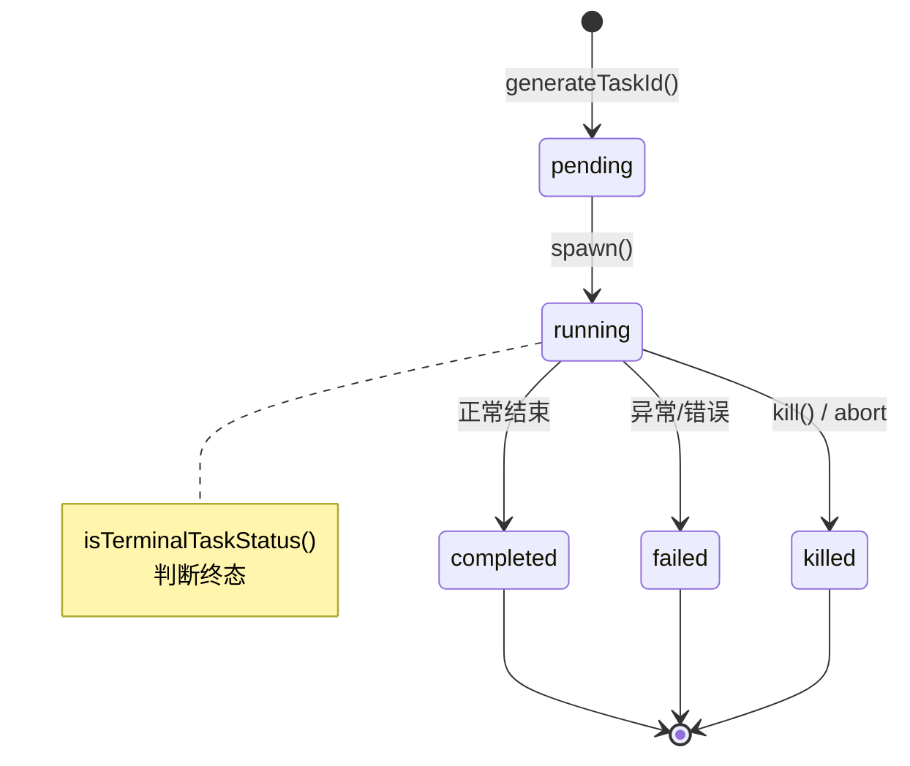
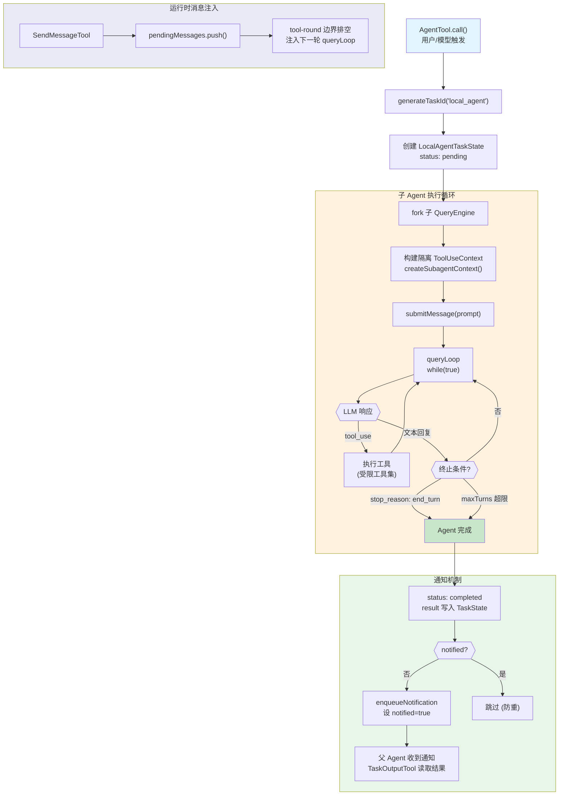

# 第9章：任务系统与多Agent架构

本章是 Claude Code 架构中最核心的章节之一。任务系统是所有后台执行、子Agent、远程Agent 的统一抽象层，而多Agent架构则是在此基础上实现的协作式 AI 执行引擎。

### 代码流程图：Task 状态机与 Agent 生命周期





---

## 9.1 Task 类型体系

### 9.1.1 TaskType 枚举

文件：`src/Task.ts`

```typescript
export type TaskType =
  | 'local_bash'
  | 'local_agent'
  | 'remote_agent'
  | 'in_process_teammate'
  | 'local_workflow'
  | 'monitor_mcp'
  | 'dream'
```

七种任务类型覆盖了 Claude Code 所有后台执行场景：

| TaskType | 前缀 | 用途 |
|----------|------|------|
| `local_bash` | `b` | 后台 Shell 命令执行 |
| `local_agent` | `a` | 本地子 Agent（核心） |
| `remote_agent` | `r` | 远程 CCR Agent |
| `in_process_teammate` | `t` | 进程内 Teammate（Swarm） |
| `local_workflow` | `w` | 工作流脚本 |
| `monitor_mcp` | `m` | MCP 监控任务 |
| `dream` | `d` | Dream 后台任务 |

### 9.1.2 TaskStatus 状态机

```typescript
export type TaskStatus =
  | 'pending'
  | 'running'
  | 'completed'
  | 'failed'
  | 'killed'
```

状态转移图：

```
pending --> running --> completed
                   \-> failed
                   \-> killed
```

其中 `completed`、`failed`、`killed` 是终态。`isTerminalTaskStatus()` 用于判断：

```typescript
export function isTerminalTaskStatus(status: TaskStatus): boolean {
  return status === 'completed' || status === 'failed' || status === 'killed'
}
```

这个函数在多处使用：防止向已终止的 Teammate 注入消息、从 AppState 驱逐已完成任务、孤儿任务清理等。

### 9.1.3 TaskStateBase 逐字段详解

```typescript
export type TaskStateBase = {
  id: string              // 任务唯一标识，格式：前缀 + 8位随机字符
  type: TaskType          // 任务类型
  status: TaskStatus      // 当前状态
  description: string     // 人类可读描述
  toolUseId?: string      // 关联的 tool_use 块 ID（用于通知回传）
  startTime: number       // 创建时间戳
  endTime?: number        // 结束时间戳
  totalPausedMs?: number  // 总暂停时间（用于精确计时）
  outputFile: string      // 磁盘输出文件路径
  outputOffset: number    // 已消费的输出偏移量（增量读取）
  notified: boolean       // 是否已发送完成通知（防重复）
}
```

关键设计要点：

- **`id`**：通过 `generateTaskId()` 生成，前缀标识类型（如 `b` 代表 bash），后面跟 8 位 36 进制随机字符（`0-9a-z`），36^8 约 2.8 万亿组合，足以抵抗符号链接暴力破解。
- **`outputOffset`**：增量读取机制的核心。每次轮询只读 `outputOffset` 之后的新内容，避免重复处理。
- **`notified`**：原子性防重标志。多个路径可能同时触发通知（任务自然完成 vs TaskStopTool 停止），此字段确保只发一次。

### 9.1.4 Task ID 生成

```typescript
const TASK_ID_ALPHABET = '0123456789abcdefghijklmnopqrstuvwxyz'

export function generateTaskId(type: TaskType): string {
  const prefix = getTaskIdPrefix(type)
  const bytes = randomBytes(8)
  let id = prefix
  for (let i = 0; i < 8; i++) {
    id += TASK_ID_ALPHABET[bytes[i]! % TASK_ID_ALPHABET.length]
  }
  return id
}
```

使用 `crypto.randomBytes` 保证密码学安全的随机性。取模映射到 36 字符的字母表，刻意使用全小写以保证大小写不敏感的文件系统兼容性。

### 9.1.5 TaskContext 与 TaskHandle

```typescript
export type TaskContext = {
  abortController: AbortController
  getAppState: () => AppState
  setAppState: SetAppState
}

export type TaskHandle = {
  taskId: string
  cleanup?: () => void
}
```

`TaskContext` 提供三要素：中止控制器、状态读取、状态写入。`TaskHandle` 是轻量引用，`cleanup` 用于注销清理回调。

### 9.1.6 Task 接口

```typescript
export type Task = {
  name: string
  type: TaskType
  kill(taskId: string, setAppState: SetAppState): Promise<void>
}
```

`Task` 接口极为精简。注释明确说明：`spawn` 和 `render` 从未被多态调用过（在 #22546 中移除），所有六种 `kill` 实现只需要 `setAppState`。这是重构后的最小接口。

---

## 9.2 任务注册表

文件：`src/tasks.ts`

```typescript
export function getAllTasks(): Task[] {
  const tasks: Task[] = [
    LocalShellTask,
    LocalAgentTask,
    RemoteAgentTask,
    DreamTask,
  ]
  if (LocalWorkflowTask) tasks.push(LocalWorkflowTask)
  if (MonitorMcpTask) tasks.push(MonitorMcpTask)
  return tasks
}

export function getTaskByType(type: TaskType): Task | undefined {
  return getAllTasks().find(t => t.type === type)
}
```

核心四种任务无条件注册，`LocalWorkflowTask` 和 `MonitorMcpTask` 通过 `bun:bundle` 的 `feature()` 功能门控条件加载：

```typescript
const LocalWorkflowTask: Task | null = feature('WORKFLOW_SCRIPTS')
  ? require('./tasks/LocalWorkflowTask/LocalWorkflowTask.js').LocalWorkflowTask
  : null
```

这种模式避免了未启用功能时的无谓导入，同时利用 Bun 的 tree-shaking 在编译期裁剪代码。

---

## 9.3 各种 Task 类型详解

### 9.3.1 LocalShellTask

文件：`src/tasks/LocalShellTask/guards.ts`、`src/tasks/LocalShellTask/LocalShellTask.tsx`

**状态类型**：

```typescript
export type LocalShellTaskState = TaskStateBase & {
  type: 'local_bash'
  command: string
  result?: { code: number; interrupted: boolean }
  completionStatusSentInAttachment: boolean
  shellCommand: ShellCommand | null
  unregisterCleanup?: () => void
  cleanupTimeoutId?: NodeJS.Timeout
  lastReportedTotalLines: number
  isBackgrounded: boolean
  agentId?: AgentId
  kind?: BashTaskKind  // 'bash' | 'monitor'
}
```

关键字段解读：

- **`shellCommand`**：底层 `ShellCommand` 实例的引用，用于进程级控制。
- **`lastReportedTotalLines`**：增量报告的基准线号，用于计算 delta。
- **`isBackgrounded`**：`false` = 前台运行（用户可见实时输出），`true` = 已转入后台。
- **`agentId`**：追踪是哪个 Agent 创建的此任务。当 Agent 退出时，用于清理其名下的孤儿 bash 进程。
- **`kind`**：`'monitor'` 变体在 UI 上显示 description 而非命令，拥有独立的状态栏图标。

**Stall Watchdog 机制**：

```typescript
function startStallWatchdog(taskId, description, kind, toolUseId?, agentId?): () => void {
  const outputPath = getTaskOutputPath(taskId)
  let lastSize = 0
  let lastGrowth = Date.now()
  let cancelled = false
  const timer = setInterval(() => {
    void stat(outputPath).then(s => {
      if (s.size > lastSize) {
        lastSize = s.size; lastGrowth = Date.now(); return
      }
      if (Date.now() - lastGrowth < STALL_THRESHOLD_MS) return
      void tailFile(outputPath, STALL_TAIL_BYTES).then(({ content }) => {
        if (cancelled) return
        if (!looksLikePrompt(content)) {
          lastGrowth = Date.now(); return
        }
        cancelled = true
        clearInterval(timer)
        // 发送交互式输入等待通知...
      })
    })
  }, STALL_CHECK_INTERVAL_MS)
}
```

这是一个精巧的死锁检测器：

1. 每 5 秒检查输出文件大小是否增长
2. 如果 45 秒无增长，读取文件末尾 1024 字节
3. 用正则检查是否像交互提示（`(y/n)`、`Press Enter` 等）
4. 如果是，发送通知告诉模型命令可能阻塞在交互输入上
5. Monitor 类型跳过此检测（它就是用来长期运行的）

**通知防重机制**：

```typescript
function enqueueShellNotification(taskId, description, status, exitCode, setAppState, toolUseId?, kind?, agentId?): void {
  let shouldEnqueue = false
  updateTaskState(taskId, setAppState, task => {
    if (task.notified) { return task }
    shouldEnqueue = true
    return { ...task, notified: true }
  })
  if (!shouldEnqueue) { return }
  abortSpeculation(setAppState)
  // 构建 XML 通知并入队...
}
```

通过 `updateTaskState` 内的原子 check-and-set 操作，即使多条路径并发触发也只会发一次通知。发通知前还会中止当前的推测（speculation），因为后台任务状态变化可能导致推测结果过时。

### 9.3.2 LocalAgentTask

文件：`src/tasks/LocalAgentTask/LocalAgentTask.tsx`

这是最核心的任务类型，驱动所有本地子 Agent。

**状态类型**：

```typescript
export type LocalAgentTaskState = TaskStateBase & {
  type: 'local_agent'
  agentId: string
  prompt: string
  selectedAgent?: AgentDefinition
  agentType: string
  model?: string
  abortController?: AbortController
  unregisterCleanup?: () => void
  error?: string
  result?: AgentToolResult
  progress?: AgentProgress
  retrieved: boolean
  messages?: Message[]
  lastReportedToolCount: number
  lastReportedTokenCount: number
  isBackgrounded: boolean
  pendingMessages: string[]
  retain: boolean
  diskLoaded: boolean
  evictAfter?: number
}
```

关键字段：

- **`progress`**：包含 `toolUseCount`、`tokenCount`、`lastActivity`、`recentActivities`、`summary`。实时追踪 Agent 的进度。
- **`retrieved`**：标记结果是否已被父 Agent 取回。
- **`pendingMessages`**：通过 `SendMessage` 在 Agent 运行时中途排队的消息，在 tool-round 边界被排空。
- **`retain`**：UI 是否正在"持有"此任务（用户正在查看），阻止驱逐。
- **`diskLoaded`**：是否已从 sidechain JSONL 加载历史记录，每个 retain 周期只加载一次。
- **`evictAfter`**：面板可见性截止时间。`undefined` 表示无截止（运行中或被保留），时间戳表示此时间后可隐藏和 GC。

**进度追踪系统**：

```typescript
export type ProgressTracker = {
  toolUseCount: number
  latestInputTokens: number       // 最新的输入 token 数（API 累积值）
  cumulativeOutputTokens: number  // 累积的输出 token 数
  recentActivities: ToolActivity[]
}
```

```typescript
export function updateProgressFromMessage(
  tracker: ProgressTracker, message: Message,
  resolveActivityDescription?, tools?
): void {
  if (message.type !== 'assistant') { return }
  const usage = message.message.usage
  tracker.latestInputTokens = usage.input_tokens
    + (usage.cache_creation_input_tokens ?? 0)
    + (usage.cache_read_input_tokens ?? 0)
  tracker.cumulativeOutputTokens += usage.output_tokens
  for (const content of message.message.content) {
    if (content.type === 'tool_use') {
      tracker.toolUseCount++
      if (content.name !== SYNTHETIC_OUTPUT_TOOL_NAME) {
        tracker.recentActivities.push({
          toolName: content.name,
          input,
          activityDescription: resolveActivityDescription?.(content.name, input),
          isSearch: classification?.isSearch,
          isRead: classification?.isRead
        })
      }
    }
  }
  while (tracker.recentActivities.length > MAX_RECENT_ACTIVITIES) {
    tracker.recentActivities.shift()
  }
}
```

设计要点：

- **`input_tokens` 取最新值而非累加**：因为 Claude API 的 `input_tokens` 是每轮累积的（包含所有历史上下文），所以取最新值。
- **`output_tokens` 才需要累加**：因为它是每轮独立的。
- **缓存 token 计入输入**：`cache_creation_input_tokens` 和 `cache_read_input_tokens` 一并统计。
- **`SYNTHETIC_OUTPUT_TOOL_NAME` 被排除**：它是内部工具，不应出现在活动预览中。
- **最多保留 5 条最近活动**：`MAX_RECENT_ACTIVITIES = 5`，采用 shift 淘汰旧的。

**Agent 注册流程**：

```typescript
export function registerAsyncAgent({
  agentId, description, prompt, selectedAgent,
  setAppState, parentAbortController, toolUseId
}): LocalAgentTaskState {
  void initTaskOutputAsSymlink(agentId, getAgentTranscriptPath(asAgentId(agentId)))
  const abortController = parentAbortController
    ? createChildAbortController(parentAbortController)
    : createAbortController()
  const taskState: LocalAgentTaskState = {
    ...createTaskStateBase(agentId, 'local_agent', description, toolUseId),
    type: 'local_agent',
    status: 'running',
    agentId, prompt, selectedAgent,
    agentType: selectedAgent.agentType ?? 'general-purpose',
    abortController,
    retrieved: false,
    lastReportedToolCount: 0,
    lastReportedTokenCount: 0,
    isBackgrounded: true,
    pendingMessages: [],
    retain: false,
    diskLoaded: false
  }
  const unregisterCleanup = registerCleanup(async () => {
    killAsyncAgent(agentId, setAppState)
  })
  taskState.unregisterCleanup = unregisterCleanup
  registerTask(taskState, setAppState)
  return taskState
}
```

关键流程：

1. 初始化输出文件为指向 Agent transcript 的符号链接（统一读取路径）
2. 如果有父 AbortController，创建子控制器（父终止时子自动终止）
3. 构造完整的 `LocalAgentTaskState`，状态直接为 `running`
4. 注册清理回调确保进程退出时能正常终止
5. 调用 `registerTask` 写入 AppState

**前台到后台切换**：

```typescript
export function registerAgentForeground({
  agentId, description, prompt, selectedAgent,
  setAppState, autoBackgroundMs, toolUseId
}): { taskId, backgroundSignal, cancelAutoBackground? } {
  // ...创建任务，isBackgrounded: false
  let resolveBackgroundSignal: () => void
  const backgroundSignal = new Promise<void>(resolve => {
    resolveBackgroundSignal = resolve
  })
  backgroundSignalResolvers.set(agentId, resolveBackgroundSignal!)
  // 如果配置了 autoBackgroundMs，设置定时器自动转后台
  if (autoBackgroundMs !== undefined && autoBackgroundMs > 0) {
    const timer = setTimeout((...) => {
      setAppState(prev => ({ ...prev, tasks: { ...prev.tasks,
        [agentId]: { ...prevTask, isBackgrounded: true }
      }}))
    }, autoBackgroundMs, setAppState, agentId)
  }
  return { taskId: agentId, backgroundSignal, cancelAutoBackground }
}
```

这个模式允许 Agent 先在前台显示实时输出，用户按 Esc 或等待超时后自动转入后台。`backgroundSignal` 是一个 Promise，调用方可以 `await` 等待切换事件。

**Kill 流程**：

```typescript
export function killAsyncAgent(taskId: string, setAppState: SetAppState): void {
  let killed = false
  updateTaskState<LocalAgentTaskState>(taskId, setAppState, task => {
    if (task.status !== 'running') { return task }
    killed = true
    task.abortController?.abort()
    task.unregisterCleanup?.()
    return {
      ...task,
      status: 'killed', endTime: Date.now(),
      evictAfter: task.retain ? undefined : Date.now() + PANEL_GRACE_MS,
      abortController: undefined,
      unregisterCleanup: undefined,
      selectedAgent: undefined
    }
  })
  if (killed) { void evictTaskOutput(taskId) }
}
```

- 通过 `abort()` 信号通知 Agent 停止
- 设置 `evictAfter`：如果 UI 没有保留（`retain = false`），给 30 秒的面板宽限期
- 清理 `selectedAgent` 引用，释放 `AgentDefinition` 占用的内存
- 异步清理磁盘输出

### 9.3.3 Task 类型差异对比表

| 特性 | LocalShellTask | LocalAgentTask | RemoteAgentTask | InProcessTeammateTask |
|------|---------------|----------------|-----------------|----------------------|
| 执行位置 | 本地子进程 | 本地 async generator | 远程 CCR 服务器 | 本地同进程 |
| 进度追踪 | 文件大小增量 | token/tool 计数 | SDK 消息流 | token/tool 计数 |
| 终止方式 | SIGTERM 进程 | AbortController | HTTP API | AbortController |
| 通知格式 | XML task-notification | XML task-notification | XML task-notification | 邮箱系统 |
| 上下文隔离 | 完全隔离（子进程） | 部分隔离 | 完全隔离（远程） | AsyncLocalStorage |
| 支持消息队列 | 无 | pendingMessages | 无 | pendingUserMessages + 邮箱 |
| 面板宽限期 | 3 秒 | 30 秒 | 无 | 3 秒 |
| 内存管理 | 无特殊 | 磁盘加载/驱逐 | todo list 追踪 | 50 条消息上限 |

---

## 9.4 InProcessTeammate 深度解析

文件：`src/tasks/InProcessTeammateTask/types.ts`

### 9.4.1 状态结构

```typescript
export type InProcessTeammateTaskState = TaskStateBase & {
  type: 'in_process_teammate'
  identity: TeammateIdentity
  prompt: string
  model?: string
  selectedAgent?: AgentDefinition
  abortController?: AbortController
  currentWorkAbortController?: AbortController
  unregisterCleanup?: () => void
  awaitingPlanApproval: boolean
  permissionMode: PermissionMode
  error?: string
  result?: AgentToolResult
  progress?: AgentProgress
  messages?: Message[]
  inProgressToolUseIDs?: Set<string>
  pendingUserMessages: string[]
  spinnerVerb?: string
  pastTenseVerb?: string
  isIdle: boolean
  shutdownRequested: boolean
  onIdleCallbacks?: Array<() => void>
  lastReportedToolCount: number
  lastReportedTokenCount: number
}
```

核心设计：

- **双层 AbortController**：`abortController` 终止整个 Teammate 生命周期，`currentWorkAbortController` 仅中止当前轮次工作（Esc 中断但不杀死）。
- **`awaitingPlanApproval`**：Plan 模式下，Teammate 提交计划后等待 Leader 审批。
- **`permissionMode`**：独立于 Leader 的权限模式，可通过 Shift+Tab 独立切换。
- **`isIdle`** / **`shutdownRequested`**：生命周期状态，idle 表示完成当前任务等待新指令。
- **`onIdleCallbacks`**：回调数组，Leader 可注册回调在 Teammate 变 idle 时被通知，避免轮询。

### 9.4.2 TeammateIdentity

```typescript
export type TeammateIdentity = {
  agentId: string         // 如 "researcher@my-team"
  agentName: string       // 如 "researcher"
  teamName: string
  color?: string
  planModeRequired: boolean
  parentSessionId: string // Leader 的 session ID
}
```

`agentId` 的格式是 `name@team`，保证全局唯一。`parentSessionId` 用于跨 Agent 的日志关联和任务列表访问。

### 9.4.3 内存控制

```typescript
export const TEAMMATE_MESSAGES_UI_CAP = 50

export function appendCappedMessage<T>(
  prev: readonly T[] | undefined, item: T
): T[] {
  if (prev === undefined || prev.length === 0) { return [item] }
  if (prev.length >= TEAMMATE_MESSAGES_UI_CAP) {
    const next = prev.slice(-(TEAMMATE_MESSAGES_UI_CAP - 1))
    next.push(item)
    return next
  }
  return [...prev, item]
}
```

注释中记录了一个真实的内存事故：

> BQ 分析（2026-03-20 第 9 轮）显示每个 Agent 在 500+ 轮对话时约占用 20MB RSS，并发 Agent 在 Swarm 爆发时约 125MB/个。鲸鱼会话 9a990de8 在 2 分钟内启动了 292 个 Agent，内存达到 36.8GB。主要成本是此数组持有每条消息的第二份完整拷贝。

因此 `task.messages` 上限为 50 条，仅用于 UI 展示。完整对话历史保存在 `inProcessRunner` 的本地 `allMessages` 数组和磁盘 transcript 中。

---

## 9.5 状态管理框架

文件：`src/utils/task/framework.ts`

### 9.5.1 updateTaskState

```typescript
export function updateTaskState<T extends TaskState>(
  taskId: string,
  setAppState: SetAppState,
  updater: (task: T) => T,
): void {
  setAppState(prev => {
    const task = prev.tasks?.[taskId] as T | undefined
    if (!task) { return prev }
    const updated = updater(task)
    if (updated === task) { return prev }
    return { ...prev, tasks: { ...prev.tasks, [taskId]: updated } }
  })
}
```

泛型设计允许类型安全的更新。**关键优化**：如果 updater 返回同一引用（early-return no-op），跳过 spread 操作，避免触发不必要的 re-render。

### 9.5.2 registerTask

```typescript
export function registerTask(task: TaskState, setAppState: SetAppState): void {
  let isReplacement = false
  setAppState(prev => {
    const existing = prev.tasks[task.id]
    isReplacement = existing !== undefined
    const merged = existing && 'retain' in existing
      ? {
          ...task,
          retain: existing.retain,
          startTime: existing.startTime,
          messages: existing.messages,
          diskLoaded: existing.diskLoaded,
          pendingMessages: existing.pendingMessages,
        }
      : task
    return { ...prev, tasks: { ...prev.tasks, [task.id]: merged } }
  })
  if (isReplacement) return
  enqueueSdkEvent({
    type: 'system', subtype: 'task_started',
    task_id: task.id, tool_use_id: task.toolUseId,
    description: task.description, task_type: task.type,
    // ...
  })
}
```

替换场景（如 `resumeAgentBackground` 恢复 Agent）时，保留用户的 UI 状态：
- `retain`：不重置"持有"状态
- `startTime`：保持面板排序稳定
- `messages` / `diskLoaded`：保持已查看的 transcript
- `pendingMessages`：保持排队中的消息

仅在**首次注册**时发送 SDK 事件，避免恢复时的双重发射。

### 9.5.3 evictTerminalTask

```typescript
export function evictTerminalTask(taskId: string, setAppState: SetAppState): void {
  setAppState(prev => {
    const task = prev.tasks?.[taskId]
    if (!task) return prev
    if (!isTerminalTaskStatus(task.status)) return prev
    if (!task.notified) return prev
    if ('retain' in task && (task.evictAfter ?? Infinity) > Date.now()) {
      return prev
    }
    const { [taskId]: _, ...remainingTasks } = prev.tasks
    return { ...prev, tasks: remainingTasks }
  })
}
```

三重保护：
1. 必须是终态
2. 必须已发送通知
3. 如果被 UI 保留，必须过了宽限期

### 9.5.4 轮询与附件生成

```typescript
export async function generateTaskAttachments(state: AppState): Promise<{
  attachments: TaskAttachment[]
  updatedTaskOffsets: Record<string, number>
  evictedTaskIds: string[]
}> {
  // ...遍历所有任务
  for (const taskState of Object.values(tasks)) {
    if (taskState.notified) {
      switch (taskState.status) {
        case 'completed': case 'failed': case 'killed':
          evictedTaskIds.push(taskState.id)  // 终态+已通知 -> 可驱逐
          continue
        case 'running':
          break  // 继续处理
      }
    }
    if (taskState.status === 'running') {
      const delta = await getTaskOutputDelta(taskState.id, taskState.outputOffset)
      if (delta.content) {
        updatedTaskOffsets[taskState.id] = delta.newOffset
      }
    }
  }
  return { attachments, updatedTaskOffsets, evictedTaskIds }
}
```

`applyTaskOffsetsAndEvictions()` 在应用偏移和驱逐时，**从新鲜的 prev.tasks 读取**而非使用 await 前的快照，防止并发状态转移被覆盖（TOCTOU 问题）。

---

## 9.6 runAgent() 核心引擎

文件：`src/tools/AgentTool/runAgent.ts`

### 9.6.1 函数签名

```typescript
export async function* runAgent({
  agentDefinition, promptMessages, toolUseContext, canUseTool,
  isAsync, canShowPermissionPrompts, forkContextMessages,
  querySource, override, model, maxTurns, preserveToolUseResults,
  availableTools, allowedTools, onCacheSafeParams,
  contentReplacementState, useExactTools, worktreePath,
  description, transcriptSubdir, onQueryProgress,
}: { ... }): AsyncGenerator<Message, void>
```

这是一个 **async generator**，`yield` 每条来自子 Agent 的消息。调用方通过 `for await...of` 消费。

### 9.6.2 初始化流程

**模型解析**：
```typescript
const resolvedAgentModel = getAgentModel(
  agentDefinition.model,
  toolUseContext.options.mainLoopModel,
  model,
  permissionMode,
)
```

四级优先级：Agent 定义 > 调用方指定 > 主循环模型 > 默认模型。

**Agent ID 生成**：
```typescript
const agentId = override?.agentId ? override.agentId : createAgentId()
```

如果有 override（如恢复场景），复用原 ID；否则生成新 ID。

**MCP 服务器初始化**：
```typescript
const { clients, tools, cleanup } = await initializeAgentMcpServers(
  agentDefinition, parentClients
)
```

Agent 可以在 frontmatter 中定义自己的 MCP 服务器，这些服务器**叠加**到父上下文的服务器列表上。字符串引用复用父服务器（通过 memoized `connectToServer`），内联定义创建新连接并在 Agent 结束时清理。

**权限模式处理**：
```typescript
const agentGetAppState = () => {
  const state = toolUseContext.getAppState()
  let toolPermissionContext = state.toolPermissionContext
  if (agentPermissionMode &&
      state.toolPermissionContext.mode !== 'bypassPermissions' &&
      state.toolPermissionContext.mode !== 'acceptEdits') {
    toolPermissionContext = { ...toolPermissionContext, mode: agentPermissionMode }
  }
  // 异步 Agent 设置 shouldAvoidPermissionPrompts: true
  // bubble 模式总是显示提示
  // 异步但可显示提示的 Agent 设置 awaitAutomatedChecksBeforeDialog
  return { ...state, toolPermissionContext, effortValue }
}
```

权限继承规则：
- `bypassPermissions` 和 `acceptEdits` 模式**永远从父级继承**（不可降级）
- Agent 自定义的 `permissionMode` 在其他情况下生效
- 异步 Agent 默认 `shouldAvoidPermissionPrompts = true`（无法显示 UI）
- 但 `bubble` 模式是例外：权限提示冒泡到父终端

**工具解析**：
```typescript
const resolvedTools = useExactTools
  ? availableTools
  : resolveAgentTools(agentDefinition, availableTools, isAsync).resolvedTools
```

Fork 模式使用 `useExactTools = true`，直接使用父的工具池，保证 API 请求前缀字节相同（prompt cache 命中）。

**SubagentStart 钩子**：
```typescript
for await (const hookResult of executeSubagentStartHooks(
  agentId, agentDefinition.agentType, agentAbortController.signal
)) {
  if (hookResult.additionalContexts?.length > 0) {
    additionalContexts.push(...hookResult.additionalContexts)
  }
}
```

Hook 可以注入额外上下文到子 Agent（如 Vercel 插件注入项目信息）。

### 9.6.3 主循环

```typescript
try {
  for await (const message of query({
    messages: initialMessages,
    systemPrompt: agentSystemPrompt,
    userContext: resolvedUserContext,
    systemContext: resolvedSystemContext,
    canUseTool,
    toolUseContext: agentToolUseContext,
    querySource,
    maxTurns: maxTurns ?? agentDefinition.maxTurns,
  })) {
    onQueryProgress?.()
    // 转发 API request start 到父的指标显示
    if (message.type === 'stream_event' && message.event.type === 'message_start') {
      toolUseContext.pushApiMetricsEntry?.(message.ttftMs)
      continue
    }
    // 处理 max_turns_reached
    if (message.type === 'attachment' && message.attachment.type === 'max_turns_reached') {
      break
    }
    // 记录到 sidechain transcript
    if (isRecordableMessage(message)) {
      await recordSidechainTranscript([message], agentId, lastRecordedUuid)
      lastRecordedUuid = message.uuid
      yield message
    }
  }
} finally {
  await mcpCleanup()
  clearSessionHooks(rootSetAppState, agentId)
  cleanupAgentTracking(agentId)
  agentToolUseContext.readFileState.clear()
  initialMessages.length = 0
  unregisterPerfettoAgent(agentId)
  clearAgentTranscriptSubdir(agentId)
  // 清理 Agent 的 todos
  rootSetAppState(prev => {
    if (!(agentId in prev.todos)) return prev
    const { [agentId]: _removed, ...todos } = prev.todos
    return { ...prev, todos }
  })
  // 杀死 Agent 创建的后台 bash 任务
  killShellTasksForAgent(agentId, toolUseContext.getAppState, rootSetAppState)
}
```

`finally` 块的清理链非常重要，防止资源泄漏：
1. 清理 Agent 专属 MCP 连接
2. 清理 Session hooks
3. 清理 prompt cache 追踪
4. 释放 readFileState 缓存
5. 释放 fork context messages 内存
6. 注销 Perfetto 追踪
7. 清理 transcript 子目录映射
8. 清理 Agent 的 todo 条目（防止鲸鱼会话内存泄漏）
9. 杀死 Agent 创建的后台 bash/monitor 任务

### 9.6.4 Sidechain Transcript 记录

```typescript
void recordSidechainTranscript(initialMessages, agentId)
// ...每条消息增量记录
await recordSidechainTranscript([message], agentId, lastRecordedUuid)
```

使用 `lastRecordedUuid` 链接父子消息，形成链式结构。增量写入（O(1) per message），而非每次重写全部历史。

---

## 9.7 Fork Subagent 模式

文件：`src/tools/AgentTool/forkSubagent.ts`

### 9.7.1 Feature Gate

```typescript
export function isForkSubagentEnabled(): boolean {
  if (feature('FORK_SUBAGENT')) {
    if (isCoordinatorMode()) return false
    if (getIsNonInteractiveSession()) return false
    return true
  }
  return false
}
```

Fork 模式与 Coordinator 模式互斥。非交互会话也不支持。

### 9.7.2 Fork Agent 定义

```typescript
export const FORK_AGENT = {
  agentType: FORK_SUBAGENT_TYPE,
  tools: ['*'],
  maxTurns: 200,
  model: 'inherit',
  permissionMode: 'bubble',
  source: 'built-in',
  baseDir: 'built-in',
  getSystemPrompt: () => '',
} satisfies BuiltInAgentDefinition
```

关键决策：
- **`tools: ['*']`** + **`useExactTools`**：Fork 子代接收父的完整工具池，保证 API 请求前缀字节一致。
- **`model: 'inherit'`**：使用父的模型，确保上下文长度一致。
- **`permissionMode: 'bubble'`**：权限提示冒泡到父终端。
- **`getSystemPrompt: () => ''`**：不使用。Fork 路径通过 `override.systemPrompt` 传递父的已渲染系统提示字节，避免 GrowthBook 冷热启动差异导致 prompt cache 失效。

### 9.7.3 Prompt Cache 优化：buildForkedMessages

```typescript
export function buildForkedMessages(
  directive: string, assistantMessage: AssistantMessage
): MessageType[] {
  // 克隆 assistant message（保留所有 content block）
  const fullAssistantMessage = { ...assistantMessage, uuid: randomUUID(),
    message: { ...assistantMessage.message, content: [...assistantMessage.message.content] }
  }
  // 收集所有 tool_use block
  const toolUseBlocks = assistantMessage.message.content.filter(
    block => block.type === 'tool_use'
  )
  // 为每个 tool_use 创建相同占位符的 tool_result
  const toolResultBlocks = toolUseBlocks.map(block => ({
    type: 'tool_result', tool_use_id: block.id,
    content: [{ type: 'text', text: FORK_PLACEHOLDER_RESULT }]
  }))
  // 构建单个 user message：占位符结果 + 子代指令
  const toolResultMessage = createUserMessage({
    content: [
      ...toolResultBlocks,
      { type: 'text', text: buildChildMessage(directive) }
    ]
  })
  return [fullAssistantMessage, toolResultMessage]
}
```

这是 Fork 模式最精妙的设计。为了**最大化 prompt cache 命中率**：

1. 所有 Fork 子代共享完全相同的 assistant message（包含所有 tool_use block、thinking、text）
2. 所有 tool_result 使用**相同的占位符文本**：`'Fork started -- processing in background'`
3. 每个子代的差异**仅在最后一个 text block**（directive）

结果：`[...history, assistant(all_tool_uses), user(placeholder_results..., directive)]`

只有最后的 text block 不同。在 Claude API 中，cache key 基于前缀匹配，相同前缀的请求可以共享 cache，从而大幅减少 TTFT。

### 9.7.4 防递归 Fork

```typescript
export function isInForkChild(messages: MessageType[]): boolean {
  return messages.some(m => {
    if (m.type !== 'user') return false
    const content = m.message.content
    if (!Array.isArray(content)) return false
    return content.some(
      block => block.type === 'text' && block.text.includes(`<${FORK_BOILERPLATE_TAG}>`)
    )
  })
}
```

Fork 子代保留 Agent 工具是为了 cache 一致性，但不允许递归 fork。通过检测对话历史中是否存在 fork boilerplate 标签来阻止。

### 9.7.5 Fork 子代指令模板

```typescript
export function buildChildMessage(directive: string): string {
  return `<${FORK_BOILERPLATE_TAG}>
STOP. READ THIS FIRST.
You are a forked worker process. You are NOT the main agent.
RULES (non-negotiable):
1. Your system prompt says "default to forking." IGNORE IT...
2. Do NOT converse, ask questions, or suggest next steps
3. Do NOT editorialize or add meta-commentary
4. USE your tools directly: Bash, Read, Write, etc.
5. If you modify files, commit your changes before reporting...
6. Do NOT emit text between tool calls...
7. Stay strictly within your directive's scope...
8. Keep your report under 500 words...
9. Your response MUST begin with "Scope:"...
10. REPORT structured facts, then stop
Output format (plain text labels, not markdown headers):
  Scope: <echo back your assigned scope>
  Result: <key findings>
  Key files: <relevant paths>
  Files changed: <list with commit hash>
  Issues: <list>
</${FORK_BOILERPLATE_TAG}>

${FORK_DIRECTIVE_PREFIX}${directive}`
```

10 条严格规则确保 Fork 子代不会脱离范围。结构化输出格式保证结果可机器解析。

---

## 9.8 任务通知 XML 格式

所有任务类型共享一致的 XML 通知格式：

```xml
<task-notification>
<task-id>b1a2b3c4d5</task-id>
<tool-use-id>toolu_01234</tool-use-id>
<output-file>/path/to/output</output-file>
<status>completed</status>
<summary>Background command "npm test" completed (exit code 0)</summary>
</task-notification>
```

Agent 任务可能附加额外内容：

```xml
<task-notification>
<task-id>a1x2y3z4w5</task-id>
<tool-use-id>toolu_56789</tool-use-id>
<output-file>/path/to/transcript</output-file>
<status>completed</status>
<summary>Agent "Explore" completed</summary>
<result>Final message from agent...</result>
<usage><total_tokens>12345</total_tokens><tool_uses>8</tool_uses><duration_ms>45000</duration_ms></usage>
<worktree><worktree-path>/tmp/wt</worktree-path><worktree-branch>feat/x</worktree-branch></worktree>
</task-notification>
```

通知通过 `enqueuePendingNotification()` 入队，默认优先级为 `'later'`，低于用户输入（`'next'`），确保用户交互不被系统消息饥饿。

---

## 9.9 消息队列管理器

文件：`src/utils/messageQueueManager.ts`

### 9.9.1 统一命令队列

```typescript
const commandQueue: QueuedCommand[] = []
let snapshot: readonly QueuedCommand[] = Object.freeze([])
const queueChanged = createSignal()
```

所有命令（用户输入、任务通知、孤儿权限）都通过这个单一队列。React 组件通过 `useSyncExternalStore` 订阅，非 React 代码通过 `getCommandQueue()` 直接读取。

### 9.9.2 优先级系统

```typescript
const PRIORITY_ORDER: Record<QueuePriority, number> = {
  now: 0,   // 最高：立即处理
  next: 1,  // 用户输入默认优先级
  later: 2, // 任务通知默认优先级
}
```

```typescript
export function dequeue(filter?): QueuedCommand | undefined {
  let bestIdx = -1
  let bestPriority = Infinity
  for (let i = 0; i < commandQueue.length; i++) {
    const cmd = commandQueue[i]!
    if (filter && !filter(cmd)) continue
    const priority = PRIORITY_ORDER[cmd.priority ?? 'next']
    if (priority < bestPriority) {
      bestIdx = i
      bestPriority = priority
    }
  }
  if (bestIdx === -1) return undefined
  const [dequeued] = commandQueue.splice(bestIdx, 1)
  notifySubscribers()
  return dequeued
}
```

出队逻辑：扫描整个队列找到最高优先级的命令。相同优先级内 FIFO。可选的 `filter` 允许选择性出队（如只取主线程命令）。

### 9.9.3 入队接口

```typescript
export function enqueue(command: QueuedCommand): void {
  commandQueue.push({ ...command, priority: command.priority ?? 'next' })
  notifySubscribers()
}

export function enqueuePendingNotification(command: QueuedCommand): void {
  commandQueue.push({ ...command, priority: command.priority ?? 'later' })
  notifySubscribers()
}
```

用户命令默认 `'next'`，任务通知默认 `'later'`。这保证即使有大量后台任务完成通知涌入，用户的输入也不会被饿死。

---

## 9.10 LocalAgentTask 完整生命周期

综合以上各组件，一个 LocalAgentTask 的完整生命周期如下：

### 阶段一：创建

1. `AgentTool.call()` 被调用，解析 `subagent_type` 并加载 `AgentDefinition`
2. 调用 `registerAsyncAgent()` 或 `registerAgentForeground()`：
   - 生成 task ID（即 agent ID，前缀 `a`）
   - 创建符号链接：`outputFile -> agentTranscriptPath`
   - 创建 AbortController（可能是父的子控制器）
   - 构造 `LocalAgentTaskState`，状态 `running`
   - 注册清理回调
   - 调用 `registerTask()` 写入 AppState，发送 SDK `task_started` 事件

### 阶段二：运行

3. 启动 `runAgent()` async generator：
   - 解析模型、权限模式、工具列表
   - 初始化 Agent 专属 MCP 服务器
   - 执行 SubagentStart 钩子
   - 注册 frontmatter hooks
   - 预加载 skills
   - 创建 subagent context（隔离或共享，取决于 sync/async）
   - 记录初始消息到 sidechain transcript
4. 进入 `query()` 循环：
   - 每条 assistant message 通过 `yield` 返回给调用方
   - 调用方通过 `updateProgressFromMessage()` 更新进度
   - 通过 `updateAgentProgress()` 写入 AppState

### 阶段三：完成与通知

5. Agent 正常完成 / 错误 / 被 kill：
   - `completeAgentTask()` / `failAgentTask()` / `killAsyncAgent()` 被调用
   - 更新状态为终态，设置 `evictAfter`
   - 清理 AbortController、cleanup handler、selectedAgent
   - 异步清理磁盘输出
6. `enqueueAgentNotification()` 发送通知：
   - 原子性检查 `notified` 标志
   - 中止活跃的推测
   - 构建 XML 通知消息
   - 通过 `enqueuePendingNotification()` 入队

### 阶段四：清理

7. `runAgent()` 的 `finally` 块执行：
   - 清理 MCP 连接、session hooks、prompt cache 追踪
   - 释放 readFileState 缓存、initialMessages 内存
   - 注销 Perfetto 追踪、transcript 子目录映射
   - 清理 Agent 的 todo 条目
   - 杀死 Agent 创建的后台 bash/monitor 任务
8. `generateTaskAttachments()` 轮询发现终态+已通知任务，加入 `evictedTaskIds`
9. `applyTaskOffsetsAndEvictions()` 从 AppState 中删除任务条目

---

## 9.11 Coordinator 模式与 Agent 蜂群

当用户让 Claude Code 执行复杂任务时，它可能启动多个子 Agent 并行工作。AgentTool 的输入 schema 定义了子 Agent 的完整配置：

```typescript
z.object({
  description: z.string().describe('A short (3-5 word) description'),
  prompt: z.string().describe('The task for the agent to perform'),
  subagent_type: z.string().optional(),
  model: z.enum(['sonnet', 'opus', 'haiku']).optional(),
  run_in_background: z.boolean().optional(),
})
```

在 Coordinator 模式下，主 Agent 变成纯粹的任务编排者，自己不干活，只分配：

```
Phase 1: Research       → 3 个 worker 并行搜索代码库
Phase 2: Synthesis      → 主 Agent 综合理解所有发现
Phase 3: Implementation → 2 个 worker 分别修改不同文件
Phase 4: Verification   → 1 个 worker 跑测试
```

核心原则是 "Parallelism is your superpower"：只读研究任务并行跑，写文件任务按文件分组串行跑（避免冲突）。

### Prompt Cache 的极致优化

为了最大化子 Agent 的缓存命中率，所有 Fork 子代理的工具结果使用相同的占位符文本 `'Fork started -- processing in background'`。因为 Claude API 的 prompt cache 基于字节级前缀匹配，如果 10 个子 Agent 的前缀字节完全一致，那么只有第一个需要"冷启动"，后面 9 个直接命中缓存。这是一个每次调用节省几美分的优化，但在大规模使用下能省下大量成本。

---

## 9.12 小结

Claude Code 的任务系统体现了几个重要的工程决策：

1. **统一抽象**：所有后台执行通过 `TaskStateBase` 和 `Task` 接口统一管理，无论是 Shell 命令、本地 Agent、远程 Agent 还是进程内 Teammate。

2. **不可变状态更新**：所有状态变更通过 `setAppState` + immutable spread 完成，与 React 的状态管理模型一致。

3. **资源生命周期管理**：`registerCleanup` + `finally` 块 + `evictTerminalTask` 三层保障，防止内存和进程泄漏。

4. **Prompt Cache 优化**：Fork 模式精心设计消息结构，确保多个子代共享 API cache prefix，显著降低延迟和成本。

5. **防重机制**：`notified` 标志的原子 check-and-set 确保通知不重复，即使在复杂的并发场景下。

6. **渐进式复杂度**：从简单的 `local_bash` 到复杂的 `in_process_teammate`，每种类型只添加必需的字段和行为，没有过度设计。
